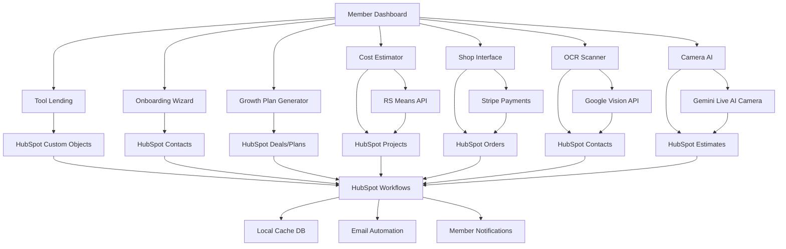

# Design Document

## Overview

This design document outlines the technical architecture for five integrated member experience features: Tool Lending Library, Interactive Onboarding, AI-Powered Business Growth Plans, RS Means Cost API Integration, and Dual-Facing Shop System. The design emphasizes real data integration, authentic business logic, and seamless cross-feature functionality within the existing NAMC platform architecture.

## Architecture

### System Integration Points

The new features integrate with HubSpot as the central data repository and workflow engine:

- **HubSpot CRM**: Primary data store for member profiles, projects, and business relationships
- **HubSpot Custom Objects**: Tool inventory, growth plans, cost estimates, and shop orders as custom objects
- **HubSpot Workflows**: Automated processes for onboarding, notifications, and member engagement
- **HubSpot Properties**: Custom properties for all feature-specific data
- **Local Database**: Prisma schema serves as cache and real-time processing layer, syncing with HubSpot
- **Authentication**: NextAuth.js with HubSpot contact validation
- **API Layer**: HubSpot-first API design with local fallback for performance

### Data Flow Architecture



## HubSpot Integration Architecture

### HubSpot as Data Backbone

All member portal functionality is built on HubSpot as the primary data repository:

#### HubSpot Custom Objects Structure

```typescript
// HubSpot Custom Objects Configuration
interface HubSpotCustomObjects {
  // Tool Lending
  tools: {
    objectType: 'tools';
    properties: {
      tool_name: string;
      category: string;
      daily_rate: number;
      condition: string;
      serial_number: string;
      location: string;
      is_available: boolean;
    };
    associations: ['contacts', 'tool_reservations'];
  };
  
  tool_reservations: {
    objectType: 'tool_reservations';
    properties: {
      start_date: string;
      end_date: string;
      status: string;
      total_cost: number;
      checkout_condition: string;
      return_condition: string;
    };
    associations: ['contacts', 'tools'];
  };
  
  // Growth Plans
  growth_plans: {
    objectType: 'growth_plans';
    properties: {
      plan_name: string;
      current_phase: string;
      progress_score: number;
      ai_analysis: string;
      roadmap_data: string;
      milestones: string;
    };
    associations: ['contacts', 'deals'];
  };
  
  // Cost Estimates
  cost_estimates: {
    objectType: 'cost_estimates';
    properties: {
      project_name: string;
      project_type: string;
      total_estimate: number;
      rs_means_data: string;
      ai_adjustments: string;
      confidence_score: number;
      bid_submitted: boolean;
      bid_result: string;
    };
    associations: ['contacts', 'deals', 'companies'];
  };
  
  // Camera Estimates
  camera_estimates: {
    objectType: 'camera_estimates';
    properties: {
      session_id: string;
      scene_analysis: string;
      material_analysis: string;
      estimated_costs: string;
      confidence: number;
      media_url: string;
    };
    associations: ['contacts', 'cost_estimates'];
  };
  
  // Shop Orders
  shop_orders: {
    objectType: 'shop_orders';
    properties: {
      order_number: string;
      total_amount: number;
      order_status: string;
      payment_status: string;
      items_data: string;
      shipping_address: string;
    };
    associations: ['contacts'];
  };
  
  // Project Budget Tracking
  project_budgets: {
    objectType: 'project_budgets';
    properties: {
      total_budget: number;
      allocated_funds: number;
      spent_amount: number;
      remaining_funds: number;
      member_funding: number;
      sponsor_funding: number;
      crowd_funding: number;
      contract_value: number;
      profit_margin: number;
    };
    associations: ['deals', 'contacts'];
  };
  
  // Funding Campaigns
  funding_campaigns: {
    objectType: 'funding_campaigns';
    properties: {
      campaign_title: string;
      target_amount: number;
      raised_amount: number;
      campaign_type: string;
      campaign_status: string;
      start_date: string;
      end_date: string;
      jobs_to_create: number;
      training_hours: number;
      local_hire_target: number;
    };
    associations: ['deals', 'contacts', 'project_budgets'];
  };
  
  // Social Impact Metrics
  social_impact_metrics: {
    objectType: 'social_impact_metrics';
    properties: {
      jobs_created: number;
      jobs_planned: number;
      training_hours_provided: number;
      local_hire_percentage: number;
      minority_hire_percentage: number;
      housing_units_created: number;
      affordable_units_created: number;
      affordability_improvement: number;
      community_benefit_score: number;
      local_spending_amount: number;
      green_building_certification: string;
      carbon_footprint_reduction: number;
    };
    associations: ['deals', 'contacts'];
  };
  
  // Member Website Management
  member_websites: {
    objectType: 'member_websites';
    properties: {
      website_url: string;
      domain_name: string;
      cms_page_id: string;
      professional_email: string;
      website_status: string;
      template_version: string;
      monthly_visitors: number;
      leads_generated: number;
      creation_date: string;
      last_updated: string;
    };
    associations: ['contacts', 'tickets'];
  };
  
  // Website Requests
  website_requests: {
    objectType: 'website_requests';
    properties: {
      website_type: string;
      domain_preference: string;
      business_focus: string;
      request_status: string;
      priority: string;
      assigned_admin: string;
      estimated_completion: string;
      special_requests: string;
    };
    associations: ['contacts', 'tickets'];
  };
  
  // AI Bid Generation and Review
  ai_generated_bids: {
    objectType: 'ai_generated_bids';
    properties: {
      project_name: string;
      project_type: string;
      total_bid_amount: number;
      confidence_score: number;
      win_probability: number;
      risk_score: number;
      bid_status: string;
      data_sources_used: string;
      ai_analysis: string;
      submitted_date: string;
      actual_outcome: string;
      bid_accuracy: number;
    };
    associations: ['contacts', 'deals'];
  };
  
  // Bid Reviews
  bid_reviews: {
    objectType: 'bid_reviews';
    properties: {
      review_type: string;
      overall_score: number;
      competitiveness_score: number;
      pricing_position: string;
      win_probability: number;
      strengths: string;
      weaknesses: string;
      recommendations: string;
      risk_factors: string;
      review_date: string;
    };
    associations: ['contacts', 'ai_generated_bids'];
  };
  
  // Compliance Review and Smart Document Management
  compliance_reviews: {
    objectType: 'compliance_reviews';
    properties: {
      document_id: string;
      document_type: string;
      document_name: string;
      compliance_score: number;
      risk_level: string;
      compliance_status: string;
      issues_found: number;
      total_issues: number;
      ai_recommendations: string;
      regulatory_requirements: string;
      review_date: string;
      resolution_date: string;
    };
    associations: ['contacts', 'deals'];
  };
  
  // Smart Forms
  smart_forms: {
    objectType: 'smart_forms';
    properties: {
      template_id: string;
      template_name: string;
      project_id: string;
      form_status: string;
      completion_percentage: number;
      auto_filled_fields: number;
      total_fields: number;
      current_step: number;
      total_steps: number;
      submitted_date: string;
      approved_date: string;
      assigned_to: string;
    };
    associations: ['contacts', 'deals'];
  };
  
  // Member Community Platform
  community_discussions: {
    objectType: 'community_discussions';
    properties: {
      title: string;
      category: string;
      discussion_type: string;
      tags: string;
      view_count: number;
      reply_count: number;
      like_count: number;
      status: string;
      is_public: boolean;
      is_pinned: boolean;
      created_by: string;
      last_activity: string;
    };
    associations: ['contacts'];
  };
  
  // Member Messaging
  member_messages: {
    objectType: 'member_messages';
    properties: {
      sender_id: string;
      recipient_id: string;
      subject: string;
      message_type: string;
      is_read: boolean;
      priority: string;
      sent_date: string;
    };
    associations: ['contacts'];
  };
  
  // Committees
  committees: {
    objectType: 'committees';
    properties: {
      name: string;
      description: string;
      category: string;
      chair_id: string;
      member_count: number;
      status: string;
      is_public: boolean;
      meeting_frequency: string;
      next_meeting: string;
    };
    associations: ['contacts'];
  };
  
  // Community Voting
  community_votes: {
    objectType: 'community_votes';
    properties: {
      title: string;
      description: string;
      vote_type: string;
      created_by: string;
      start_date: string;
      end_date: string;
      status: string;
      is_anonymous: boolean;
      total_votes: number;
      results: string;
    };
    associations: ['contacts', 'committees'];
  };
  
  // Inter-Chapter Collaboration
  chapter_connections: {
    objectType: 'chapter_connections';
    properties: {
      from_chapter: string;
      to_chapter: string;
      connection_type: string;
      status: string;
      established_date: string;
      last_activity: string;
      collaboration_count: number;
      shared_projects: number;
      member_exchanges: number;
      resource_shares: number;
      allow_member_exchange: boolean;
      allow_resource_sharing: boolean;
      allow_project_sharing: boolean;
    };
    associations: ['contacts'];
  };
  
  // Cross-Chapter Opportunities
  cross_chapter_opportunities: {
    objectType: 'cross_chapter_opportunities';
    properties: {
      original_opportunity_id: string;
      origin_chapter: string;
      target_chapters: string;
      sharing_type: string;
      title: string;
      estimated_value: number;
      status: string;
      shared_date: string;
      expiration_date: string;
      interested_chapters: string;
      collaboration_responses: number;
      selected_chapters: string;
      collaboration_formed: boolean;
      project_value: number;
    };
    associations: ['deals', 'chapter_connections'];
  };
  
  // Member Exchanges
  member_exchanges: {
    objectType: 'member_exchanges';
    properties: {
      member_id: string;
      origin_chapter: string;
      target_chapter: string;
      exchange_type: string;
      purpose: string;
      duration: number;
      status: string;
      request_date: string;
      approval_date: string;
      start_date: string;
      end_date: string;
      projects_completed: number;
      resources_shared: number;
      connections_formed: number;
      business_generated: number;
      success_rating: number;
    };
    associations: ['contacts', 'chapter_connections'];
  };
  
  // Inter-Chapter Projects
  inter_chapter_projects: {
    objectType: 'deals';
    pipeline: 'inter_chapter_projects';
    properties: {
      project_type: string;
      lead_chapter: string;
      participating_chapters: string;
      estimated_value: number;
      project_location: string;
      member_allocation: string;
      resource_sharing: string;
      revenue_sharing: string;
      completion_percentage: number;
      actual_value: number;
      member_satisfaction: number;
    };
    associations: ['contacts', 'companies'];
  };
  
  // Categorized Learning Management System
  sponsored_courses: {
    objectType: 'sponsored_courses';
    properties: {
      title: string;
      category: string;
      subcategory: string;
      sponsor_id: string;
      sponsor_name: string;
      partnership_type: string;
      content_url: string;
      duration: number;
      difficulty_level: string;
      badge_id: string;
      badge_required: boolean;
      enrollment_count: number;
      completion_count: number;
      completion_rate: number;
      average_rating: number;
      revenue_sharing_percentage: number;
      total_revenue: number;
      is_active: boolean;
      launch_date: string;
    };
    associations: ['companies', 'contacts'];
  };
  
  // Proficiency Badges
  proficiency_badges: {
    objectType: 'proficiency_badges';
    properties: {
      member_id: string;
      course_id: string;
      badge_id: string;
      badge_name: string;
      category: string;
      skill_area: string;
      level: string;
      earned_date: string;
      verification_status: string;
      expiration_date: string;
      requires_continuing_ed: boolean;
      next_renewal_date: string;
      project_opportunities_unlocked: string;
      shop_campaigns_triggered: string;
    };
    associations: ['contacts', 'sponsored_courses'];
  };
  
  // Badge Shop Campaigns
  badge_shop_campaigns: {
    objectType: 'badge_shop_campaigns';
    properties: {
      member_id: string;
      badge_id: string;
      campaign_type: string;
      title: string;
      product_ids: string;
      product_categories: string;
      discount_percentage: number;
      campaign_duration: number;
      start_date: string;
      end_date: string;
      member_project_fund_percentage: number;
      namc_support_percentage: number;
      sponsor_partnership_percentage: number;
      view_count: number;
      click_count: number;
      purchase_count: number;
      total_revenue: number;
      member_project_fund_generated: number;
      namc_support_generated: number;
      sponsor_partnership_generated: number;
      status: string;
    };
    associations: ['contacts', 'proficiency_badges'];
  };
  
  // Sponsor Partnerships
  sponsor_partnerships: {
    objectType: 'companies';
    properties: {
      partnership_type: string;
      partnership_status: string;
      course_categories: string;
      specializations: string;
      revenue_sharing_percentage: number;
      minimum_commitment: number;
      courses_sponsored: number;
      members_trained: number;
      total_partnership_value: number;
      badges_awarded: number;
      partnership_start_date: string;
      partnership_end_date: string;
      next_renewal_date: string;
    };
    associations: ['sponsored_courses'];
  };
  
  // Project Payment & Escrow System
  project_escrows: {
    objectType: 'project_escrows';
    properties: {
      project_id: string;
      total_project_value: number;
      escrow_balance: number;
      total_paid: number;
      total_deposited: number;
      client_id: string;
      contractor_id: string;
      payment_schedule: string;
      retention_percentage: number;
      retention_amount: number;
      escrow_status: string;
      created_date: string;
      expected_completion_date: string;
      actual_completion_date: string;
      last_payment_date: string;
      last_payment_amount: number;
    };
    associations: ['deals', 'contacts'];
  };
  
  // Task Payments
  task_payments: {
    objectType: 'task_payments';
    properties: {
      escrow_id: string;
      task_id: string;
      payment_amount: number;
      contractor_id: string;
      completion_requirements: string;
      verification_criteria: string;
      approval_required: boolean;
      approved_by: string;
      payment_status: string;
      approved_date: string;
      paid_date: string;
      payment_transaction_id: string;
      quality_score: number;
      compliance_check: boolean;
      photos_required: boolean;
      photos_submitted: string;
    };
    associations: ['project_escrows', 'contacts', 'tasks'];
  };
  
  // Payment Milestones
  payment_milestones: {
    objectType: 'payment_milestones';
    properties: {
      escrow_id: string;
      milestone_name: string;
      payment_amount: number;
      payment_percentage: number;
      deliverables: string;
      verification_criteria: string;
      due_date: string;
      milestone_status: string;
      completed_date: string;
      verified_by: string;
      verification_date: string;
      payment_released: boolean;
      payment_date: string;
      payment_transaction_id: string;
    };
    associations: ['project_escrows', 'contacts'];
  };
  
  // Escrow Payments
  escrow_payments: {
    objectType: 'escrow_payments';
    properties: {
      escrow_id: string;
      recipient_id: string;
      amount: number;
      payment_type: string;
      transaction_id: string;
      payment_method: string;
      payment_date: string;
      payment_status: string;
      failure_reason: string;
      bank_transaction_id: string;
      clearing_date: string;
    };
    associations: ['project_escrows', 'contacts'];
  };
  
  // Payment Disputes (uses tickets)
  payment_disputes: {
    objectType: 'tickets';
    pipeline: 'payment_disputes';
    properties: {
      payment_id: string;
      dispute_reason: string;
      dispute_amount: number;
      submitted_by: string;
      respondent_id: string;
      mediator_id: string;
      evidence_provided: string;
      supporting_docs: string;
      dispute_status: string;
      resolution: string;
      resolution_amount: number;
      resolution_date: string;
      response_deadline: string;
      mediation_date: string;
    };
    associations: ['contacts', 'escrow_payments'];
  };
}
```

#### HubSpot Workflows Configuration

```typescript
// Key HubSpot Workflows
interface HubSpotWorkflows {
  member_onboarding: {
    trigger: 'Contact property change: onboarding_step';
    actions: [
      'Send welcome email sequence',
      'Assign to member success team',
      'Create growth plan deal',
      'Schedule follow-up tasks'
    ];
  };
  
  tool_reservation: {
    trigger: 'Tool reservation object created';
    actions: [
      'Send confirmation email',
      'Create calendar reminder',
      'Update tool availability',
      'Notify facility staff'
    ];
  };
  
  growth_plan_milestone: {
    trigger: 'Growth plan progress update';
    actions: [
      'Send congratulations email',
      'Recommend next actions',
      'Update member tier if applicable',
      'Create follow-up tasks'
    ];
  };
  
  cost_estimate_created: {
    trigger: 'Cost estimate object created';
    actions: [
      'Create project deal',
      'Assign to sales team',
      'Send estimate summary',
      'Schedule follow-up call'
    ];
  };
  
  business_card_scanned: {
    trigger: 'Contact created via OCR';
    actions: [
      'Send membership invitation',
      'Add to nurture sequence',
      'Assign to business development',
      'Create networking task'
    ];
  };
  
  task_assigned: {
    trigger: 'Task created or reassigned';
    actions: [
      'Send task notification email',
      'Create calendar reminder',
      'Update member dashboard',
      'Log activity in timeline'
    ];
  };
  
  task_completed: {
    trigger: 'Task status changed to completed';
    actions: [
      'Send completion confirmation',
      'Update project progress',
      'Award completion points',
      'Create follow-up tasks if needed'
    ];
  };
  
  task_overdue: {
    trigger: 'Task due date passed without completion';
    actions: [
      'Send overdue notification',
      'Notify task creator',
      'Escalate to supervisor',
      'Update priority to urgent'
    ];
  };
  
  project_task_creation: {
    trigger: 'Project deal stage change';
    actions: [
      'Create project milestone tasks',
      'Assign to project team members',
      'Set up progress tracking',
      'Schedule check-in meetings'
    ];
  };
}
```

#### HubSpot API Integration Service

```typescript
// /src/lib/services/hubspot-backbone.service.ts
export class HubSpotBackboneService {
  private hubspotClient: Client;
  
  constructor() {
    this.hubspotClient = new Client({
      accessToken: process.env.HUBSPOT_ACCESS_TOKEN
    });
  }
  
  // Member Profile Management
  async getMemberProfile(memberId: string): Promise<HubSpotContact> {
    const contact = await this.hubspotClient.crm.contacts.basicApi.getById(
      memberId,
      ['email', 'firstname', 'lastname', 'company', 'member_type', 'onboarding_progress']
    );
    
    return this.transformHubSpotContact(contact);
  }
  
  async updateMemberProfile(
    memberId: string, 
    updates: MemberProfileUpdates
  ): Promise<void> {
    await this.hubspotClient.crm.contacts.basicApi.update(memberId, {
      properties: this.transformToHubSpotProperties(updates)
    });
    
    // Sync to local cache
    await this.syncToLocalCache('contact', memberId, updates);
  }
  
  // Tool Management
  async createToolReservation(
    reservationData: ToolReservationData
  ): Promise<HubSpotCustomObject> {
    // Create tool reservation custom object
    const reservation = await this.hubspotClient.crm.objects.basicApi.create(
      'tool_reservations',
      {
        properties: this.transformToolReservation(reservationData),
        associations: [
          {
            to: { id: reservationData.memberId },
            types: [{ associationCategory: 'HUBSPOT_DEFINED', associationTypeId: 1 }]
          },
          {
            to: { id: reservationData.toolId },
            types: [{ associationCategory: 'USER_DEFINED', associationTypeId: 'tool_to_reservation' }]
          }
        ]
      }
    );
    
    // Trigger workflow
    await this.triggerWorkflow('tool_reservation', reservation.id);
    
    return reservation;
  }
  
  // Growth Plan Management
  async createGrowthPlan(
    memberId: string,
    planData: GrowthPlanData
  ): Promise<HubSpotDeal> {
    // Create as a deal for pipeline tracking
    const deal = await this.hubspotClient.crm.deals.basicApi.create({
      properties: {
        dealname: `Growth Plan - ${planData.planName}`,
        dealstage: 'assessment',
        amount: '0',
        pipeline: 'growth_plans',
        hubspot_owner_id: await this.getOwnerForMember(memberId)
      },
      associations: [
        {
          to: { id: memberId },
          types: [{ associationCategory: 'HUBSPOT_DEFINED', associationTypeId: 3 }]
        }
      ]
    });
    
    // Create custom object for detailed data
    await this.hubspotClient.crm.objects.basicApi.create('growth_plans', {
      properties: {
        plan_name: planData.planName,
        ai_analysis: JSON.stringify(planData.aiAnalysis),
        roadmap_data: JSON.stringify(planData.roadmap),
        progress_score: 0
      },
      associations: [
        {
          to: { id: deal.id },
          types: [{ associationCategory: 'USER_DEFINED', associationTypeId: 'deal_to_growth_plan' }]
        }
      ]
    });
    
    return deal;
  }
  
  // Cost Estimation Integration
  async createCostEstimate(
    estimateData: CostEstimateData
  ): Promise<HubSpotCustomObject> {
    const estimate = await this.hubspotClient.crm.objects.basicApi.create(
      'cost_estimates',
      {
        properties: {
          project_name: estimateData.projectName,
          project_type: estimateData.projectType,
          total_estimate: estimateData.totalEstimate,
          rs_means_data: JSON.stringify(estimateData.rsMeansData),
          confidence_score: estimateData.confidenceScore
        },
        associations: [
          {
            to: { id: estimateData.memberId },
            types: [{ associationCategory: 'HUBSPOT_DEFINED', associationTypeId: 1 }]
          }
        ]
      }
    );
    
    // Create associated deal if estimate is for bidding
    if (estimateData.forBidding) {
      await this.createProjectDeal(estimateData, estimate.id);
    }
    
    return estimate;
  }
  
  // OCR Business Card Integration
  async createContactFromOCR(
    ocrData: OCRExtractedData,
    scannedBy: string
  ): Promise<HubSpotContact> {
    const contact = await this.hubspotClient.crm.contacts.basicApi.create({
      properties: {
        email: ocrData.email,
        firstname: ocrData.firstName,
        lastname: ocrData.lastName,
        company: ocrData.company,
        phone: ocrData.phone,
        website: ocrData.website,
        lead_source: 'business_card_scan',
        scanned_by: scannedBy,
        ocr_confidence: ocrData.confidence
      }
    });
    
    // Trigger business card workflow
    await this.triggerWorkflow('business_card_scanned', contact.id);
    
    return contact;
  }
  
  // Task Management Integration
  async createTask(taskData: TaskData): Promise<HubSpotTask> {
    const task = await this.hubspotClient.crm.objects.tasks.basicApi.create({
      properties: {
        hs_task_subject: taskData.subject,
        hs_task_body: taskData.description,
        hs_task_status: 'NOT_STARTED',
        hs_task_priority: taskData.priority,
        hs_task_type: taskData.type,
        hubspot_owner_id: taskData.assigneeId,
        hs_task_due_date: taskData.dueDate?.toISOString()
      },
      associations: [
        // Associate with contact (member)
        {
          to: { id: taskData.memberId },
          types: [{ associationCategory: 'HUBSPOT_DEFINED', associationTypeId: 204 }]
        },
        // Associate with project/deal if applicable
        ...(taskData.projectId ? [{
          to: { id: taskData.projectId },
          types: [{ associationCategory: 'HUBSPOT_DEFINED', associationTypeId: 214 }]
        }] : [])
      ]
    });
    
    // Trigger task assignment workflow
    await this.triggerWorkflow('task_assigned', task.id);
    
    return task;
  }
  
  async assignTaskToMember(
    taskId: string,
    assigneeId: string,
    assignedBy: string
  ): Promise<void> {
    await this.hubspotClient.crm.objects.tasks.basicApi.update(taskId, {
      properties: {
        hubspot_owner_id: assigneeId,
        assigned_by: assignedBy,
        assigned_date: new Date().toISOString(),
        hs_task_status: 'IN_PROGRESS'
      }
    });
    
    // Trigger assignment notification workflow
    await this.triggerWorkflow('task_reassigned', taskId);
  }
  
  async completeTask(
    taskId: string,
    completedBy: string,
    completionNotes?: string
  ): Promise<void> {
    await this.hubspotClient.crm.objects.tasks.basicApi.update(taskId, {
      properties: {
        hs_task_status: 'COMPLETED',
        completed_by: completedBy,
        completion_date: new Date().toISOString(),
        completion_notes: completionNotes || ''
      }
    });
    
    // Update project progress if task is project-related
    const task = await this.hubspotClient.crm.objects.tasks.basicApi.getById(taskId);
    if (task.associations?.deals) {
      await this.updateProjectProgress(task.associations.deals[0].id);
    }
    
    // Trigger completion workflow
    await this.triggerWorkflow('task_completed', taskId);
  }
  
  async getMemberTasks(
    memberId: string,
    status?: 'NOT_STARTED' | 'IN_PROGRESS' | 'COMPLETED'
  ): Promise<HubSpotTask[]> {
    const filterGroups = [
      {
        filters: [
          {
            propertyName: 'associations.contact',
            operator: 'EQ',
            value: memberId
          },
          ...(status ? [{
            propertyName: 'hs_task_status',
            operator: 'EQ',
            value: status
          }] : [])
        ]
      }
    ];
    
    const tasks = await this.hubspotClient.crm.objects.tasks.searchApi.doSearch({
      filterGroups,
      properties: [
        'hs_task_subject',
        'hs_task_body',
        'hs_task_status',
        'hs_task_priority',
        'hs_task_due_date',
        'hubspot_owner_id'
      ],
      associations: ['contacts', 'deals']
    });
    
    return tasks.results;
  }
  
  async delegateTask(
    taskId: string,
    fromMemberId: string,
    toMemberId: string,
    delegationNotes?: string
  ): Promise<void> {
    // Create delegation record
    await this.hubspotClient.crm.objects.tasks.basicApi.update(taskId, {
      properties: {
        delegated_from: fromMemberId,
        delegated_to: toMemberId,
        delegation_date: new Date().toISOString(),
        delegation_notes: delegationNotes || '',
        hubspot_owner_id: toMemberId,
        hs_task_status: 'IN_PROGRESS'
      }
    });
    
    // Trigger delegation workflow
    await this.triggerWorkflow('task_delegated', taskId);
  }
  
  // Shop Integration
  async createShopOrder(orderData: ShopOrderData): Promise<HubSpotCustomObject> {
    const order = await this.hubspotClient.crm.objects.basicApi.create(
      'shop_orders',
      {
        properties: {
          order_number: orderData.orderNumber,
          total_amount: orderData.totalAmount,
          order_status: orderData.status,
          payment_status: orderData.paymentStatus,
          items_data: JSON.stringify(orderData.items)
        },
        associations: orderData.memberId ? [
          {
            to: { id: orderData.memberId },
            types: [{ associationCategory: 'HUBSPOT_DEFINED', associationTypeId: 1 }]
          }
        ] : []
      }
    );
    
    // Update member purchase history
    if (orderData.memberId) {
      await this.updateMemberPurchaseHistory(orderData.memberId, orderData);
    }
    
    return order;
  }
  
  // QuickBooks Financial Integration
  async syncToQuickBooks(
    transactionType: 'invoice' | 'expense' | 'payment',
    transactionData: any
  ): Promise<QuickBooksTransaction> {
    // Placeholder for QuickBooks API integration
    // This will be implemented as a foundation for future financial management
    
    const qbService = new QuickBooksAPIService();
    
    switch (transactionType) {
      case 'invoice':
        return await qbService.createInvoice(transactionData);
      case 'expense':
        return await qbService.createExpense(transactionData);
      case 'payment':
        return await qbService.recordPayment(transactionData);
      default:
        throw new Error(`Unsupported transaction type: ${transactionType}`);
    }
  }
  
  async getFinancialSummary(memberId: string): Promise<FinancialSummary> {
    // Placeholder for financial reporting
    const qbService = new QuickBooksAPIService();
    
    return await qbService.getMemberFinancialSummary(memberId);
  }
  
  // Project Budget Management
  async createProjectBudget(
    projectId: string,
    budgetData: ProjectBudgetData
  ): Promise<HubSpotCustomObject> {
    const budget = await this.hubspotClient.crm.objects.basicApi.create(
      'project_budgets',
      {
        properties: {
          total_budget: budgetData.totalBudget,
          allocated_funds: budgetData.allocatedFunds,
          spent_amount: 0,
          remaining_funds: budgetData.totalBudget,
          member_funding: budgetData.memberFunding || 0,
          sponsor_funding: budgetData.sponsorFunding || 0,
          crowd_funding: budgetData.crowdFunding || 0,
          contract_value: budgetData.contractValue,
          profit_margin: budgetData.profitMargin || 0
        },
        associations: [
          {
            to: { id: projectId },
            types: [{ associationCategory: 'USER_DEFINED', associationTypeId: 'deal_to_budget' }]
          }
        ]
      }
    );
    
    // Trigger budget creation workflow
    await this.triggerWorkflow('project_budget_created', budget.id);
    
    return budget;
  }
  
  async updateProjectExpense(
    budgetId: string,
    expenseData: ProjectExpenseData
  ): Promise<void> {
    // Update budget spent amount
    const currentBudget = await this.hubspotClient.crm.objects.basicApi.getById(
      budgetId,
      ['spent_amount', 'total_budget']
    );
    
    const newSpentAmount = parseFloat(currentBudget.properties.spent_amount) + expenseData.amount;
    const remainingFunds = parseFloat(currentBudget.properties.total_budget) - newSpentAmount;
    
    await this.hubspotClient.crm.objects.basicApi.update(budgetId, {
      properties: {
        spent_amount: newSpentAmount,
        remaining_funds: remainingFunds
      }
    });
    
    // Check for budget alerts
    if (remainingFunds < (parseFloat(currentBudget.properties.total_budget) * 0.1)) {
      await this.triggerWorkflow('budget_low_funds_alert', budgetId);
    }
  }
  
  // Crowdfunding and Sponsorship
  async createFundingCampaign(
    projectId: string,
    campaignData: FundingCampaignData
  ): Promise<HubSpotCustomObject> {
    const campaign = await this.hubspotClient.crm.objects.basicApi.create(
      'funding_campaigns',
      {
        properties: {
          campaign_title: campaignData.title,
          target_amount: campaignData.targetAmount,
          raised_amount: 0,
          campaign_type: campaignData.type,
          campaign_status: 'active',
          start_date: campaignData.startDate.toISOString(),
          end_date: campaignData.endDate.toISOString(),
          jobs_to_create: campaignData.socialGoals?.jobsToCreate || 0,
          training_hours: campaignData.socialGoals?.trainingHours || 0,
          local_hire_target: campaignData.socialGoals?.localHireTarget || 0
        },
        associations: [
          {
            to: { id: projectId },
            types: [{ associationCategory: 'USER_DEFINED', associationTypeId: 'deal_to_campaign' }]
          }
        ]
      }
    );
    
    // Trigger campaign launch workflow
    await this.triggerWorkflow('funding_campaign_launched', campaign.id);
    
    return campaign;
  }
  
  async recordFundingContribution(
    campaignId: string,
    contributionData: FundingContributionData
  ): Promise<void> {
    // Update campaign raised amount
    const campaign = await this.hubspotClient.crm.objects.basicApi.getById(
      campaignId,
      ['raised_amount', 'target_amount']
    );
    
    const newRaisedAmount = parseFloat(campaign.properties.raised_amount) + contributionData.amount;
    
    await this.hubspotClient.crm.objects.basicApi.update(campaignId, {
      properties: {
        raised_amount: newRaisedAmount
      }
    });
    
    // Create contributor contact if new
    if (contributionData.contributorEmail && !contributionData.contributorId) {
      const contributor = await this.createContactFromContribution(contributionData);
      contributionData.contributorId = contributor.id;
    }
    
    // Check if campaign goal reached
    if (newRaisedAmount >= parseFloat(campaign.properties.target_amount)) {
      await this.triggerWorkflow('funding_goal_achieved', campaignId);
    }
    
    // Send thank you workflow
    await this.triggerWorkflow('funding_contribution_received', campaignId);
  }
  
  // Social Impact Tracking
  async createSocialImpactMetrics(
    projectId: string,
    impactGoals: SocialImpactGoals
  ): Promise<HubSpotCustomObject> {
    const metrics = await this.hubspotClient.crm.objects.basicApi.create(
      'social_impact_metrics',
      {
        properties: {
          jobs_created: 0,
          jobs_planned: impactGoals.jobsPlanned || 0,
          training_hours_provided: 0,
          local_hire_percentage: 0,
          local_hire_target: impactGoals.localHireTarget || 0,
          minority_hire_percentage: 0,
          housing_units_created: 0,
          affordable_units_created: 0,
          affordability_improvement: 0,
          community_benefit_score: 0,
          local_spending_amount: 0,
          green_building_certification: impactGoals.greenCertification || '',
          carbon_footprint_reduction: 0
        },
        associations: [
          {
            to: { id: projectId },
            types: [{ associationCategory: 'USER_DEFINED', associationTypeId: 'deal_to_impact' }]
          }
        ]
      }
    );
    
    return metrics;
  }
  
  async updateSocialImpactMetrics(
    metricsId: string,
    updates: SocialImpactUpdates
  ): Promise<void> {
    await this.hubspotClient.crm.objects.basicApi.update(metricsId, {
      properties: this.transformSocialImpactUpdates(updates)
    });
    
    // Calculate community benefit score
    const benefitScore = await this.calculateCommunityBenefitScore(metricsId);
    
    await this.hubspotClient.crm.objects.basicApi.update(metricsId, {
      properties: {
        community_benefit_score: benefitScore
      }
    });
    
    // Trigger impact milestone workflows if thresholds met
    await this.checkImpactMilestones(metricsId, updates);
  }
  
  private async calculateCommunityBenefitScore(metricsId: string): Promise<number> {
    // Algorithm to calculate 0-100 community benefit score
    // Based on jobs created, local hiring, affordability, environmental impact
    const metrics = await this.hubspotClient.crm.objects.basicApi.getById(metricsId);
    
    let score = 0;
    
    // Jobs component (30 points max)
    const jobsScore = Math.min(30, (parseFloat(metrics.properties.jobs_created) / 10) * 30);
    
    // Local hiring component (25 points max)
    const localHireScore = (parseFloat(metrics.properties.local_hire_percentage) / 100) * 25;
    
    // Affordability component (25 points max)
    const affordabilityScore = (parseFloat(metrics.properties.affordability_improvement) / 100) * 25;
    
    // Environmental component (20 points max)
    const envScore = metrics.properties.green_building_certification ? 20 : 0;
    
    score = jobsScore + localHireScore + affordabilityScore + envScore;
    
    return Math.round(score);
  }
  
  // ArcGIS Online Integration for Business Intelligence
  async getProjectLocationAnalytics(
    projectId: string,
    coordinates: { lat: number, lng: number }
  ): Promise<ArcGISLocationAnalytics> {
    const arcgisService = new ArcGISOnlineService();
    
    // Fetch demographic data
    const demographics = await arcgisService.getDemographicData(coordinates);
    
    // Get construction market data
    const marketData = await arcgisService.getConstructionMarketData(coordinates);
    
    // Analyze permit activity in area
    const permitActivity = await arcgisService.getPermitActivity(coordinates, '1mile');
    
    // Get economic indicators
    const economicData = await arcgisService.getEconomicIndicators(coordinates);
    
    // Store analytics in HubSpot
    await this.hubspotClient.crm.deals.basicApi.update(projectId, {
      properties: {
        location_demographics: JSON.stringify(demographics),
        market_conditions: JSON.stringify(marketData),
        permit_activity: JSON.stringify(permitActivity),
        economic_indicators: JSON.stringify(economicData)
      }
    });
    
    return {
      demographics,
      marketData,
      permitActivity,
      economicData,
      insights: await this.generateLocationInsights(demographics, marketData, economicData)
    };
  }
  
  async provisionArcGISAccess(
    memberId: string,
    accessLevel: 'viewer' | 'editor' | 'analyst',
    duration: number // days
  ): Promise<ArcGISAccessCredentials> {
    const arcgisService = new ArcGISOnlineService();
    
    // Create temporary ArcGIS Online user
    const credentials = await arcgisService.createTemporaryUser({
      memberId,
      accessLevel,
      expirationDate: new Date(Date.now() + duration * 24 * 60 * 60 * 1000)
    });
    
    // Log access provision in HubSpot
    await this.hubspotClient.crm.contacts.basicApi.update(memberId, {
      properties: {
        arcgis_access_level: accessLevel,
        arcgis_access_expires: credentials.expirationDate.toISOString(),
        arcgis_username: credentials.username
      }
    });
    
    // Trigger access notification workflow
    await this.triggerWorkflow('arcgis_access_granted', memberId);
    
    return credentials;
  }
  
  async getSpatialBusinessIntelligence(
    serviceArea: GeoPolygon,
    projectType: string
  ): Promise<SpatialBusinessIntelligence> {
    const arcgisService = new ArcGISOnlineService();
    
    // Analyze service area demographics
    const areaAnalysis = await arcgisService.analyzeServiceArea(serviceArea);
    
    // Get construction opportunity data
    const opportunities = await arcgisService.getConstructionOpportunities(
      serviceArea,
      projectType
    );
    
    // Analyze competition density
    const competition = await arcgisService.getCompetitorAnalysis(
      serviceArea,
      projectType
    );
    
    // Get economic development projects
    const developmentProjects = await arcgisService.getDevelopmentProjects(serviceArea);
    
    return {
      areaAnalysis,
      opportunities,
      competition,
      developmentProjects,
      recommendations: await this.generateBusinessRecommendations(
        areaAnalysis,
        opportunities,
        competition
      )
    };
  }
}

// ArcGIS Online Integration Service
export class ArcGISOnlineService {
  private apiKey: string;
  private baseUrl: string = 'https://services.arcgis.com';
  private portalUrl: string = 'https://www.arcgis.com/sharing/rest';
  
  constructor() {
    this.apiKey = process.env.ARCGIS_API_KEY!;
  }
  
  async getDemographicData(
    coordinates: { lat: number, lng: number },
    radius: number = 1 // miles
  ): Promise<DemographicData> {
    // Check cache first
    const cached = await this.getCachedAnalysis(coordinates, radius, 'demographic');
    if (cached && !this.isCacheExpired(cached)) {
      return cached.demographicData;
    }
    
    // Fetch from ArcGIS Demographics service
    const response = await fetch(`${this.baseUrl}/World/GeoenrichmentServer/Geoenrichment/enrich`, {
      method: 'POST',
      headers: {
        'Content-Type': 'application/x-www-form-urlencoded',
      },
      body: new URLSearchParams({
        studyAreas: JSON.stringify([{
          geometry: {
            x: coordinates.lng,
            y: coordinates.lat,
            spatialReference: { wkid: 4326 }
          },
          areaType: 'RingBuffer',
          bufferUnits: 'Miles',
          bufferRadii: [radius]
        }]),
        dataCollections: JSON.stringify([
          'KeyGlobalFacts',
          'Demographics',
          'Housing',
          'Income',
          'Employment'
        ]),
        token: this.apiKey,
        f: 'json'
      })
    });
    
    const data = await response.json();
    const demographics = this.parseDemographicData(data);
    
    // Cache the result
    await this.cacheAnalysis(coordinates, radius, 'demographic', demographics);
    
    return demographics;
  }
  
  async getConstructionMarketData(
    coordinates: { lat: number, lng: number },
    radius: number = 5
  ): Promise<ConstructionMarketData> {
    // Use ArcGIS Business Analyst for construction industry data
    const response = await fetch(`${this.baseUrl}/World/GeoenrichmentServer/Geoenrichment/enrich`, {
      method: 'POST',
      headers: {
        'Content-Type': 'application/x-www-form-urlencoded',
      },
      body: new URLSearchParams({
        studyAreas: JSON.stringify([{
          geometry: {
            x: coordinates.lng,
            y: coordinates.lat,
            spatialReference: { wkid: 4326 }
          },
          areaType: 'RingBuffer',
          bufferUnits: 'Miles',
          bufferRadii: [radius]
        }]),
        dataCollections: JSON.stringify([
          'BusinessSummary',
          'Industry',
          'Construction'
        ]),
        token: this.apiKey,
        f: 'json'
      })
    });
    
    const data = await response.json();
    return this.parseConstructionMarketData(data);
  }
  
  async getPermitActivity(
    coordinates: { lat: number, lng: number },
    radius: string = '1mile'
  ): Promise<PermitActivityData> {
    // Query ArcGIS feature service for construction permits
    const response = await fetch(`${this.baseUrl}/construction-permits/FeatureServer/0/query`, {
      method: 'POST',
      headers: {
        'Content-Type': 'application/x-www-form-urlencoded',
      },
      body: new URLSearchParams({
        geometry: JSON.stringify({
          x: coordinates.lng,
          y: coordinates.lat,
          spatialReference: { wkid: 4326 }
        }),
        geometryType: 'esriGeometryPoint',
        distance: radius,
        units: 'esriSRUnit_StatuteMile',
        spatialRel: 'esriSpatialRelWithin',
        outFields: '*',
        returnGeometry: 'true',
        token: this.apiKey,
        f: 'json'
      })
    });
    
    const data = await response.json();
    return this.parsePermitActivity(data);
  }
  
  async createTemporaryUser(
    userConfig: ArcGISUserConfig
  ): Promise<ArcGISAccessCredentials> {
    // Create temporary ArcGIS Online user account
    const response = await fetch(`${this.portalUrl}/community/createUser`, {
      method: 'POST',
      headers: {
        'Content-Type': 'application/x-www-form-urlencoded',
      },
      body: new URLSearchParams({
        username: `namc_temp_${userConfig.memberId}_${Date.now()}`,
        password: this.generateSecurePassword(),
        fullname: `NAMC Member ${userConfig.memberId}`,
        email: `temp.${userConfig.memberId}@namc-temp.org`,
        role: this.mapAccessLevelToRole(userConfig.accessLevel),
        userLicenseType: this.mapAccessLevelToLicense(userConfig.accessLevel),
        token: this.apiKey,
        f: 'json'
      })
    });
    
    const userData = await response.json();
    
    // Set expiration
    await this.setUserExpiration(userData.user.username, userConfig.expirationDate);
    
    return {
      username: userData.user.username,
      userId: userData.user.id,
      accessToken: userData.token,
      expirationDate: userConfig.expirationDate,
      portalUrl: 'https://namc.maps.arcgis.com'
    };
  }
  
  async analyzeServiceArea(serviceArea: GeoPolygon): Promise<ServiceAreaAnalysis> {
    // Use ArcGIS Spatial Analysis service
    const response = await fetch(`${this.baseUrl}/analysis/GPServer/SummarizeWithin/submitJob`, {
      method: 'POST',
      headers: {
        'Content-Type': 'application/x-www-form-urlencoded',
      },
      body: new URLSearchParams({
        polygonLayer: JSON.stringify({
          features: [{
            geometry: serviceArea,
            attributes: {}
          }]
        }),
        summaryLayer: 'https://services.arcgis.com/demographics/FeatureServer/0',
        summaryFields: JSON.stringify([
          'TOTPOP_CY',
          'MEDHINC_CY',
          'AVGHHSZ_CY',
          'UNEMPRT_CY'
        ]),
        token: this.apiKey,
        f: 'json'
      })
    });
    
    const jobData = await response.json();
    
    // Poll for job completion
    const results = await this.pollForJobCompletion(jobData.jobId);
    
    return this.parseServiceAreaAnalysis(results);
  }
  
  private async getCachedAnalysis(
    coordinates: { lat: number, lng: number },
    radius: number,
    type: string
  ): Promise<SpatialAnalysisCache | null> {
    const locationHash = this.generateLocationHash(coordinates, radius);
    
    return await prisma.spatialAnalysisCache.findUnique({
      where: { locationHash }
    });
  }
  
  private async cacheAnalysis(
    coordinates: { lat: number, lng: number },
    radius: number,
    type: string,
    data: any
  ): Promise<void> {
    const locationHash = this.generateLocationHash(coordinates, radius);
    const expirationDate = new Date(Date.now() + 7 * 24 * 60 * 60 * 1000); // 7 days
    
    await prisma.spatialAnalysisCache.upsert({
      where: { locationHash },
      update: {
        demographicData: type === 'demographic' ? data : undefined,
        marketData: type === 'market' ? data : undefined,
        economicData: type === 'economic' ? data : undefined,
        cacheDate: new Date(),
        expirationDate,
        isValid: true
      },
      create: {
        locationHash,
        latitude: coordinates.lat,
        longitude: coordinates.lng,
        radius,
        demographicData: type === 'demographic' ? data : {},
        marketData: type === 'market' ? data : {},
        economicData: type === 'economic' ? data : {},
        permitData: type === 'permit' ? data : {},
        dataSource: 'ArcGIS Online',
        expirationDate
      }
    });
  }
  
  private generateLocationHash(
    coordinates: { lat: number, lng: number },
    radius: number
  ): string {
    return `${coordinates.lat.toFixed(4)}_${coordinates.lng.toFixed(4)}_${radius}`;
  }
  
  private parseDemographicData(arcgisData: any): DemographicData {
    // Parse ArcGIS demographic response into structured data
    const features = arcgisData.results[0].value.FeatureSet[0].features[0];
    const attributes = features.attributes;
    
    return {
      population: attributes.TOTPOP_CY,
      medianIncome: attributes.MEDHINC_CY,
      averageHouseholdSize: attributes.AVGHHSZ_CY,
      unemploymentRate: attributes.UNEMPRT_CY,
      ageDistribution: {
        under18: attributes.AGE0_CY,
        age18to34: attributes.AGE18_CY,
        age35to54: attributes.AGE35_CY,
        age55plus: attributes.AGE55_CY
      },
      educationLevels: {
        highSchool: attributes.EDUHSCY,
        bachelors: attributes.EDUBACH,
        graduate: attributes.EDUGRAD
      }
    };
  }
  
  // Professional Website Generation for Members
  async createWebsiteRequest(
    memberId: string,
    websiteRequirements: WebsiteRequirements
  ): Promise<HubSpotTicket> {
    // Create support ticket in HubSpot for website request
    const ticket = await this.hubspotClient.crm.tickets.basicApi.create({
      properties: {
        subject: `Professional Website Request - Member ${memberId}`,
        content: `Website request details:\n${JSON.stringify(websiteRequirements, null, 2)}`,
        hs_pipeline: 'website_requests',
        hs_pipeline_stage: 'new_request',
        hs_ticket_priority: 'MEDIUM',
        hs_ticket_category: 'Website Generation',
        member_id: memberId,
        website_type: websiteRequirements.websiteType,
        domain_preference: websiteRequirements.domainPreference,
        business_focus: websiteRequirements.businessFocus
      },
      associations: [
        {
          to: { id: memberId },
          types: [{ associationCategory: 'HUBSPOT_DEFINED', associationTypeId: 16 }]
        }
      ]
    });
    
    // Trigger website request workflow
    await this.triggerWorkflow('website_request_submitted', ticket.id);
    
    return ticket;
  }
  
  async generateMemberWebsite(
    memberId: string,
    websiteConfig: WebsiteConfiguration
  ): Promise<HubSpotWebsite> {
    // Get member data for website population
    const memberData = await this.getMemberWebsiteData(memberId);
    
    // Create website using HubSpot CMS Hub
    const website = await this.hubspotClient.cms.pages.basicApi.create({
      name: `${memberData.businessName} - Professional Contracting Services`,
      slug: websiteConfig.domainSlug,
      templatePath: 'contractor-professional-template',
      htmlTitle: `${memberData.businessName} | ${memberData.specialties.join(', ')} | NAMC Member`,
      metaDescription: `Professional ${memberData.specialties.join(', ')} services by ${memberData.businessName}. NAMC certified minority contractor with ${memberData.yearsExperience} years experience.`,
      widgets: this.generateWebsiteWidgets(memberData, websiteConfig)
    });
    
    // Set up professional email
    const emailSetup = await this.setupProfessionalEmail(
      memberId,
      websiteConfig.domain,
      memberData.contactEmail
    );
    
    // Create website record in HubSpot
    const websiteRecord = await this.hubspotClient.crm.objects.basicApi.create(
      'member_websites',
      {
        properties: {
          member_id: memberId,
          website_url: website.url,
          domain_name: websiteConfig.domain,
          cms_page_id: website.id,
          professional_email: emailSetup.emailAddress,
          website_status: 'active',
          creation_date: new Date().toISOString(),
          last_updated: new Date().toISOString(),
          template_version: 'contractor-v1.0'
        },
        associations: [
          {
            to: { id: memberId },
            types: [{ associationCategory: 'USER_DEFINED', associationTypeId: 'contact_to_website' }]
          }
        ]
      }
    );
    
    // Trigger website creation completion workflow
    await this.triggerWorkflow('website_created', websiteRecord.id);
    
    return {
      websiteId: websiteRecord.id,
      websiteUrl: website.url,
      adminUrl: `${website.url}/hs-admin`,
      emailAddress: emailSetup.emailAddress,
      loginCredentials: emailSetup.credentials
    };
  }
  
  private async getMemberWebsiteData(memberId: string): Promise<MemberWebsiteData> {
    // Fetch comprehensive member data for website
    const member = await this.hubspotClient.crm.contacts.basicApi.getById(
      memberId,
      [
        'firstname', 'lastname', 'email', 'phone', 'company',
        'member_specialties', 'years_experience', 'license_number',
        'service_areas', 'website', 'business_description'
      ]
    );
    
    // Get member's completed projects
    const projects = await this.hubspotClient.crm.deals.searchApi.doSearch({
      filterGroups: [{
        filters: [{
          propertyName: 'associations.contact',
          operator: 'EQ',
          value: memberId
        }, {
          propertyName: 'dealstage',
          operator: 'EQ',
          value: 'closedwon'
        }]
      }],
      properties: ['dealname', 'amount', 'closedate', 'project_type', 'project_images'],
      limit: 10
    });
    
    return {
      businessName: member.properties.company,
      ownerName: `${member.properties.firstname} ${member.properties.lastname}`,
      contactEmail: member.properties.email,
      phone: member.properties.phone,
      specialties: JSON.parse(member.properties.member_specialties || '[]'),
      yearsExperience: parseInt(member.properties.years_experience) || 0,
      licenseNumber: member.properties.license_number,
      serviceAreas: member.properties.service_areas,
      businessDescription: member.properties.business_description,
      completedProjects: projects.results,
      certifications: ['NAMC Certified Minority Contractor']
    };
  }
  
  // AI Bid Generator and Reviewer
  async generateConstructionBid(
    projectDetails: ProjectBidRequest,
    memberId: string
  ): Promise<GeneratedBid> {
    // Gather comprehensive data for bid generation
    const memberProfile = await this.getMemberBiddingProfile(memberId);
    const rsMeansData = await this.getRSMeansDataForProject(projectDetails);
    const arcgisData = await this.getArcGISMarketData(projectDetails.location);
    const permitData = await this.getShovelsPermitData(projectDetails);
    const historicalBids = await this.getMemberBidHistory(memberId, projectDetails.projectType);
    
    // Generate AI-powered bid analysis
    const bidAnalysis = await this.generateBidAnalysis({
      projectDetails,
      memberProfile,
      rsMeansData,
      arcgisData,
      permitData,
      historicalBids
    });
    
    // Create comprehensive bid document
    const generatedBid = await this.createBidDocument(bidAnalysis);
    
    // Store bid in HubSpot as a deal
    const bidDeal = await this.hubspotClient.crm.deals.basicApi.create({
      properties: {
        dealname: `Bid: ${projectDetails.projectName}`,
        dealstage: 'bid_submitted',
        amount: generatedBid.totalBidAmount,
        pipeline: 'construction_bids',
        project_type: projectDetails.projectType,
        bid_generated_by_ai: true,
        bid_confidence_score: bidAnalysis.confidenceScore,
        estimated_win_probability: bidAnalysis.winProbability,
        project_location: JSON.stringify(projectDetails.location),
        permit_requirements: JSON.stringify(permitData),
        rs_means_data: JSON.stringify(rsMeansData),
        market_analysis: JSON.stringify(arcgisData)
      },
      associations: [
        {
          to: { id: memberId },
          types: [{ associationCategory: 'HUBSPOT_DEFINED', associationTypeId: 3 }]
        }
      ]
    });
    
    return {
      bidId: bidDeal.id,
      document: generatedBid.document,
      analysis: bidAnalysis,
      recommendations: bidAnalysis.recommendations
    };
  }
  
  async reviewExistingBid(
    bidDocument: BidDocument,
    memberId: string
  ): Promise<BidReviewAnalysis> {
    // Get member's bidding profile and market data
    const memberProfile = await this.getMemberBiddingProfile(memberId);
    const marketData = await this.getArcGISMarketData(bidDocument.projectLocation);
    const rsMeansComparison = await this.getRSMeansComparison(bidDocument);
    
    // AI analysis of the existing bid
    const aiPrompt = this.buildBidReviewPrompt(
      bidDocument,
      memberProfile,
      marketData,
      rsMeansComparison
    );
    
    const aiAnalysis = await this.aiService.analyze(aiPrompt);
    
    return {
      overallScore: aiAnalysis.overallScore,
      strengths: aiAnalysis.strengths,
      weaknesses: aiAnalysis.weaknesses,
      recommendations: aiAnalysis.recommendations,
      competitivenessAnalysis: aiAnalysis.competitivenessAnalysis,
      riskAssessment: aiAnalysis.riskAssessment,
      improvementSuggestions: aiAnalysis.improvementSuggestions
    };
  }
  
  private async generateBidAnalysis(data: BidGenerationData): Promise<BidAnalysis> {
    const aiPrompt = `
      Generate a comprehensive construction bid analysis using:
      Project: ${JSON.stringify(data.projectDetails)}
      Member Profile: ${JSON.stringify(data.memberProfile)}
      RS Means Data: ${JSON.stringify(data.rsMeansData)}
      Market Conditions: ${JSON.stringify(data.arcgisData)}
      Permit Requirements: ${JSON.stringify(data.permitData)}
      
      Provide detailed cost breakdown, risk assessment, competitive analysis, and recommendations.
    `;
    
    const aiResponse = await this.aiService.analyze(aiPrompt);
    
    return {
      costBreakdown: aiResponse.costBreakdown,
      totalBidAmount: aiResponse.totalBidAmount,
      riskFactors: aiResponse.riskFactors,
      winProbability: aiResponse.winProbability,
      confidenceScore: aiResponse.confidenceScore,
      recommendations: aiResponse.recommendations
    };
  }
}
  
  // Workflow Triggers
  private async triggerWorkflow(workflowName: string, objectId: string): Promise<void> {
    // Trigger HubSpot workflow by updating a trigger property
    const triggerProperty = `${workflowName}_trigger`;
    
    await this.hubspotClient.crm.objects.basicApi.update(objectId, {
      properties: {
        [triggerProperty]: new Date().toISOString()
      }
    });
  }
  
  // Local Cache Synchronization
  private async syncToLocalCache(
    objectType: string,
    objectId: string,
    data: any
  ): Promise<void> {
    // Update local Prisma database for performance
    switch (objectType) {
      case 'contact':
        await prisma.user.upsert({
          where: { id: objectId },
          update: data,
          create: { id: objectId, ...data }
        });
        break;
      // Add other object types as needed
    }
  }
  
  // Real-time Sync via Webhooks
  async handleHubSpotWebhook(webhookData: HubSpotWebhookData): Promise<void> {
    const { objectType, objectId, propertyName, propertyValue } = webhookData;
    
    // Update local cache based on HubSpot changes
    await this.syncToLocalCache(objectType, objectId, {
      [propertyName]: propertyValue
    });
    
    // Trigger any necessary local processes
    await this.processHubSpotUpdate(webhookData);
  }
  
  // AI Compliance Review and Smart Document Management
  async performComplianceReview(
    documentId: string,
    documentType: string,
    memberId: string
  ): Promise<ComplianceReviewResult> {
    // Get document content and member context
    const document = await this.getDocumentContent(documentId);
    const memberProfile = await this.getMemberComplianceProfile(memberId);
    const regulatoryContext = await this.getRegulatoryContext(documentType, memberProfile.location);
    
    // AI-powered compliance analysis
    const complianceAnalysis = await this.analyzeDocumentCompliance({
      document,
      documentType,
      memberProfile,
      regulatoryContext
    });
    
    // Create compliance review record in HubSpot
    const reviewRecord = await this.hubspotClient.crm.objects.basicApi.create(
      'compliance_reviews',
      {
        properties: {
          member_id: memberId,
          document_id: documentId,
          document_type: documentType,
          compliance_score: complianceAnalysis.overallScore,
          issues_found: complianceAnalysis.issuesCount,
          risk_level: complianceAnalysis.riskLevel,
          review_date: new Date().toISOString(),
          ai_recommendations: JSON.stringify(complianceAnalysis.recommendations),
          compliance_status: complianceAnalysis.status
        }
      }
    );
    
    return {
      reviewId: reviewRecord.id,
      overallScore: complianceAnalysis.overallScore,
      status: complianceAnalysis.status,
      issues: complianceAnalysis.issues,
      recommendations: complianceAnalysis.recommendations,
      riskLevel: complianceAnalysis.riskLevel
    };
  }
  
  async generateSmartForm(
    templateId: string,
    memberId: string,
    projectId?: string
  ): Promise<SmartFormInstance> {
    // Get form template and member data
    const template = await this.getFormTemplate(templateId);
    const memberData = await this.getMemberFormData(memberId);
    const projectData = projectId ? await this.getProjectFormData(projectId) : null;
    
    // AI-powered auto-fill
    const autoFilledForm = await this.autoFillFormFields({
      template,
      memberData,
      projectData
    });
    
    return {
      formId: autoFilledForm.id,
      templateName: template.name,
      formData: autoFilledForm.data,
      completionPercentage: autoFilledForm.completionPercentage,
      progressSteps: autoFilledForm.progressSteps
    };
  }
  
  private async analyzeDocumentCompliance(data: ComplianceAnalysisData): Promise<ComplianceAnalysis> {
    const aiPrompt = `
      Perform compliance review for ${data.documentType}:
      Document: ${data.document.content}
      Location: ${data.memberProfile.location}
      Regulations: ${JSON.stringify(data.regulatoryContext)}
      
      Check regulatory compliance, contract completeness, and legal requirements.
    `;
    
    const aiResponse = await this.aiService.analyze(aiPrompt);
    
    return {
      overallScore: aiResponse.overallScore,
      status: aiResponse.status,
      issuesCount: aiResponse.issues.length,
      issues: aiResponse.issues,
      recommendations: aiResponse.recommendations,
      riskLevel: aiResponse.riskLevel
    };
  }
  
  // Member Community Platform with Messaging, Committees, and Voting
  async createCommunityDiscussion(
    memberId: string,
    discussionData: CommunityDiscussionData
  ): Promise<CommunityDiscussion> {
    // Create discussion in HubSpot
    const discussion = await this.hubspotClient.crm.objects.basicApi.create(
      'community_discussions',
      {
        properties: {
          title: discussionData.title,
          category: discussionData.category,
          description: discussionData.description,
          created_by: memberId,
          discussion_type: discussionData.type,
          tags: JSON.stringify(discussionData.tags),
          reply_count: 0,
          view_count: 0,
          last_activity: new Date().toISOString()
        }
      }
    );
    
    return {
      discussionId: discussion.id,
      title: discussionData.title,
      category: discussionData.category,
      createdBy: memberId
    };
  }
  
  async sendMemberMessage(
    senderId: string,
    recipientId: string,
    messageData: MessageData
  ): Promise<MemberMessage> {
    // Create message in HubSpot
    const message = await this.hubspotClient.crm.objects.basicApi.create(
      'member_messages',
      {
        properties: {
          sender_id: senderId,
          recipient_id: recipientId,
          subject: messageData.subject,
          message_type: messageData.type,
          is_read: false,
          sent_date: new Date().toISOString()
        }
      }
    );
    
    return {
      messageId: message.id,
      senderId,
      recipientId,
      subject: messageData.subject,
      isRead: false
    };
  }
  
  async createCommittee(
    creatorId: string,
    committeeData: CommitteeData
  ): Promise<Committee> {
    // Create committee in HubSpot
    const committee = await this.hubspotClient.crm.objects.basicApi.create(
      'committees',
      {
        properties: {
          name: committeeData.name,
          description: committeeData.description,
          category: committeeData.category,
          chair_id: creatorId,
          member_count: 1,
          status: 'active',
          created_date: new Date().toISOString()
        }
      }
    );
    
    return {
      committeeId: committee.id,
      name: committeeData.name,
      chairId: creatorId,
      status: 'active'
    };
  }
  
  async createVote(
    creatorId: string,
    voteData: VoteData
  ): Promise<Vote> {
    // Create vote in HubSpot
    const vote = await this.hubspotClient.crm.objects.basicApi.create(
      'community_votes',
      {
        properties: {
          title: voteData.title,
          description: voteData.description,
          vote_type: voteData.type,
          created_by: creatorId,
          start_date: voteData.startDate.toISOString(),
          end_date: voteData.endDate.toISOString(),
          status: 'active',
          total_votes: 0
        }
      }
    );
    
    return {
      voteId: vote.id,
      title: voteData.title,
      status: 'active',
      createdBy: creatorId
    };
  }
  
  // Inter-Chapter Collaboration System
  async createChapterConnection(
    fromChapter: string,
    toChapter: string,
    connectionType: string
  ): Promise<ChapterConnection> {
    // Create chapter connection in HubSpot
    const connection = await this.hubspotClient.crm.objects.basicApi.create(
      'chapter_connections',
      {
        properties: {
          from_chapter: fromChapter,
          to_chapter: toChapter,
          connection_type: connectionType, // collaboration, resource_sharing, project_partnership
          status: 'active',
          established_date: new Date().toISOString(),
          collaboration_count: 0,
          shared_projects: 0,
          member_exchanges: 0
        }
      }
    );
    
    return {
      connectionId: connection.id,
      fromChapter,
      toChapter,
      connectionType,
      status: 'active'
    };
  }
  
  async shareOpportunityAcrossChapters(
    opportunityId: string,
    targetChapters: string[]
  ): Promise<CrossChapterOpportunity> {
    // Create cross-chapter opportunity sharing
    const sharedOpportunity = await this.hubspotClient.crm.objects.basicApi.create(
      'cross_chapter_opportunities',
      {
        properties: {
          original_opportunity_id: opportunityId,
          origin_chapter: 'northern_california',
          target_chapters: JSON.stringify(targetChapters),
          sharing_type: 'project_opportunity',
          status: 'active',
          shared_date: new Date().toISOString(),
          interested_chapters: '[]',
          collaboration_responses: 0
        }
      }
    );
    
    return {
      sharedOpportunityId: sharedOpportunity.id,
      originalOpportunityId: opportunityId,
      targetChapters,
      status: 'active'
    };
  }
  
  async facilitateChapterMemberExchange(
    memberId: string,
    targetChapter: string,
    exchangeType: string
  ): Promise<MemberExchange> {
    // Create member exchange record
    const exchange = await this.hubspotClient.crm.objects.basicApi.create(
      'member_exchanges',
      {
        properties: {
          member_id: memberId,
          origin_chapter: 'northern_california',
          target_chapter: targetChapter,
          exchange_type: exchangeType, // project_collaboration, mentorship, resource_sharing, temporary_membership
          status: 'pending',
          request_date: new Date().toISOString(),
          duration: exchangeType === 'temporary_membership' ? '90' : '30', // days
          purpose: `${exchangeType} collaboration between chapters`
        }
      }
    );
    
    return {
      exchangeId: exchange.id,
      memberId,
      targetChapter,
      exchangeType,
      status: 'pending'
    };
  }
  
  // Categorized Learning Management System with Sponsor Integration
  async createSponsoredCourse(
    sponsorId: string,
    courseData: SponsoredCourseData
  ): Promise<SponsoredCourse> {
    // Create course in HubSpot
    const course = await this.hubspotClient.crm.objects.basicApi.create(
      'sponsored_courses',
      {
        properties: {
          title: courseData.title,
          category: courseData.category, // residential, commercial, industrial, business_development
          sponsor_id: sponsorId,
          sponsor_name: courseData.sponsorName,
          description: courseData.description,
          duration_hours: courseData.durationHours,
          badge_id: courseData.badgeId,
          enrollment_count: 0,
          completion_rate: 0,
          revenue_sharing_percentage: courseData.revenueSharingPercentage || 20,
          is_active: true,
          created_date: new Date().toISOString()
        }
      }
    );
    
    return {
      courseId: course.id,
      title: courseData.title,
      category: courseData.category,
      sponsorName: courseData.sponsorName,
      badgeId: courseData.badgeId
    };
  }
  
  async awardProficiencyBadge(
    memberId: string,
    badgeId: string,
    courseId: string
  ): Promise<ProficiencyBadge> {
    // Create badge award in HubSpot
    const badgeAward = await this.hubspotClient.crm.objects.basicApi.create(
      'proficiency_badges',
      {
        properties: {
          member_id: memberId,
          badge_id: badgeId,
          course_id: courseId,
          earned_date: new Date().toISOString(),
          badge_type: await this.getBadgeType(badgeId),
          skill_category: await this.getBadgeCategory(badgeId),
          verification_status: 'verified'
        }
      }
    );
    
    // Unlock related project opportunities
    await this.unlockProjectOpportunities(memberId, badgeId);
    
    // Trigger shop campaign for badge-related products
    await this.triggerBadgeShopCampaign(memberId, badgeId);
    
    return {
      badgeAwardId: badgeAward.id,
      badgeId,
      memberId,
      earnedDate: new Date()
    };
  }
  
  async triggerBadgeShopCampaign(
    memberId: string,
    badgeId: string
  ): Promise<BadgeShopCampaign> {
    // Create targeted shop campaign
    const campaign = await this.hubspotClient.crm.objects.basicApi.create(
      'badge_shop_campaigns',
      {
        properties: {
          member_id: memberId,
          badge_id: badgeId,
          campaign_type: 'badge_achievement',
          discount_percentage: 15,
          campaign_duration: 30,
          funding_allocation: JSON.stringify({
            member_project_fund: 40,
            namc_support: 35,
            sponsor_partnership: 25
          }),
          status: 'active',
          created_date: new Date().toISOString()
        }
      }
    );
    
    return {
      campaignId: campaign.id,
      badgeId,
      discountPercentage: 15
    };
  }
  
  // Project Payment & Escrow System with Automated Progress Payments
  async createProjectEscrow(
    projectId: string,
    escrowData: ProjectEscrowData
  ): Promise<ProjectEscrow> {
    // Create escrow account in HubSpot
    const escrow = await this.hubspotClient.crm.objects.basicApi.create(
      'project_escrows',
      {
        properties: {
          project_id: projectId,
          total_project_value: escrowData.totalProjectValue,
          escrow_balance: escrowData.initialDeposit,
          client_id: escrowData.clientId,
          contractor_id: escrowData.contractorId,
          escrow_status: 'active',
          payment_schedule: JSON.stringify(escrowData.paymentSchedule),
          retention_percentage: escrowData.retentionPercentage || 10,
          retention_amount: (escrowData.totalProjectValue * (escrowData.retentionPercentage || 10)) / 100,
          created_date: new Date().toISOString(),
          expected_completion_date: escrowData.expectedCompletionDate?.toISOString()
        },
        associations: [
          {
            to: { id: projectId },
            types: [{ associationCategory: 'USER_DEFINED', associationTypeId: 'deal_to_escrow' }]
          }
        ]
      }
    );
    
    // Create local escrow record
    const projectEscrow = await prisma.projectEscrow.create({
      data: {
        projectId,
        hubspotObjectId: escrow.id,
        totalProjectValue: escrowData.totalProjectValue,
        escrowBalance: escrowData.initialDeposit,
        clientId: escrowData.clientId,
        contractorId: escrowData.contractorId,
        paymentSchedule: escrowData.paymentSchedule,
        retentionPercentage: escrowData.retentionPercentage || 10,
        status: 'active'
      }
    });
    
    // Initialize payment milestones
    await this.createPaymentMilestones(projectEscrow.id, escrowData.paymentSchedule);
    
    return projectEscrow;
  }
  
  async processTaskCompletion(
    taskId: string,
    completionData: TaskCompletionData
  ): Promise<PaymentProcessingResult> {
    // Get task payment information
    const taskPayment = await prisma.taskPayment.findUnique({
      where: { taskId },
      include: { escrow: true }
    });
    
    if (!taskPayment) {
      throw new Error('Task payment configuration not found');
    }
    
    // Verify task completion requirements
    const verificationResult = await this.verifyTaskCompletion(taskId, completionData);
    
    if (!verificationResult.isValid) {
      return {
        success: false,
        message: 'Task completion verification failed',
        errors: verificationResult.errors
      };
    }
    
    // Process automatic payment
    const paymentResult = await this.releaseEscrowPayment(
      taskPayment.escrowId,
      taskPayment.paymentAmount,
      taskPayment.contractorId,
      `Task completion payment for task ${taskId}`
    );
    
    // Update task payment status
    await prisma.taskPayment.update({
      where: { id: taskPayment.id },
      data: {
        status: 'paid',
        paidDate: new Date(),
        paymentTransactionId: paymentResult.transactionId
      }
    });
    
    // Update HubSpot task
    await this.hubspotClient.crm.objects.tasks.basicApi.update(taskId, {
      properties: {
        payment_status: 'paid',
        payment_amount: taskPayment.paymentAmount,
        payment_date: new Date().toISOString(),
        payment_transaction_id: paymentResult.transactionId
      }
    });
    
    return {
      success: true,
      paymentAmount: taskPayment.paymentAmount,
      transactionId: paymentResult.transactionId,
      remainingEscrowBalance: paymentResult.remainingBalance
    };
  }
  
  async releaseEscrowPayment(
    escrowId: string,
    amount: number,
    recipientId: string,
    description: string
  ): Promise<EscrowPaymentResult> {
    // Get escrow account
    const escrow = await prisma.projectEscrow.findUnique({
      where: { id: escrowId }
    });
    
    if (!escrow || escrow.escrowBalance < amount) {
      throw new Error('Insufficient escrow balance');
    }
    
    // Process payment through payment processor
    const paymentResult = await this.processPayment({
      amount,
      recipientId,
      description,
      escrowAccountId: escrow.externalEscrowAccountId
    });
    
    // Update escrow balance
    const newBalance = escrow.escrowBalance - amount;
    await prisma.projectEscrow.update({
      where: { id: escrowId },
      data: {
        escrowBalance: newBalance,
        totalPaid: escrow.totalPaid + amount
      }
    });
    
    // Create payment record
    const paymentRecord = await prisma.escrowPayment.create({
      data: {
        escrowId,
        recipientId,
        amount,
        description,
        transactionId: paymentResult.transactionId,
        status: 'completed',
        paymentDate: new Date()
      }
    });
    
    // Update HubSpot escrow record
    await this.hubspotClient.crm.objects.basicApi.update(
      escrow.hubspotObjectId,
      {
        properties: {
          escrow_balance: newBalance,
          total_paid: escrow.totalPaid + amount,
          last_payment_date: new Date().toISOString(),
          last_payment_amount: amount
        }
      }
    );
    
    // Trigger payment notification workflow
    await this.triggerWorkflow('escrow_payment_released', paymentRecord.id);
    
    return {
      transactionId: paymentResult.transactionId,
      paymentId: paymentRecord.id,
      remainingBalance: newBalance,
      paymentStatus: 'completed'
    };
  }
  
  async createPaymentDispute(
    paymentId: string,
    disputeData: PaymentDisputeData
  ): Promise<PaymentDispute> {
    // Create dispute in HubSpot
    const dispute = await this.hubspotClient.crm.tickets.basicApi.create({
      properties: {
        subject: `Payment Dispute - ${disputeData.disputeReason}`,
        content: disputeData.description,
        hs_pipeline: 'payment_disputes',
        hs_pipeline_stage: 'new_dispute',
        hs_ticket_priority: 'HIGH',
        payment_id: paymentId,
        dispute_amount: disputeData.disputeAmount,
        dispute_reason: disputeData.disputeReason,
        submitted_by: disputeData.submittedBy,
        evidence_provided: JSON.stringify(disputeData.evidence)
      }
    });
    
    // Create local dispute record
    const paymentDispute = await prisma.paymentDispute.create({
      data: {
        paymentId,
        hubspotTicketId: dispute.id,
        disputeReason: disputeData.disputeReason,
        disputeAmount: disputeData.disputeAmount,
        description: disputeData.description,
        submittedBy: disputeData.submittedBy,
        evidence: disputeData.evidence,
        status: 'open'
      }
    });
    
    // Trigger dispute workflow
    await this.triggerWorkflow('payment_dispute_created', dispute.id);
    
    return paymentDispute;
  }
  
  async generateCashFlowReport(
    projectId: string,
    reportPeriod: DateRange
  ): Promise<CashFlowReport> {
    // Get project escrow and payment data
    const escrow = await prisma.projectEscrow.findFirst({
      where: { projectId },
      include: {
        payments: {
          where: {
            paymentDate: {
              gte: reportPeriod.startDate,
              lte: reportPeriod.endDate
            }
          }
        },
        milestones: true
      }
    });
    
    if (!escrow) {
      throw new Error('Project escrow not found');
    }
    
    // Calculate cash flow metrics
    const totalPayments = escrow.payments.reduce((sum, payment) => sum + payment.amount, 0);
    const pendingPayments = await this.calculatePendingPayments(projectId);
    const projectedCashFlow = await this.calculateProjectedCashFlow(projectId, reportPeriod);
    
    return {
      projectId,
      reportPeriod,
      escrowBalance: escrow.escrowBalance,
      totalProjectValue: escrow.totalProjectValue,
      totalPaid: totalPayments,
      pendingPayments,
      retentionAmount: escrow.retentionAmount,
      projectedCashFlow,
      paymentHistory: escrow.payments,
      upcomingMilestones: escrow.milestones.filter(m => m.dueDate > new Date()),
      cashFlowHealth: this.assessCashFlowHealth(escrow, pendingPayments, projectedCashFlow)
    };
  }
  
  // Energy Efficiency Project Tools Integration
  async generateResidentialEnergyScope(
    projectId: string,
    buildingData: ResidentialBuildingData
  ): Promise<EnergyEfficiencyScope> {
    // Integrate with SnuggPro API for home energy auditing
    const snuggProAnalysis = await this.callSnuggProAPI({
      address: buildingData.address,
      buildingType: buildingData.buildingType,
      yearBuilt: buildingData.yearBuilt,
      squareFootage: buildingData.squareFootage,
      heatingSystem: buildingData.heatingSystem,
      coolingSystem: buildingData.coolingSystem
    });
    
    // Use Energy Plus API for detailed energy simulation
    const energyPlusModel = await this.callEnergyPlusAPI({
      buildingGeometry: buildingData.geometry,
      climateZone: buildingData.climateZone,
      constructionDetails: buildingData.construction,
      hvacSystems: buildingData.hvacSystems
    });
    
    // Create energy efficiency scope in HubSpot
    const energyScope = await this.hubspotClient.crm.objects.basicApi.create(
      'energy_efficiency_scopes',
      {
        properties: {
          project_id: projectId,
          building_type: 'residential',
          snuggpro_analysis: JSON.stringify(snuggProAnalysis),
          energy_plus_model: JSON.stringify(energyPlusModel),
          current_energy_score: snuggProAnalysis.currentScore,
          potential_energy_score: snuggProAnalysis.potentialScore,
          estimated_savings: snuggProAnalysis.estimatedSavings,
          recommended_measures: JSON.stringify(snuggProAnalysis.measures),
          rebate_opportunities: JSON.stringify(snuggProAnalysis.rebates),
          scope_status: 'generated',
          created_date: new Date().toISOString()
        }
      }
    );
    
    return {
      scopeId: energyScope.id,
      currentEnergyScore: snuggProAnalysis.currentScore,
      potentialEnergyScore: snuggProAnalysis.potentialScore,
      estimatedSavings: snuggProAnalysis.estimatedSavings,
      recommendedMeasures: snuggProAnalysis.measures,
      rebateOpportunities: snuggProAnalysis.rebates,
      energyModel: energyPlusModel
    };
  }
  
  async generateCommercialEnergyAnalysis(
    projectId: string,
    buildingData: CommercialBuildingData
  ): Promise<CommercialEnergyAnalysis> {
    // Integrate with Energy Star Portfolio Manager
    const energyStarData = await this.callEnergyStarAPI({
      propertyId: buildingData.propertyId,
      buildingType: buildingData.buildingType,
      grossFloorArea: buildingData.grossFloorArea,
      yearBuilt: buildingData.yearBuilt,
      occupancy: buildingData.occupancy,
      operatingHours: buildingData.operatingHours
    });
    
    // Create commercial energy analysis
    const analysis = await this.hubspotClient.crm.objects.basicApi.create(
      'commercial_energy_analyses',
      {
        properties: {
          project_id: projectId,
          building_type: 'commercial',
          energy_star_score: energyStarData.score,
          energy_use_intensity: energyStarData.eui,
          benchmark_comparison: JSON.stringify(energyStarData.benchmark),
          certification_status: energyStarData.certificationStatus,
          improvement_opportunities: JSON.stringify(energyStarData.opportunities),
          estimated_cost_savings: energyStarData.estimatedSavings,
          carbon_reduction_potential: energyStarData.carbonReduction,
          analysis_status: 'completed',
          created_date: new Date().toISOString()
        }
      }
    );
    
    return {
      analysisId: analysis.id,
      energyStarScore: energyStarData.score,
      energyUseIntensity: energyStarData.eui,
      benchmarkComparison: energyStarData.benchmark,
      improvementOpportunities: energyStarData.opportunities,
      estimatedSavings: energyStarData.estimatedSavings,
      carbonReduction: energyStarData.carbonReduction
    };
  }
  
  async identifyEnergyRebates(
    location: ProjectLocation,
    projectType: string,
    energyMeasures: EnergyMeasure[]
  ): Promise<EnergyRebateOpportunities> {
    // Get utility and government rebate programs
    const utilityRebates = await this.getUtilityRebates(location, energyMeasures);
    const governmentIncentives = await this.getGovernmentIncentives(location, projectType);
    const federalTaxCredits = await this.getFederalTaxCredits(energyMeasures);
    
    // Create rebate opportunities record
    const rebateOpportunities = await this.hubspotClient.crm.objects.basicApi.create(
      'energy_rebate_opportunities',
      {
        properties: {
          location: JSON.stringify(location),
          project_type: projectType,
          energy_measures: JSON.stringify(energyMeasures),
          utility_rebates: JSON.stringify(utilityRebates),
          government_incentives: JSON.stringify(governmentIncentives),
          federal_tax_credits: JSON.stringify(federalTaxCredits),
          total_rebate_value: utilityRebates.totalValue + governmentIncentives.totalValue + federalTaxCredits.totalValue,
          application_deadlines: JSON.stringify(this.getApplicationDeadlines(utilityRebates, governmentIncentives)),
          created_date: new Date().toISOString()
        }
      }
    );
    
    return {
      opportunityId: rebateOpportunities.id,
      utilityRebates,
      governmentIncentives,
      federalTaxCredits,
      totalRebateValue: utilityRebates.totalValue + governmentIncentives.totalValue + federalTaxCredits.totalValue,
      applicationDeadlines: this.getApplicationDeadlines(utilityRebates, governmentIncentives)
    };
  }
  
  private async callSnuggProAPI(buildingData: any): Promise<any> {
    const response = await fetch('https://api.snuggpro.com/v1/audit', {
      method: 'POST',
      headers: {
        'Authorization': `Bearer ${process.env.SNUGGPRO_API_KEY}`,
        'Content-Type': 'application/json'
      },
      body: JSON.stringify(buildingData)
    });
    
    return await response.json();
  }
  
  private async callEnergyPlusAPI(modelData: any): Promise<any> {
    const response = await fetch('https://api.energyplus.net/v1/simulate', {
      method: 'POST',
      headers: {
        'Authorization': `Bearer ${process.env.ENERGY_PLUS_API_KEY}`,
        'Content-Type': 'application/json'
      },
      body: JSON.stringify(modelData)
    });
    
    return await response.json();
  }
  
  private async callEnergyStarAPI(propertyData: any): Promise<any> {
    const response = await fetch('https://portfoliomanager.energystar.gov/ws/property', {
      method: 'POST',
      headers: {
        'Authorization': `Bearer ${process.env.ENERGY_STAR_API_KEY}`,
        'Content-Type': 'application/json'
      },
      body: JSON.stringify(propertyData)
    });
    
    return await response.json();
  }
}
```

## Components and Interfaces

### 1. Tool Lending Library Components

#### Local Cache Database Schema

```typescript
// Prisma schema for local caching (HubSpot is primary source)
model Tool {
  // HubSpot sync fields
  hubspotObjectId   String   @unique // HubSpot custom object ID
  id              String   @id @default(cuid())
  name            String
  category        String   // Power Tools, Hand Tools, Heavy Equipment, etc.
  description     String
  manufacturer    String?
  model           String?
  serialNumber    String?  @unique
  dailyRate       Float
  weeklyRate      Float?
  monthlyRate     Float?
  condition       String   // Excellent, Good, Fair, Needs Repair
  location        String   // Storage location/branch
  images          String[] // Array of image URLs
  specifications  Json?    // Technical specs as JSON
  
  // Availability and reservations
  reservations    ToolReservation[]
  maintenanceLog  ToolMaintenance[]
  
  isActive        Boolean  @default(true)
  
  // HubSpot sync metadata
  lastSyncedAt    DateTime @default(now())
  syncStatus      String   @default("synced") // synced, pending, error
  
  createdAt       DateTime @default(now())
  updatedAt       DateTime @updatedAt
}

model ToolReservation {
  id              String   @id @default(cuid())
  hubspotObjectId String   @unique // HubSpot custom object ID
  toolId          String
  memberId        String
  startDate       DateTime
  endDate         DateTime
  status          String   // Reserved, Checked Out, Returned, Cancelled
  totalCost       Float
  
  // Checkout/Return tracking
  checkedOutAt    DateTime?
  checkedOutBy    String?  // Staff member ID
  returnedAt      DateTime?
  returnedBy      String?
  
  // Condition tracking
  checkoutCondition String?
  returnCondition   String?
  damageNotes      String?
  lateFees         Float?
  
  tool            Tool     @relation(fields: [toolId], references: [id])
  
  // HubSpot sync metadata
  lastSyncedAt    DateTime @default(now())
  syncStatus      String   @default("synced")
  
  createdAt       DateTime @default(now())
  updatedAt       DateTime @updatedAt
}

model ToolMaintenance {
  id              String   @id @default(cuid())
  toolId          String
  type            String   // Routine, Repair, Inspection
  description     String
  cost            Float?
  performedBy     String   // Staff or vendor
  performedAt     DateTime
  nextDueDate     DateTime?
  
  tool            Tool     @relation(fields: [toolId], references: [id])
  createdAt       DateTime @default(now())
}

// Task Management (cached from HubSpot Tasks)
model Task {
  id              String   @id // HubSpot Task ID
  hubspotTaskId   String   @unique
  
  // Task details
  subject         String
  description     String?
  status          String   // NOT_STARTED, IN_PROGRESS, COMPLETED, CANCELLED
  priority        String   // LOW, MEDIUM, HIGH, URGENT
  type            String   // Project, Event, Administrative, Follow-up
  
  // Assignment
  assigneeId      String   // HubSpot Contact ID
  assignedBy      String?  // Who assigned the task
  assignedDate    DateTime?
  
  // Delegation
  delegatedFrom   String?  // Original assignee
  delegatedTo     String?  // Current assignee
  delegationNotes String?
  
  // Completion
  completedBy     String?
  completedDate   DateTime?
  completionNotes String?
  
  // Associations
  projectId       String?  // Associated HubSpot Deal ID
  eventId         String?  // Associated event
  
  // Dates
  dueDate         DateTime?
  startDate       DateTime?
  
  // HubSpot sync
  lastSyncedAt    DateTime @default(now())
  syncStatus      String   @default("synced")
  
  comments        TaskComment[]
  
  createdAt       DateTime @default(now())
  updatedAt       DateTime @updatedAt
}

model TaskComment {
  id              String   @id @default(cuid())
  taskId          String
  authorId        String   // HubSpot Contact ID
  content         String
  
  // HubSpot integration
  hubspotNoteId   String?  // If synced as HubSpot note
  
  task            Task     @relation(fields: [taskId], references: [id])
  createdAt       DateTime @default(now())
  updatedAt       DateTime @updatedAt
}

// Project Budget and Social Impact Tracking
model ProjectBudget {
  id              String   @id @default(cuid())
  projectId       String   @unique // HubSpot Deal ID
  hubspotDealId   String   @unique
  
  // Budget tracking
  totalBudget     Float
  allocatedFunds  Float
  spentAmount     Float
  remainingFunds  Float
  contingency     Float    // Emergency fund percentage
  
  // Funding sources
  memberFunding   Float    @default(0)
  sponsorFunding  Float    @default(0)
  crowdFunding    Float    @default(0)
  grantFunding    Float    @default(0)
  
  // Budget categories
  laborCosts      Float    @default(0)
  materialCosts   Float    @default(0)
  equipmentCosts  Float    @default(0)
  permitCosts     Float    @default(0)
  overheadCosts   Float    @default(0)
  
  // Revenue tracking
  contractValue   Float
  completedValue  Float    @default(0)
  pendingPayments Float    @default(0)
  profitMargin    Float    @default(0)
  
  // Funding campaigns
  fundingCampaigns FundingCampaign[]
  expenses        ProjectExpense[]
  
  // HubSpot sync
  lastSyncedAt    DateTime @default(now())
  syncStatus      String   @default("synced")
  
  createdAt       DateTime @default(now())
  updatedAt       DateTime @updatedAt
}

model FundingCampaign {
  id              String   @id @default(cuid())
  projectBudgetId String
  hubspotDealId   String   // Associated HubSpot deal
  
  // Campaign details
  title           String
  description     String
  targetAmount    Float
  raisedAmount    Float    @default(0)
  campaignType    String   // crowdfunding, sponsorship, grant
  
  // Campaign status
  status          String   // active, completed, cancelled, paused
  startDate       DateTime
  endDate         DateTime
  
  // Social impact goals
  jobsToCreate    Int?
  trainingHours   Int?
  localHireTarget Float?   // Percentage
  affordabilityTarget Float? // Housing affordability improvement
  
  // Contributors
  contributions   FundingContribution[]
  
  projectBudget   ProjectBudget @relation(fields: [projectBudgetId], references: [id])
  
  createdAt       DateTime @default(now())
  updatedAt       DateTime @updatedAt
}

model FundingContribution {
  id              String   @id @default(cuid())
  campaignId      String
  contributorId   String?  // HubSpot Contact ID if known
  
  // Contribution details
  amount          Float
  contributorName String
  contributorEmail String?
  contributorType String   // individual, corporate, foundation, government
  
  // Payment tracking
  paymentStatus   String   // pending, completed, failed, refunded
  paymentMethod   String?
  stripePaymentId String?
  
  // Recognition
  isAnonymous     Boolean  @default(false)
  recognitionLevel String? // bronze, silver, gold, platinum
  
  campaign        FundingCampaign @relation(fields: [campaignId], references: [id])
  
  createdAt       DateTime @default(now())
  updatedAt       DateTime @updatedAt
}

model ProjectExpense {
  id              String   @id @default(cuid())
  projectBudgetId String
  
  // Expense details
  description     String
  amount          Float
  category        String   // labor, materials, equipment, permits, overhead
  vendor          String?
  
  // Approval workflow
  status          String   // pending, approved, rejected, paid
  approvedBy      String?  // HubSpot Contact ID
  approvedAt      DateTime?
  
  // Receipt and documentation
  receiptUrl      String?
  invoiceNumber   String?
  
  projectBudget   ProjectBudget @relation(fields: [projectBudgetId], references: [id])
  
  createdAt       DateTime @default(now())
  updatedAt       DateTime @updatedAt
}

model SocialImpactMetrics {
  id              String   @id @default(cuid())
  projectId       String   @unique // HubSpot Deal ID
  hubspotDealId   String   @unique
  
  // Job creation metrics
  jobsCreated     Int      @default(0)
  jobsPlanned     Int      @default(0)
  fullTimeJobs    Int      @default(0)
  partTimeJobs    Int      @default(0)
  temporaryJobs   Int      @default(0)
  
  // Training and development
  trainingHoursProvided Int @default(0)
  trainingHoursPlanned  Int @default(0)
  apprenticesHired      Int @default(0)
  skillsCertifications  Int @default(0)
  
  // Local hiring metrics
  localHirePercentage   Float @default(0)
  localHireTarget       Float @default(0)
  minorityHirePercentage Float @default(0)
  womenHirePercentage   Float @default(0)
  
  // Housing and community impact
  housingUnitsCreated   Int?
  affordableUnitsCreated Int?
  affordabilityImprovement Float? // Percentage improvement
  communityBenefitScore Float?    // 0-100 score
  
  // Environmental impact
  greenBuildingCertification String? // LEED, Energy Star, etc.
  energyEfficiencyRating    String?
  sustainableMaterialsUsed  Float?  // Percentage
  wasteReductionPercentage  Float?
  carbonFootprintReduction  Float?
  
  // Economic impact
  localSpendingAmount       Float @default(0)
  minorityBusinessSpending  Float @default(0)
  economicMultiplierEffect  Float? // Economic impact multiplier
  
  // Measurement dates
  baselineMeasurementDate   DateTime?
  lastMeasurementDate       DateTime?
  
  // HubSpot sync
  lastSyncedAt    DateTime @default(now())
  syncStatus      String   @default("synced")
  
  createdAt       DateTime @default(now())
  updatedAt       DateTime @updatedAt
}

model SocialImpactGoal {
  id              String   @id @default(cuid())
  projectId       String   // HubSpot Deal ID
  
  // Goal details
  goalType        String   // jobs, training, local_hiring, affordability, environment
  targetValue     Float
  currentValue    Float    @default(0)
  unit            String   // jobs, hours, percentage, units, etc.
  
  // Timeline
  targetDate      DateTime
  achievedDate    DateTime?
  
  // Status
  status          String   // not_started, in_progress, achieved, at_risk
  
  createdAt       DateTime @default(now())
  updatedAt       DateTime @updatedAt
}

// ArcGIS Integration and Spatial Analytics
model ArcGISAnalytics {
  id              String   @id @default(cuid())
  projectId       String   @unique // HubSpot Deal ID
  hubspotDealId   String   @unique
  
  // Location data
  latitude        Float
  longitude       Float
  address         String
  serviceRadius   Float?   // Miles
  
  // Demographic analysis
  populationDensity Float?
  medianIncome    Float?
  householdSize   Float?
  ageDistribution Json?    // Age demographic breakdown
  educationLevels Json?    // Education statistics
  
  // Market analysis
  constructionActivity Float? // Construction permits per sq mile
  competitorDensity   Float?  // Competing contractors in area
  marketSaturation    Float?  // 0-100 scale
  averageProjectValue Float?  // Average project values in area
  
  // Economic indicators
  unemploymentRate    Float?
  economicGrowthRate  Float?
  housingAffordability Float? // Affordability index
  developmentProjects Json?   // Nearby development projects
  
  // Business intelligence
  opportunityScore    Float?  // 0-100 business opportunity score
  riskFactors         Json?   // Identified risk factors
  recommendations     Json?   // AI-generated recommendations
  
  // ArcGIS access tracking
  arcgisDataSources   Json?   // Data sources used
  lastAnalysisDate    DateTime?
  analysisVersion     String? // Version of analysis algorithm
  
  // HubSpot sync
  lastSyncedAt        DateTime @default(now())
  syncStatus          String   @default("synced")
  
  createdAt           DateTime @default(now())
  updatedAt           DateTime @updatedAt
}

model MemberArcGISAccess {
  id              String   @id @default(cuid())
  memberId        String   // HubSpot Contact ID
  hubspotContactId String
  
  // ArcGIS credentials
  arcgisUsername  String
  arcgisUserId    String
  accessLevel     String   // viewer, editor, analyst
  
  // Access control
  grantedDate     DateTime @default(now())
  expirationDate  DateTime
  isActive        Boolean  @default(true)
  
  // Usage tracking
  lastLoginDate   DateTime?
  totalSessions   Int      @default(0)
  dataUsage       Float    @default(0) // GB of data used
  
  // Access reason
  projectId       String?  // Associated project if applicable
  accessReason    String   // project_analysis, business_intelligence, training
  
  createdAt       DateTime @default(now())
  updatedAt       DateTime @updatedAt
}

model SpatialAnalysisCache {
  id              String   @id @default(cuid())
  
  // Location identifier
  locationHash    String   @unique // Hash of lat/lng for caching
  latitude        Float
  longitude       Float
  radius          Float    // Analysis radius in miles
  
  // Cached data
  demographicData Json
  marketData      Json
  economicData    Json
  permitData      Json
  
  // Cache metadata
  dataSource      String   // ArcGIS Online, Census, etc.
  cacheDate       DateTime @default(now())
  expirationDate  DateTime
  isValid         Boolean  @default(true)
  
  createdAt       DateTime @default(now())
  updatedAt       DateTime @updatedAt
  
  @@index([locationHash, radius])
}

// Professional Website Generation for Members
model MemberWebsite {
  id              String   @id @default(cuid())
  memberId        String   @unique // HubSpot Contact ID
  hubspotContactId String  @unique
  
  // Website details
  websiteUrl      String   @unique
  domainName      String   @unique
  cmsPageId       String   // HubSpot CMS page ID
  templateVersion String   @default("contractor-v1.0")
  
  // Professional email
  professionalEmail String @unique
  emailForwarding   String // Forward to member's personal email
  
  // Website status
  status          String   @default("active") // active, suspended, maintenance
  creationDate    DateTime @default(now())
  lastUpdated     DateTime @default(now())
  autoUpdateCount Int      @default(0)
  
  // Website configuration
  websiteConfig   Json     // Theme, colors, layout preferences
  contentSections Json     // Enabled/disabled sections
  seoSettings     Json     // SEO configuration
  
  // Analytics
  monthlyVisitors Int      @default(0)
  leadGenerated   Int      @default(0)
  lastAnalyticsUpdate DateTime?
  
  // Support and maintenance
  supportTickets  WebsiteSupportTicket[]
  
  // HubSpot sync
  lastSyncedAt    DateTime @default(now())
  syncStatus      String   @default("synced")
  
  createdAt       DateTime @default(now())
  updatedAt       DateTime @updatedAt
}

model WebsiteRequest {
  id              String   @id @default(cuid())
  memberId        String   // HubSpot Contact ID
  hubspotTicketId String   @unique
  
  // Request details
  websiteType     String   // basic, professional, premium
  domainPreference String  // preferred domain name
  businessFocus   String   // primary business focus
  specialRequests String?  // Additional requirements
  
  // Request status
  status          String   @default("submitted") // submitted, in_review, approved, in_progress, completed, rejected
  priority        String   @default("medium")   // low, medium, high, urgent
  
  // Admin assignment
  assignedAdmin   String?  // Admin user ID
  assignedDate    DateTime?
  
  // Timeline
  requestDate     DateTime @default(now())
  approvalDate    DateTime?
  completionDate  DateTime?
  estimatedCompletion DateTime?
  
  // Communication
  adminNotes      String?
  memberFeedback  String?
  
  createdAt       DateTime @default(now())
  updatedAt       DateTime @updatedAt
}

model WebsiteSupportTicket {
  id              String   @id @default(cuid())
  websiteId       String
  memberId        String   // HubSpot Contact ID
  hubspotTicketId String   @unique
  
  // Ticket details
  subject         String
  description     String
  category        String   // technical, content_update, design_change, email_issue
  priority        String   @default("medium")
  
  // Status tracking
  status          String   @default("open") // open, in_progress, resolved, closed
  assignedAdmin   String?
  
  // Resolution
  resolution      String?
  resolvedDate    DateTime?
  resolutionTime  Int?     // Hours to resolution
  
  website         MemberWebsite @relation(fields: [websiteId], references: [id])
  
  createdAt       DateTime @default(now())
  updatedAt       DateTime @updatedAt
}

model ProfessionalEmailAccount {
  id              String   @id @default(cuid())
  memberId        String   // HubSpot Contact ID
  websiteId       String?  // Associated website if applicable
  
  // Email details
  emailAddress    String   @unique
  domain          String
  forwardingEmail String   // Member's personal email
  
  // Account status
  status          String   @default("active") // active, suspended, expired
  setupDate       DateTime @default(now())
  expirationDate  DateTime?
  
  // Usage tracking
  emailsSent      Int      @default(0)
  emailsReceived  Int      @default(0)
  storageUsed     Float    @default(0) // MB
  lastActivity    DateTime?
  
  // Configuration
  autoResponder   Json?    // Auto-responder settings
  signature       String?  // Email signature
  
  createdAt       DateTime @default(now())
  updatedAt       DateTime @updatedAt
}

// AI Bid Generation and Review System
model AIGeneratedBid {
  id              String   @id @default(cuid())
  memberId        String   // HubSpot Contact ID
  hubspotDealId   String   @unique
  
  // Project details
  projectName     String
  projectType     String
  projectLocation Json     // Location coordinates and address
  
  // Bid information
  totalBidAmount  Float
  bidDocument     Json     // Complete bid document structure
  aiAnalysis      Json     // AI analysis and reasoning
  
  // Data sources used
  dataSourcesUsed Json     // Which APIs/data were used
  rsMeansData     Json?    // RS Means pricing data used
  arcgisData      Json?    // ArcGIS market data used
  shovelsData     Json?    // Permit data used
  
  // AI confidence and predictions
  confidenceScore Float    // 0-100 AI confidence in bid accuracy
  winProbability  Float    // 0-100 estimated probability of winning
  riskScore       Float    // 0-100 project risk assessment
  
  // Bid status and outcomes
  status          String   @default("generated") // generated, submitted, won, lost, withdrawn
  submittedDate   DateTime?
  outcomeDate     DateTime?
  actualOutcome   String?  // won, lost, no_response
  actualAmount    Float?   // Final contract amount if won
  
  // Performance tracking
  bidAccuracy     Float?   // How close AI estimate was to actual costs
  profitMargin    Float?   // Actual profit margin achieved
  
  // Reviews and feedback
  reviews         BidReview[]
  
  // HubSpot sync
  lastSyncedAt    DateTime @default(now())
  syncStatus      String   @default("synced")
  
  createdAt       DateTime @default(now())
  updatedAt       DateTime @updatedAt
}

model BidReview {
  id              String   @id @default(cuid())
  bidId           String?  // AI generated bid ID if applicable
  memberId        String   // HubSpot Contact ID
  
  // Review details
  reviewType      String   // ai_generated, manual_review, post_submission
  overallScore    Float    // 0-100 overall bid quality score
  
  // Analysis results
  strengths       Json     // Identified strengths
  weaknesses      Json     // Identified weaknesses
  recommendations Json     // Improvement recommendations
  
  // Competitive analysis
  competitivenessScore Float // 0-100 competitiveness rating
  pricingPosition String   // high, competitive, low
  winProbability  Float    // 0-100 estimated win probability
  
  // Risk assessment
  riskFactors     Json     // Identified risks
  riskMitigation  Json     // Risk mitigation suggestions
  
  bid             AIGeneratedBid? @relation(fields: [bidId], references: [id])
  
  createdAt       DateTime @default(now())
  updatedAt       DateTime @updatedAt
}

model BidPerformanceMetrics {
  id              String   @id @default(cuid())
  memberId        String   @unique // HubSpot Contact ID
  
  // Overall bidding performance
  totalBidsGenerated Int   @default(0)
  totalBidsSubmitted Int   @default(0)
  totalBidsWon      Int    @default(0)
  totalBidsLost     Int    @default(0)
  
  // Win rates
  overallWinRate    Float  @default(0) // Percentage
  aiGeneratedWinRate Float @default(0) // Win rate for AI-generated bids
  
  // Financial performance
  totalBidValue     Float  @default(0) // Total value of all bids
  totalWonValue     Float  @default(0) // Total value of won bids
  averageBidAmount  Float  @default(0)
  
  // Accuracy metrics
  averageAccuracy   Float  @default(0) // How close estimates are to actual costs
  averageProfitMargin Float @default(0) // Average profit margin achieved
  
  // Performance by project type
  performanceByType Json   // Win rates and metrics by project type
  
  createdAt         DateTime @default(now())
  updatedAt         DateTime @updatedAt
}

// AI Compliance Review and Smart Document Management
model ComplianceReview {
  id              String   @id @default(cuid())
  memberId        String   // HubSpot Contact ID
  hubspotObjectId String   @unique
  
  // Document details
  documentId      String
  documentType    String   // contract, permit, insurance, safety_plan, etc.
  documentName    String
  
  // Compliance analysis
  complianceScore Float    // 0-100 overall compliance score
  riskLevel       String   // low, medium, high, critical
  status          String   // compliant, non_compliant, needs_review, pending
  
  // Issues and recommendations
  issuesFound     Json     // Array of compliance issues
  recommendations Json     // AI-generated recommendations
  riskAssessment  Json     // Risk analysis and mitigation
  regulatoryRequirements Json // Applicable regulations
  
  // Review metadata
  reviewDate      DateTime @default(now())
  aiModelUsed     String   @default("claude-3")
  reviewVersion   String   @default("v1.0")
  
  // Follow-up tracking
  issuesResolved  Int      @default(0)
  totalIssues     Int      @default(0)
  resolutionDate  DateTime?
  
  // HubSpot sync
  lastSyncedAt    DateTime @default(now())
  syncStatus      String   @default("synced")
  
  createdAt       DateTime @default(now())
  updatedAt       DateTime @updatedAt
}

model SmartFormTemplate {
  id              String   @id @default(cuid())
  name            String
  description     String
  category        String   // permits, contracts, safety, insurance, etc.
  
  // Template structure
  formStructure   Json     // Complete form field definitions
  validationRules Json     // Field validation requirements
  autoFillRules   Json     // Rules for auto-filling fields
  progressSteps   Json     // Form completion steps
  helpText        Json     // Contextual help for each field
  
  // Template metadata
  version         String   @default("1.0")
  isActive        Boolean  @default(true)
  isPublic        Boolean  @default(true) // Available to all members
  
  // Usage tracking
  usageCount      Int      @default(0)
  averageCompletionTime Int? // Minutes
  completionRate  Float?   // Percentage of started forms completed
  
  // Template instances
  instances       SmartFormInstance[]
  
  createdAt       DateTime @default(now())
  updatedAt       DateTime @updatedAt
}

model SmartFormInstance {
  id              String   @id @default(cuid())
  memberId        String   // HubSpot Contact ID
  hubspotObjectId String   @unique
  templateId      String
  projectId       String?  // Associated project if applicable
  
  // Form data
  formData        Json     // Current form field values
  completionStatus Json    // Field completion tracking
  autoFilledFields Json    // Which fields were auto-filled
  validationErrors Json    // Current validation errors
  
  // Progress tracking
  completionPercentage Float @default(0)
  currentStep     Int      @default(0)
  totalSteps      Int      @default(1)
  
  // Status and workflow
  status          String   @default("draft") // draft, in_progress, completed, submitted, approved
  submittedDate   DateTime?
  approvedDate    DateTime?
  approvedBy      String?  // Approver ID
  
  // Collaboration
  assignedTo      String?  // Assigned team member
  comments        Json?    // Form comments and notes
  
  // Document generation
  generatedDocumentId String? // Final document ID if generated
  
  template        SmartFormTemplate @relation(fields: [templateId], references: [id])
  
  // HubSpot sync
  lastSyncedAt    DateTime @default(now())
  syncStatus      String   @default("synced")
  
  createdAt       DateTime @default(now())
  updatedAt       DateTime @updatedAt
}

model DocumentTemplate {
  id              String   @id @default(cuid())
  name            String
  description     String
  category        String   // contract, permit, safety, insurance, etc.
  
  // Template content
  templateContent String   // Document template with placeholders
  placeholders    Json     // Available placeholder variables
  formatting      Json     // Document formatting rules
  
  // Compliance integration
  complianceChecks Json    // Built-in compliance checks
  requiredFields  Json     // Required information for compliance
  
  // Template metadata
  version         String   @default("1.0")
  isActive        Boolean  @default(true)
  
  // Usage tracking
  usageCount      Int      @default(0)
  
  createdAt       DateTime @default(now())
  updatedAt       DateTime @updatedAt
}

model ComplianceChecklist {
  id              String   @id @default(cuid())
  name            String
  description     String
  category        String   // safety, legal, regulatory, quality
  
  // Checklist structure
  checklistItems  Json     // Array of checklist items
  completionCriteria Json  // Criteria for completion
  
  // Regulatory context
  applicableRegulations Json // Relevant regulations
  jurisdictions   Json     // Where this checklist applies
  
  // Template metadata
  version         String   @default("1.0")
  isActive        Boolean  @default(true)
  
  createdAt       DateTime @default(now())
  updatedAt       DateTime @updatedAt
}

// Member Community Platform with Messaging, Committees, and Voting
model CommunityDiscussion {
  id              String   @id @default(cuid())
  memberId        String   // HubSpot Contact ID (creator)
  hubspotObjectId String   @unique
  
  // Discussion details
  title           String
  content         String
  category        String   // business_opportunities, technical, networking, general
  type            String   // discussion, announcement, question, opportunity
  tags            String[] // Topic tags for categorization
  
  // Engagement metrics
  viewCount       Int      @default(0)
  replyCount      Int      @default(0)
  likeCount       Int      @default(0)
  
  // Status and visibility
  status          String   @default("active") // active, closed, archived
  isPublic        Boolean  @default(true)
  isPinned        Boolean  @default(false)
  isFeatured      Boolean  @default(false)
  
  // Moderation
  isModerated     Boolean  @default(false)
  moderatedBy     String?  // Moderator ID
  moderationNotes String?
  
  // Replies and interactions
  replies         DiscussionReply[]
  likes           DiscussionLike[]
  
  // HubSpot sync
  lastSyncedAt    DateTime @default(now())
  syncStatus      String   @default("synced")
  
  createdAt       DateTime @default(now())
  updatedAt       DateTime @updatedAt
}

model DiscussionReply {
  id              String   @id @default(cuid())
  discussionId    String
  memberId        String   // HubSpot Contact ID
  parentReplyId   String?  // For threaded replies
  
  // Reply content
  content         String
  
  // Engagement
  likeCount       Int      @default(0)
  
  // Status
  isModerated     Boolean  @default(false)
  moderatedBy     String?
  
  discussion      CommunityDiscussion @relation(fields: [discussionId], references: [id])
  likes           ReplyLike[]
  
  createdAt       DateTime @default(now())
  updatedAt       DateTime @updatedAt
}

model MemberMessage {
  id              String   @id @default(cuid())
  senderId        String   // HubSpot Contact ID
  recipientId     String   // HubSpot Contact ID
  hubspotObjectId String   @unique
  
  // Message details
  subject         String
  content         String
  messageType     String   // direct, group, committee, system
  threadId        String?  // For message threading
  
  // Status
  isRead          Boolean  @default(false)
  readAt          DateTime?
  priority        String   @default("normal") // low, normal, high, urgent
  
  // Attachments
  attachments     Json?    // File attachments
  
  // Message threading
  parentMessageId String?
  replies         MemberMessage[] @relation("MessageReplies")
  parentMessage   MemberMessage?  @relation("MessageReplies", fields: [parentMessageId], references: [id])
  
  // HubSpot sync
  lastSyncedAt    DateTime @default(now())
  syncStatus      String   @default("synced")
  
  createdAt       DateTime @default(now())
  updatedAt       DateTime @updatedAt
}

model Committee {
  id              String   @id @default(cuid())
  chairId         String   // HubSpot Contact ID
  hubspotObjectId String   @unique
  
  // Committee details
  name            String
  description     String
  category        String   // governance, technical, business_development, community, safety
  purpose         String?  // Committee's specific purpose
  
  // Meeting information
  meetingFrequency String? // weekly, monthly, quarterly, as_needed
  nextMeeting     DateTime?
  meetingLocation String?  // physical or virtual
  
  // Status and membership
  status          String   @default("active") // active, inactive, dissolved
  memberCount     Int      @default(0)
  maxMembers      Int?     // Maximum committee size
  
  // Visibility and joining
  isPublic        Boolean  @default(true)
  requiresApproval Boolean @default(false)
  
  // Committee activities
  members         CommitteeMember[]
  meetings        CommitteeMeeting[]
  projects        CommitteeProject[]
  votes           Vote[]
  
  // HubSpot sync
  lastSyncedAt    DateTime @default(now())
  syncStatus      String   @default("synced")
  
  createdAt       DateTime @default(now())
  updatedAt       DateTime @updatedAt
}

model CommitteeMember {
  id              String   @id @default(cuid())
  committeeId     String
  memberId        String   // HubSpot Contact ID
  
  // Membership details
  role            String   @default("member") // chair, vice_chair, secretary, member
  joinDate        DateTime @default(now())
  status          String   @default("active") // active, inactive, resigned
  
  // Participation tracking
  meetingsAttended Int     @default(0)
  totalMeetings   Int      @default(0)
  contributionScore Float  @default(0) // Participation score
  
  committee       Committee @relation(fields: [committeeId], references: [id])
  
  createdAt       DateTime @default(now())
  updatedAt       DateTime @updatedAt
  
  @@unique([committeeId, memberId])
}

model Vote {
  id              String   @id @default(cuid())
  creatorId       String   // HubSpot Contact ID
  committeeId     String?  // If committee-specific vote
  hubspotObjectId String   @unique
  
  // Vote details
  title           String
  description     String
  voteType        String   // simple, multiple_choice, ranked, approval
  options         Json     // Vote options
  
  // Voting period
  startDate       DateTime
  endDate         DateTime
  status          String   @default("active") // active, completed, cancelled
  
  // Voting rules
  isAnonymous     Boolean  @default(false)
  requiresQuorum  Boolean  @default(false)
  quorumPercentage Float   @default(0)
  eligibleVoters  String[] // Array of member IDs
  
  // Results
  totalVotes      Int      @default(0)
  results         Json?    // Vote results
  
  // Associations
  committee       Committee? @relation(fields: [committeeId], references: [id])
  ballots         VoteBallot[]
  
  // HubSpot sync
  lastSyncedAt    DateTime @default(now())
  syncStatus      String   @default("synced")
  
  createdAt       DateTime @default(now())
  updatedAt       DateTime @updatedAt
}

model VoteBallot {
  id              String   @id @default(cuid())
  voteId          String
  voterId         String   // HubSpot Contact ID
  
  // Ballot details
  selections      Json     // Voter's selections
  isAnonymous     Boolean  @default(false)
  
  vote            Vote     @relation(fields: [voteId], references: [id])
  
  createdAt       DateTime @default(now())
  updatedAt       DateTime @updatedAt
  
  @@unique([voteId, voterId])
}

model BusinessOpportunity {
  id              String   @id @default(cuid())
  posterId        String   // HubSpot Contact ID
  hubspotDealId   String   @unique
  
  // Opportunity details
  title           String
  description     String
  type            String   // joint_venture, subcontract, partnership, tool_sharing, mentorship
  category        String   // residential, commercial, industrial, specialty
  
  // Requirements
  skillsRequired  String[] // Required skills/specialties
  experienceLevel String?  // beginner, intermediate, advanced, expert
  location        String?  // Project location
  estimatedValue  Float?   // Estimated project value
  
  // Timeline
  deadline        DateTime?
  projectStart    DateTime?
  projectEnd      DateTime?
  
  // Status and responses
  status          String   @default("open") // open, in_progress, closed, cancelled
  interestedMembers String[] // Array of interested member IDs
  selectedMembers String[] // Array of selected member IDs
  
  // Engagement
  viewCount       Int      @default(0)
  responseCount   Int      @default(0)
  
  // HubSpot sync
  lastSyncedAt    DateTime @default(now())
  syncStatus      String   @default("synced")
  
  createdAt       DateTime @default(now())
  updatedAt       DateTime @updatedAt
}

model NetworkingConnection {
  id              String   @id @default(cuid())
  requesterId     String   // HubSpot Contact ID
  recipientId     String   // HubSpot Contact ID
  
  // Connection details
  connectionType  String   // professional, mentor, partner, referral
  status          String   @default("pending") // pending, accepted, declined, blocked
  message         String?  // Connection request message
  
  // Interaction tracking
  lastInteraction DateTime?
  interactionCount Int     @default(0)
  
  // Connection strength
  connectionScore Float    @default(0) // 0-100 connection strength
  
  createdAt       DateTime @default(now())
  updatedAt       DateTime @updatedAt
  
  @@unique([requesterId, recipientId])
}

// Supporting models for engagement tracking
model DiscussionLike {
  id              String   @id @default(cuid())
  discussionId    String
  memberId        String   // HubSpot Contact ID
  
  discussion      CommunityDiscussion @relation(fields: [discussionId], references: [id])
  
  createdAt       DateTime @default(now())
  
  @@unique([discussionId, memberId])
}

model ReplyLike {
  id              String   @id @default(cuid())
  replyId         String
  memberId        String   // HubSpot Contact ID
  
  reply           DiscussionReply @relation(fields: [replyId], references: [id])
  
  createdAt       DateTime @default(now())
  
  @@unique([replyId, memberId])
}

model CommitteeMeeting {
  id              String   @id @default(cuid())
  committeeId     String
  
  // Meeting details
  title           String
  description     String?
  meetingDate     DateTime
  duration        Int?     // Minutes
  location        String?  // Physical or virtual
  
  // Meeting status
  status          String   @default("scheduled") // scheduled, in_progress, completed, cancelled
  
  // Attendance
  attendees       Json     // Array of attendee member IDs
  absentees       Json     // Array of absent member IDs
  
  // Meeting content
  agenda          Json?    // Meeting agenda items
  minutes         String?  // Meeting minutes
  actionItems     Json?    // Action items from meeting
  
  committee       Committee @relation(fields: [committeeId], references: [id])
  
  createdAt       DateTime @default(now())
  updatedAt       DateTime @updatedAt
}

model CommitteeProject {
  id              String   @id @default(cuid())
  committeeId     String
  
  // Project details
  name            String
  description     String
  status          String   @default("planning") // planning, active, completed, on_hold
  
  // Timeline
  startDate       DateTime?
  endDate         DateTime?
  deadline        DateTime?
  
  // Project team
  projectLead     String?  // Member ID
  teamMembers     String[] // Array of member IDs
  
  // Progress tracking
  completionPercentage Float @default(0)
  milestones      Json?    // Project milestones
  
  committee       Committee @relation(fields: [committeeId], references: [id])
  
  createdAt       DateTime @default(now())
  updatedAt       DateTime @updatedAt
}

// Inter-Chapter Collaboration System
model ChapterConnection {
  id              String   @id @default(cuid())
  hubspotObjectId String   @unique
  
  // Chapter details
  fromChapter     String   // northern_california
  toChapter       String   // southern_california, oregon
  connectionType  String   // collaboration, resource_sharing, project_partnership
  
  // Connection status
  status          String   @default("active") // active, inactive, suspended
  establishedDate DateTime @default(now())
  lastActivity    DateTime?
  
  // Collaboration metrics
  collaborationCount Int   @default(0)
  sharedProjects    Int    @default(0)
  memberExchanges   Int    @default(0)
  resourceShares    Int    @default(0)
  
  // Connection settings
  allowMemberExchange Boolean @default(true)
  allowResourceSharing Boolean @default(true)
  allowProjectSharing Boolean @default(true)
  
  // Related activities
  sharedOpportunities CrossChapterOpportunity[]
  memberExchanges     MemberExchange[]
  
  // HubSpot sync
  lastSyncedAt    DateTime @default(now())
  syncStatus      String   @default("synced")
  
  createdAt       DateTime @default(now())
  updatedAt       DateTime @updatedAt
}

model CrossChapterOpportunity {
  id              String   @id @default(cuid())
  connectionId    String
  hubspotObjectId String   @unique
  
  // Opportunity details
  originalOpportunityId String // Reference to original opportunity
  originChapter   String   // Chapter that shared the opportunity
  targetChapters  String[] // Chapters receiving the opportunity
  
  // Sharing details
  sharingType     String   // project_opportunity, resource_sharing, joint_venture
  title           String
  description     String
  estimatedValue  Float?
  
  // Response tracking
  status          String   @default("active") // active, closed, expired
  sharedDate      DateTime @default(now())
  expirationDate  DateTime?
  
  // Chapter responses
  interestedChapters String[] // Chapters that expressed interest
  collaborationResponses Int @default(0)
  selectedChapters String[] // Chapters selected for collaboration
  
  // Success metrics
  collaborationFormed Boolean @default(false)
  projectValue       Float?   // Actual project value if collaboration formed
  
  connection      ChapterConnection @relation(fields: [connectionId], references: [id])
  
  // HubSpot sync
  lastSyncedAt    DateTime @default(now())
  syncStatus      String   @default("synced")
  
  createdAt       DateTime @default(now())
  updatedAt       DateTime @updatedAt
}

model MemberExchange {
  id              String   @id @default(cuid())
  connectionId    String
  hubspotObjectId String   @unique
  
  // Member details
  memberId        String   // HubSpot Contact ID
  originChapter   String   // Member's home chapter
  targetChapter   String   // Chapter they're collaborating with
  
  // Exchange details
  exchangeType    String   // project_collaboration, mentorship, resource_sharing, temporary_membership
  purpose         String   // Reason for exchange
  duration        Int      // Duration in days
  
  // Status tracking
  status          String   @default("pending") // pending, approved, active, completed, cancelled
  requestDate     DateTime @default(now())
  approvalDate    DateTime?
  startDate       DateTime?
  endDate         DateTime?
  
  // Exchange outcomes
  projectsCompleted Int    @default(0)
  resourcesShared   Int    @default(0)
  connectionsFormed Int    @default(0)
  businessGenerated Float  @default(0)
  
  // Feedback and evaluation
  memberFeedback    String?
  chapterFeedback   String?
  successRating     Float? // 1-5 rating
  
  connection      ChapterConnection @relation(fields: [connectionId], references: [id])
  
  // HubSpot sync
  lastSyncedAt    DateTime @default(now())
  syncStatus      String   @default("synced")
  
  createdAt       DateTime @default(now())
  updatedAt       DateTime @updatedAt
}

model ChapterDirectory {
  id              String   @id @default(cuid())
  
  // Chapter information
  chapterCode     String   @unique // norcal, socal, oregon
  chapterName     String   // Northern California, Southern California, Oregon
  region          String   // west_coast, california, pacific_northwest
  
  // Contact information
  contactEmail    String
  contactPhone    String?
  website         String?
  address         Json?    // Chapter address
  
  // Chapter details
  memberCount     Int      @default(0)
  establishedDate DateTime?
  chapterLead     String?  // Chapter president/lead contact
  
  // Collaboration settings
  isActive        Boolean  @default(true)
  allowsCollaboration Boolean @default(true)
  collaborationPreferences Json? // Preferred collaboration types
  
  // Chapter specialties and focus areas
  specialties     String[] // Chapter's primary construction specialties
  serviceAreas    String[] // Geographic service areas
  
  // API integration
  apiEndpoint     String?  // Chapter's API endpoint for data sharing
  apiKey          String?  // Encrypted API key for secure communication
  lastSync        DateTime?
  
  createdAt       DateTime @default(now())
  updatedAt       DateTime @updatedAt
}

model InterChapterProject {
  id              String   @id @default(cuid())
  hubspotDealId   String   @unique
  
  // Project details
  projectName     String
  description     String
  projectType     String   // joint_venture, subcontract_sharing, resource_pooling
  
  // Chapter participation
  leadChapter     String   // Chapter leading the project
  participatingChapters String[] // All chapters involved
  
  // Project scope
  estimatedValue  Float
  location        String   // Project location
  startDate       DateTime?
  endDate         DateTime?
  
  // Collaboration details
  memberAllocation Json    // How many members from each chapter
  resourceSharing Json     // Shared resources and responsibilities
  revenueSharing  Json     // Revenue distribution agreement
  
  // Project status
  status          String   @default("planning") // planning, active, completed, cancelled
  completionPercentage Float @default(0)
  
  // Success metrics
  actualValue     Float?   // Final project value
  memberSatisfaction Float? // Average satisfaction rating
  
  // HubSpot sync
  lastSyncedAt    DateTime @default(now())
  syncStatus      String   @default("synced")
  
  createdAt       DateTime @default(now())
  updatedAt       DateTime @updatedAt
}

// Categorized Learning Management System with Sponsor Integration
model SponsoredCourse {
  id              String   @id @default(cuid())
  sponsorId       String   // HubSpot Company ID
  hubspotObjectId String   @unique
  
  // Course details
  title           String
  description     String
  category        String   // residential, commercial, industrial, business_development
  subcategory     String?  // Specific specialization within category
  
  // Sponsor information
  sponsorName     String   // PG&E, Construction Resource Center, etc.
  sponsorLogo     String?  // Sponsor logo URL
  partnershipType String   // course_sponsor, certification_provider, resource_partner
  
  // Course content
  contentUrl      String?  // External course URL
  duration        Int      // Duration in hours
  difficultyLevel String   // beginner, intermediate, advanced, expert
  prerequisites   String[] // Required badges or courses
  
  // Badge integration
  badgeId         String?  // Associated proficiency badge
  badgeRequired   Boolean  @default(false) // Badge required for project opportunities
  
  // Enrollment and completion
  enrollmentCount Int      @default(0)
  completionCount Int      @default(0)
  completionRate  Float    @default(0)
  averageRating   Float?   // Course rating from members
  
  // Revenue sharing
  revenueSharingPercentage Float @default(20) // Percentage to sponsor
  totalRevenue    Float    @default(0)
  sponsorRevenue  Float    @default(0)
  
  // Course status
  isActive        Boolean  @default(true)
  launchDate      DateTime?
  retirementDate  DateTime?
  
  // Related records
  enrollments     CourseEnrollment[]
  badges          ProficiencyBadge[]
  campaigns       BadgeShopCampaign[]
  
  // HubSpot sync
  lastSyncedAt    DateTime @default(now())
  syncStatus      String   @default("synced")
  
  createdAt       DateTime @default(now())
  updatedAt       DateTime @updatedAt
}

model CourseEnrollment {
  id              String   @id @default(cuid())
  courseId        String
  memberId        String   // HubSpot Contact ID
  
  // Enrollment details
  enrollmentDate  DateTime @default(now())
  startDate       DateTime?
  completionDate  DateTime?
  
  // Progress tracking
  progressPercentage Float @default(0)
  currentModule   String?
  timeSpent       Int      @default(0) // Minutes
  
  // Completion and certification
  status          String   @default("enrolled") // enrolled, in_progress, completed, dropped
  finalScore      Float?   // Final course score
  certificateUrl  String?  // Certificate download URL
  
  // Engagement metrics
  loginCount      Int      @default(0)
  lastActivity    DateTime?
  
  course          SponsoredCourse @relation(fields: [courseId], references: [id])
  
  createdAt       DateTime @default(now())
  updatedAt       DateTime @updatedAt
  
  @@unique([courseId, memberId])
}

model ProficiencyBadge {
  id              String   @id @default(cuid())
  memberId        String   // HubSpot Contact ID
  courseId        String?  // Course that awarded the badge
  hubspotObjectId String   @unique
  
  // Badge details
  badgeId         String   // Unique badge identifier
  badgeName       String
  badgeDescription String
  badgeIcon       String?  // Badge icon URL
  
  // Badge categorization
  category        String   // residential, commercial, industrial, business_development
  skillArea       String   // electrical, plumbing, safety, project_management, etc.
  level           String   // basic, intermediate, advanced, expert
  
  // Badge validation
  earnedDate      DateTime @default(now())
  verificationStatus String @default("verified") // verified, pending, expired
  expirationDate  DateTime?
  
  // Continuing education
  requiresContinuingEd Boolean @default(false)
  nextRenewalDate DateTime?
  renewalCreditsRequired Int?
  
  // Badge impact
  projectOpportunitiesUnlocked String[] // Array of opportunity IDs
  shopCampaignsTriggered String[] // Array of campaign IDs
  
  // Related records
  course          SponsoredCourse? @relation(fields: [courseId], references: [id])
  campaigns       BadgeShopCampaign[]
  
  // HubSpot sync
  lastSyncedAt    DateTime @default(now())
  syncStatus      String   @default("synced")
  
  createdAt       DateTime @default(now())
  updatedAt       DateTime @updatedAt
}

model BadgeShopCampaign {
  id              String   @id @default(cuid())
  memberId        String   // HubSpot Contact ID
  badgeId         String   // Associated badge
  hubspotObjectId String   @unique
  
  // Campaign details
  campaignType    String   // badge_achievement, skill_advancement, project_preparation
  title           String
  description     String
  
  // Product targeting
  productIds      String[] // Array of related product IDs
  productCategories String[] // Product categories included
  
  // Campaign terms
  discountPercentage Float  @default(15)
  campaignDuration Int      @default(30) // Days
  startDate       DateTime @default(now())
  endDate         DateTime
  
  // Funding allocation (percentages)
  memberProjectFundPercentage Float @default(40)
  namcSupportPercentage      Float @default(35)
  sponsorPartnershipPercentage Float @default(25)
  
  // Campaign performance
  viewCount       Int      @default(0)
  clickCount      Int      @default(0)
  purchaseCount   Int      @default(0)
  totalRevenue    Float    @default(0)
  
  // Fund distribution
  memberProjectFundGenerated Float @default(0)
  namcSupportGenerated      Float @default(0)
  sponsorPartnershipGenerated Float @default(0)
  
  // Campaign status
  status          String   @default("active") // active, paused, completed, expired
  
  // Related records
  badge           ProficiencyBadge @relation(fields: [badgeId], references: [id])
  course          SponsoredCourse? @relation(fields: [badgeId], references: [badgeId])
  purchases       CampaignPurchase[]
  
  // HubSpot sync
  lastSyncedAt    DateTime @default(now())
  syncStatus      String   @default("synced")
  
  createdAt       DateTime @default(now())
  updatedAt       DateTime @updatedAt
}

model CampaignPurchase {
  id              String   @id @default(cuid())
  campaignId      String
  memberId        String   // HubSpot Contact ID
  
  // Purchase details
  productIds      String[] // Products purchased
  totalAmount     Float
  discountAmount  Float
  finalAmount     Float
  
  // Fund distribution
  memberProjectFund Float
  namcSupport      Float
  sponsorPartnership Float
  
  // Purchase metadata
  purchaseDate    DateTime @default(now())
  paymentStatus   String   @default("completed")
  
  campaign        BadgeShopCampaign @relation(fields: [campaignId], references: [id])
  
  createdAt       DateTime @default(now())
  updatedAt       DateTime @updatedAt
}

model SponsorPartnership {
  id              String   @id @default(cuid())
  hubspotCompanyId String  @unique
  
  // Partner details
  companyName     String
  website         String?
  contactEmail    String
  contactPhone    String?
  
  // Partnership details
  partnershipType String   // course_sponsor, certification_provider, resource_partner
  partnershipStatus String @default("active") // active, inactive, suspended
  
  // Course categories they sponsor
  courseCategories String[] // residential, commercial, industrial, business_development
  specializations String[] // Specific areas of expertise
  
  // Financial terms
  revenueSharingPercentage Float @default(20)
  minimumCommitment       Float? // Minimum annual commitment
  
  // Partnership metrics
  coursesSponsored        Int    @default(0)
  membersTrained         Int    @default(0)
  totalPartnershipValue  Float  @default(0)
  badgesAwarded          Int    @default(0)
  
  // Partnership dates
  partnershipStartDate   DateTime @default(now())
  partnershipEndDate     DateTime?
  lastRenewalDate        DateTime?
  nextRenewalDate        DateTime?
  
  // Related records
  courses         SponsoredCourse[]
  
  // HubSpot sync
  lastSyncedAt    DateTime @default(now())
  syncStatus      String   @default("synced")
  
  createdAt       DateTime @default(now())
  updatedAt       DateTime @updatedAt
}

model MemberProjectFund {
  id              String   @id @default(cuid())
  memberId        String   @unique // HubSpot Contact ID
  
  // Fund balance
  currentBalance  Float    @default(0)
  totalEarned     Float    @default(0)
  totalSpent      Float    @default(0)
  
  // Earning sources
  badgeCampaignEarnings Float @default(0)
  shopPurchaseEarnings  Float @default(0)
  projectCompletionBonus Float @default(0)
  
  // Fund usage tracking
  projectsSupported Int    @default(0)
  averageProjectFunding Float @default(0)
  
  // Fund transactions
  transactions    FundTransaction[]
  
  // Last activity
  lastEarning     DateTime?
  lastSpending    DateTime?
  
  createdAt       DateTime @default(now())
  updatedAt       DateTime @updatedAt
}

model FundTransaction {
  id              String   @id @default(cuid())
  fundId          String
  
  // Transaction details
  type            String   // earning, spending
  amount          Float
  source          String   // badge_campaign, shop_purchase, project_completion, project_expense
  description     String
  
  // Related records
  campaignId      String?  // If from campaign
  projectId       String?  // If related to project
  
  fund            MemberProjectFund @relation(fields: [fundId], references: [id])
  
  createdAt       DateTime @default(now())
}

// Project Payment & Escrow System with Automated Progress Payments
model ProjectEscrow {
  id              String   @id @default(cuid())
  projectId       String   @unique // HubSpot Deal ID
  hubspotObjectId String   @unique
  
  // Escrow account details
  externalEscrowAccountId String? // External escrow service account ID
  totalProjectValue Float
  escrowBalance   Float    // Current balance in escrow
  totalPaid       Float    @default(0)
  totalDeposited  Float    @default(0)
  
  // Project parties
  clientId        String   // HubSpot Contact ID
  contractorId    String   // HubSpot Contact ID
  escrowAgentId   String?  // Third-party escrow agent if used
  
  // Payment terms
  paymentSchedule Json     // Payment milestone schedule
  retentionPercentage Float @default(10) // Percentage held until completion
  retentionAmount Float    // Actual retention amount
  
  // Escrow status
  status          String   @default("active") // active, completed, disputed, cancelled
  createdDate     DateTime @default(now())
  expectedCompletionDate DateTime?
  actualCompletionDate   DateTime?
  
  // Related records
  payments        EscrowPayment[]
  milestones      PaymentMilestone[]
  taskPayments    TaskPayment[]
  disputes        PaymentDispute[]
  
  // HubSpot sync
  lastSyncedAt    DateTime @default(now())
  syncStatus      String   @default("synced")
  
  createdAt       DateTime @default(now())
  updatedAt       DateTime @updatedAt
}

model TaskPayment {
  id              String   @id @default(cuid())
  escrowId        String
  taskId          String   @unique // HubSpot Task ID
  
  // Payment details
  paymentAmount   Float
  contractorId    String   // HubSpot Contact ID
  description     String
  
  // Payment requirements
  completionRequirements Json // Requirements for payment release
  verificationCriteria   Json // Criteria for task verification
  approvalRequired       Boolean @default(false)
  approvedBy            String? // Approver ID if required
  
  // Payment status
  status          String   @default("pending") // pending, approved, paid, disputed
  approvedDate    DateTime?
  paidDate        DateTime?
  paymentTransactionId String?
  
  // Quality and compliance
  qualityScore    Float?   // Quality assessment score
  complianceCheck Boolean  @default(false)
  photosRequired  Boolean  @default(false)
  photosSubmitted Json?    // Array of photo URLs
  
  escrow          ProjectEscrow @relation(fields: [escrowId], references: [id])
  
  createdAt       DateTime @default(now())
  updatedAt       DateTime @updatedAt
}

model PaymentMilestone {
  id              String   @id @default(cuid())
  escrowId        String
  
  // Milestone details
  milestoneName   String
  description     String
  paymentAmount   Float
  paymentPercentage Float  // Percentage of total project value
  
  // Milestone requirements
  deliverables    Json     // Required deliverables
  verificationCriteria Json // Verification requirements
  dueDate         DateTime
  
  // Milestone status
  status          String   @default("pending") // pending, in_progress, completed, overdue
  completedDate   DateTime?
  verifiedBy      String?  // Verifier ID
  verificationDate DateTime?
  
  // Payment processing
  paymentReleased Boolean  @default(false)
  paymentDate     DateTime?
  paymentTransactionId String?
  
  escrow          ProjectEscrow @relation(fields: [escrowId], references: [id])
  
  createdAt       DateTime @default(now())
  updatedAt       DateTime @updatedAt
}

model EscrowPayment {
  id              String   @id @default(cuid())
  escrowId        String
  
  // Payment details
  recipientId     String   // HubSpot Contact ID
  amount          Float
  description     String
  paymentType     String   // task_completion, milestone, retention_release, dispute_resolution
  
  // Transaction details
  transactionId   String   @unique
  paymentMethod   String?  // bank_transfer, check, ach, wire
  paymentDate     DateTime @default(now())
  
  // Payment status
  status          String   @default("pending") // pending, processing, completed, failed, cancelled
  failureReason   String?
  
  // Related records
  taskPaymentId   String?  // If related to task payment
  milestoneId     String?  // If related to milestone
  
  // Banking details
  bankTransactionId String?
  clearingDate    DateTime?
  
  escrow          ProjectEscrow @relation(fields: [escrowId], references: [id])
  
  createdAt       DateTime @default(now())
  updatedAt       DateTime @updatedAt
}

model PaymentDispute {
  id              String   @id @default(cuid())
  paymentId       String   // Related payment ID
  hubspotTicketId String   @unique
  
  // Dispute details
  disputeReason   String   // payment_delay, quality_issues, scope_change, amount_disagreement
  disputeAmount   Float
  description     String
  
  // Dispute parties
  submittedBy     String   // HubSpot Contact ID
  respondentId    String?  // Other party in dispute
  mediatorId      String?  // Assigned mediator
  
  // Evidence and documentation
  evidence        Json     // Array of evidence documents/photos
  supportingDocs  Json?    // Additional supporting documents
  
  // Dispute resolution
  status          String   @default("open") // open, under_review, mediation, resolved, closed
  resolution      String?  // Resolution description
  resolutionAmount Float?  // Final settlement amount
  resolutionDate  DateTime?
  
  // Timeline tracking
  responseDeadline DateTime?
  mediationDate   DateTime?
  
  createdAt       DateTime @default(now())
  updatedAt       DateTime @updatedAt
}

model CashFlowProjection {
  id              String   @id @default(cuid())
  projectId       String   // HubSpot Deal ID
  
  // Projection details
  projectionDate  DateTime
  projectionPeriod String  // weekly, monthly, quarterly
  
  // Cash flow projections
  projectedInflow Float    // Expected payments in
  projectedOutflow Float   // Expected payments out
  netCashFlow     Float    // Net projected cash flow
  
  // Confidence metrics
  confidenceLevel Float    // 0-100 confidence in projection
  riskFactors     Json     // Identified risk factors
  
  // Projection basis
  basedOnMilestones Boolean @default(true)
  basedOnHistorical Boolean @default(true)
  basedOnMarketData Boolean @default(false)
  
  // Actual vs projected (filled in later)
  actualInflow    Float?
  actualOutflow   Float?
  actualNetFlow   Float?
  accuracyScore   Float?   // How accurate the projection was
  
  createdAt       DateTime @default(now())
  updatedAt       DateTime @updatedAt
}

model EscrowAccount {
  id              String   @id @default(cuid())
  
  // Account details
  accountNumber   String   @unique
  accountName     String
  bankName        String
  routingNumber   String
  
  // Account status
  status          String   @default("active") // active, suspended, closed
  balance         Float    @default(0)
  
  // Account management
  escrowAgentId   String?  // Managing escrow agent
  insuranceAmount Float?   // FDIC or other insurance coverage
  
  // Related projects
  projects        ProjectEscrow[]
  
  createdAt       DateTime @default(now())
  updatedAt       DateTime @updatedAt
}

model PaymentProcessor {
  id              String   @id @default(cuid())
  
  // Processor details
  processorName   String   // Stripe, PayPal, Bank, etc.
  processorType   String   // payment_gateway, bank, escrow_service
  apiEndpoint     String?
  
  // Configuration
  isActive        Boolean  @default(true)
  supportedMethods String[] // bank_transfer, ach, wire, check
  processingFees  Json     // Fee structure
  
  // Limits and capabilities
  dailyLimit      Float?
  transactionLimit Float?
  minimumAmount   Float?
  maximumAmount   Float?
  
  createdAt       DateTime @default(now())
  updatedAt       DateTime @updatedAt
}
```

#### HubSpot-First API Endpoints

```typescript
// All endpoints interact with HubSpot as primary data source
// /api/tools/route.ts - Fetch from HubSpot custom objects, cache locally
// /api/tools/[id]/route.ts - Get tool details from HubSpot
// /api/tools/[id]/availability/route.ts - Check HubSpot reservations
// /api/tools/reservations/route.ts - Create HubSpot custom object, trigger workflows
// /api/tools/checkout/route.ts - Update HubSpot object, notify via workflow
// /api/tools/return/route.ts - Update HubSpot, calculate fees, trigger workflows
// /api/admin/tools/route.ts - HubSpot custom object management
// /api/hubspot/webhooks/tools/route.ts - Handle HubSpot webhook updates
```

#### React Components

```typescript
// Tool Lending Components
interface ToolCatalogProps {
  filters: ToolFilters;
  onFilterChange: (filters: ToolFilters) => void;
}

interface ToolCardProps {
  tool: Tool;
  onReserve: (toolId: string) => void;
  availability: ToolAvailability[];
}

interface ReservationCalendarProps {
  toolId: string;
  existingReservations: ToolReservation[];
  onDateSelect: (startDate: Date, endDate: Date) => void;
}
```

### 2. Interactive Onboarding System

#### Database Schema Extensions

```typescript
model OnboardingProgress {
  id              String   @id @default(cuid())
  memberId        String   @unique
  currentStep     Int      @default(0)
  completedSteps  Json     // Array of completed step IDs
  stepData        Json     // Form data for each step
  badges          String[] // Earned badges
  
  // AI assistance tracking
  techComfortLevel String  @default("beginner") // beginner, intermediate, advanced
  aiPersonality   String   @default("patient") // patient, encouraging, technical
  strugglingAreas Json     // Areas where member needed extra help
  preferredLearningStyle String? // visual, hands-on, reading, video
  aiInteractions  Json     // Log of AI assistance provided
  mentorRequested Boolean  @default(false)
  
  startedAt       DateTime @default(now())
  completedAt     DateTime?
  lastActiveAt    DateTime @default(now())
  
  member          User     @relation(fields: [memberId], references: [id])
}

model OnboardingStep {
  id              String   @id @default(cuid())
  stepNumber      Int
  title           String
  description     String
  type            String   // Profile, Preferences, Skills, Goals, Verification
  requiredFields  Json     // Required form fields
  validationRules Json     // Validation configuration
  helpContent     Json     // Contextual help and examples
  
  isActive        Boolean  @default(true)
  createdAt       DateTime @default(now())
  updatedAt       DateTime @updatedAt
}
```

#### AI-Assisted Onboarding Service

```typescript
// /src/lib/services/ai-onboarding-assistant.service.ts
export class AIOnboardingAssistantService {
  private aiService: AIService;
  
  async assessTechComfortLevel(
    responses: OnboardingResponses
  ): Promise<TechComfortLevel> {
    const prompt = `Based on these responses, assess the user's technical comfort level: ${JSON.stringify(responses)}`;
    const assessment = await this.aiService.analyze(prompt);
    
    return this.parseTechComfortLevel(assessment);
  }
  
  async generatePersonalizedGuidance(
    step: OnboardingStep,
    memberProfile: MemberProfile,
    techLevel: TechComfortLevel
  ): Promise<PersonalizedGuidance> {
    const prompt = this.buildGuidancePrompt(step, memberProfile, techLevel);
    const guidance = await this.aiService.generate(prompt);
    
    return {
      explanation: guidance.explanation,
      examples: guidance.examples,
      tips: guidance.tips,
      alternativeApproaches: guidance.alternatives,
      encouragement: guidance.encouragement
    };
  }
  
  async handleStruggle(
    stepId: string,
    strugglingArea: string,
    memberProfile: MemberProfile
  ): Promise<AdditionalSupport> {
    // Log the struggle for learning
    await this.logStruggle(memberProfile.id, stepId, strugglingArea);
    
    // Generate alternative explanations
    const alternatives = await this.generateAlternativeExplanations(
      stepId,
      strugglingArea,
      memberProfile.techComfortLevel
    );
    
    // Suggest human mentor if needed
    const shouldSuggestMentor = await this.shouldSuggestMentor(
      memberProfile.id,
      strugglingArea
    );
    
    return {
      alternatives,
      videoTutorials: await this.findRelevantTutorials(stepId, strugglingArea),
      mentorSuggestion: shouldSuggestMentor,
      simplifiedSteps: await this.breakDownIntoSimpleSteps(stepId, strugglingArea)
    };
  }
  
  async adaptCommunicationStyle(
    memberId: string,
    feedback: CommunicationFeedback
  ): Promise<void> {
    const currentStyle = await this.getCurrentCommunicationStyle(memberId);
    const newStyle = await this.adjustStyle(currentStyle, feedback);
    
    await prisma.onboardingProgress.update({
      where: { memberId },
      data: { aiPersonality: newStyle }
    });
  }
  
  async generateFeatureTutorial(
    featureName: string,
    memberProfile: MemberProfile
  ): Promise<InteractiveTutorial> {
    const prompt = this.buildTutorialPrompt(featureName, memberProfile);
    const tutorial = await this.aiService.generate(prompt);
    
    return {
      steps: tutorial.steps,
      practiceExercises: tutorial.exercises,
      checkpoints: tutorial.checkpoints,
      troubleshooting: tutorial.troubleshooting
    };
  }
  
  private buildGuidancePrompt(
    step: OnboardingStep,
    profile: MemberProfile,
    techLevel: TechComfortLevel
  ): string {
    return `
      Create personalized onboarding guidance for a ${techLevel} contractor.
      Step: ${step.title}
      Background: ${profile.experience} years in construction
      Specialties: ${profile.specialties.join(', ')}
      
      Provide:
      1. Simple, jargon-free explanation
      2. Construction industry examples
      3. Step-by-step instructions
      4. Encouraging tone
      5. What to do if confused
    `;
  }
}
```

#### Onboarding Flow Logic

```typescript
interface OnboardingStep {
  id: string;
  title: string;
  component: React.ComponentType<OnboardingStepProps>;
  validation: (data: any) => ValidationResult;
  dependencies?: string[]; // Previous steps required
  aiGuidance?: PersonalizedGuidance; // AI-generated help
}

interface OnboardingWizardProps {
  memberId: string;
  onComplete: (data: OnboardingData) => void;
  onSkip: (stepId: string) => void;
  onStruggle: (stepId: string, area: string) => void;
}

// AI-Enhanced Step Components
const AIAssistedProfileStep: React.FC<OnboardingStepProps>;
const TechComfortAssessmentStep: React.FC<OnboardingStepProps>;
const GuidedSkillsAssessmentStep: React.FC<OnboardingStepProps>;
const AICoachBusinessGoalsStep: React.FC<OnboardingStepProps>;
const PersonalizedPreferencesStep: React.FC<OnboardingStepProps>;
const SupportedVerificationStep: React.FC<OnboardingStepProps>;
```

### 3. AI-Powered Business Growth Plans

#### Database Schema Extensions

```typescript
model BusinessGrowthPlan {
  id              String   @id @default(cuid())
  memberId        String
  planName        String
  currentPhase    String
  
  // Assessment data
  businessProfile Json     // Current business status
  goals           Json     // Short and long-term goals
  challenges      Json     // Identified challenges
  opportunities   Json     // Market opportunities
  
  // AI-generated plan
  aiAnalysis      Json     // AI insights and recommendations
  roadmap         Json     // Structured growth roadmap
  milestones      Json     // Trackable milestones
  actionItems     Json     // Specific action steps
  
  // Progress tracking
  completedActions String[] // Completed action item IDs
  progressScore    Float    // Overall progress percentage
  lastUpdated      DateTime @default(now())
  
  // Integration data
  hubspotDealId   String?  // Associated HubSpot deal
  
  member          User     @relation(fields: [memberId], references: [id])
  createdAt       DateTime @default(now())
  updatedAt       DateTime @updatedAt
}

model GrowthPlanTemplate {
  id              String   @id @default(cuid())
  name            String
  description     String
  businessType    String   // Residential, Commercial, Specialty
  businessSize    String   // Startup, Small, Medium, Large
  
  templateData    Json     // Template structure and content
  aiPrompts       Json     // AI prompts for customization
  
  isActive        Boolean  @default(true)
  createdAt       DateTime @default(now())
  updatedAt       DateTime @updatedAt
}
```

#### AI Integration Service

```typescript
// /src/lib/services/growth-plan-ai.service.ts
export class GrowthPlanAIService {
  async generateGrowthPlan(
    memberProfile: MemberProfile,
    assessment: BusinessAssessment,
    marketData: MarketData
  ): Promise<BusinessGrowthPlan> {
    // Real AI integration with Claude/GPT-4
    const aiPrompt = this.buildGrowthPlanPrompt(memberProfile, assessment, marketData);
    const aiResponse = await this.callAIService(aiPrompt);
    
    return this.parseAIResponse(aiResponse);
  }
  
  async updatePlanProgress(
    planId: string,
    completedActions: string[]
  ): Promise<UpdatedGrowthPlan> {
    // Update plan based on completed actions
    // Adjust recommendations and timeline
  }
  
  private buildGrowthPlanPrompt(
    profile: MemberProfile,
    assessment: BusinessAssessment,
    market: MarketData
  ): string {
    // Construct detailed prompt for AI
  }
}
```

### 4. OCR Business Card Scanner

#### Database Schema Extensions

```typescript
model BusinessCard {
  id              String   @id @default(cuid())
  scannedBy       String   // Member or admin ID
  scannerRole     String   // member, admin
  
  // Raw scan data
  originalImage   String   // S3 URL of original image
  ocrData         Json     // Raw OCR extraction results
  
  // Extracted information
  name            String?
  title           String?
  company         String?
  email           String?
  phone           String?
  website         String?
  address         Json?    // Structured address data
  
  // Processing status
  processingStatus String  // Processing, Completed, Failed
  confidence      Float?   // OCR confidence score
  
  // Integration status
  contactCreated  Boolean  @default(false)
  hubspotContactId String? // If synced to HubSpot
  memberInvited   Boolean  @default(false)
  
  // Verification and cleanup
  isVerified      Boolean  @default(false)
  verifiedBy      String?
  verifiedAt      DateTime?
  notes           String?
  
  createdAt       DateTime @default(now())
  updatedAt       DateTime @updatedAt
}

model OCRProcessingLog {
  id              String   @id @default(cuid())
  businessCardId  String
  provider        String   // Google Vision, AWS Textract, etc.
  processingTime  Int      // milliseconds
  confidence      Float
  errorMessage    String?
  
  businessCard    BusinessCard @relation(fields: [businessCardId], references: [id])
  createdAt       DateTime @default(now())
}
```

#### OCR Integration Service

```typescript
// /src/lib/services/ocr-business-card.service.ts
export class OCRBusinessCardService {
  async scanBusinessCard(
    imageFile: File,
    scannedBy: string,
    scannerRole: 'member' | 'admin'
  ): Promise<BusinessCard> {
    // Upload image to S3
    const imageUrl = await this.uploadImage(imageFile);
    
    // Process with Google Vision API
    const ocrResults = await this.processWithGoogleVision(imageUrl);
    
    // Extract structured data
    const extractedData = await this.extractBusinessCardData(ocrResults);
    
    // Save to database
    const businessCard = await prisma.businessCard.create({
      data: {
        scannedBy,
        scannerRole,
        originalImage: imageUrl,
        ocrData: ocrResults,
        ...extractedData,
        processingStatus: 'Completed',
        confidence: ocrResults.confidence
      }
    });
    
    // Auto-create HubSpot contact if admin scan
    if (scannerRole === 'admin' && extractedData.email) {
      await this.createHubSpotContact(businessCard);
    }
    
    return businessCard;
  }
  
  private async processWithGoogleVision(imageUrl: string): Promise<OCRResult> {
    const vision = new ImageAnnotatorClient({
      keyFilename: process.env.GOOGLE_VISION_KEY_PATH
    });
    
    const [result] = await vision.textDetection(imageUrl);
    const detections = result.textAnnotations;
    
    return {
      fullText: detections[0]?.description || '',
      confidence: detections[0]?.confidence || 0,
      boundingBoxes: detections.map(d => d.boundingPoly)
    };
  }
  
  private async extractBusinessCardData(ocrResult: OCRResult): Promise<ExtractedData> {
    // Use AI to parse structured data from OCR text
    const aiPrompt = `Extract business card information from this text: ${ocrResult.fullText}`;
    
    const aiResponse = await this.callAIService(aiPrompt);
    
    return this.parseAIExtraction(aiResponse);
  }
}
```

### 5. Gemini Live AI Camera for Real-Time Cost Estimation

#### Database Schema Extensions

```typescript
model CameraEstimate {
  id              String   @id @default(cuid())
  memberId        String
  sessionId       String   // Camera session identifier
  
  // Image/Video data
  mediaType       String   // image, video, live_stream
  mediaUrl        String?  // S3 URL if saved
  thumbnailUrl    String?
  
  // Enhanced AI Analysis
  geminiAnalysis  Json     // Structured Gemini analysis with business intelligence
  visionAnalysis  Json     // Google Vision supplementary analysis
  constructionElements Json // Detailed construction elements with specifications
  quantityAnalysis Json    // Accurate quantity calculations with methodology
  qualityAssessment Json   // Quality issues and compliance notes
  
  // Accurate Cost Estimation
  rsMeansIntegration Json  // RS Means cost data integration
  estimatedCosts  Json     // Detailed cost breakdown with confidence scores
  costValidation  Json     // Cost validation and verification requirements
  
  // Actionable Workflow Integration
  workflowActions Json     // Prioritized action items with timelines
  materialProcurement Json // Material ordering recommendations
  verificationTasks Json   // Required measurement and quality checks
  nextSteps       Json     // Specific contractor next steps
  
  // Business Intelligence
  confidence      Float    // Overall analysis confidence
  accuracyScore   Float    // Estimated accuracy based on conditions
  riskFactors     Json     // Identified project risks and mitigation
  
  // Integration with formal estimates
  linkedEstimateId String? // Link to formal CostEstimate
  
  // Enhanced metadata
  location        Json?    // GPS coordinates and site context
  projectContext  Json?    // Project phase and workflow context
  timestamp       DateTime @default(now())
  deviceInfo      Json?    // Camera/device information
  
  member          User     @relation(fields: [memberId], references: [id])
  createdAt       DateTime @default(now())
  updatedAt       DateTime @updatedAt
}

model CameraSession {
  id              String   @id @default(cuid())
  memberId        String
  sessionType     String   // scoping, inspection, progress_tracking
  projectId       String?  // Associated project if any
  
  // Session data
  startTime       DateTime
  endTime         DateTime?
  totalFrames     Int      @default(0)
  estimates       CameraEstimate[]
  
  // Summary
  sessionSummary  Json?    // AI-generated session summary
  keyFindings     String[] // Important observations
  
  member          User     @relation(fields: [memberId], references: [id])
  createdAt       DateTime @default(now())
  updatedAt       DateTime @updatedAt
}
```

#### Enhanced Camera Analysis Interfaces

```typescript
interface GeminiAnalysis {
  rawAnalysis: string;
  structuredData: {
    materials: MaterialSpecification[];
    qualityIssues: QualityIssue[];
    complianceNotes: ComplianceNote[];
    measurements: MeasurementData[];
    recommendations: ActionRecommendation[];
  };
  confidence: number;
  timestamp: Date;
  metadata: FrameMetadata;
}

interface MaterialSpecification {
  type: string;
  specification: string;
  quantity: number;
  unit: string;
  dimensions: {
    length?: number;
    width?: number;
    height?: number;
    area?: number;
    volume?: number;
  };
  condition: 'EXCELLENT' | 'GOOD' | 'FAIR' | 'POOR' | 'DAMAGED';
  confidence: number;
  location: string;
  specifications: string[];
  estimatedCost: number;
  laborHours: number;
  skillLevel: 'BASIC' | 'INTERMEDIATE' | 'ADVANCED' | 'SPECIALIST';
  calculationMethod: string;
  measurementNotes: string;
}

interface WorkflowAction {
  priority: 'HIGH' | 'MEDIUM' | 'LOW';
  category: 'MEASUREMENT_VERIFICATION' | 'MATERIAL_PROCUREMENT' | 'QUALITY_CONTROL' | 'COMPLIANCE_CHECK';
  title: string;
  description: string;
  items: any[];
  estimatedTime: string;
  requiredTools: string[];
  dueDate: Date;
  assignedTo?: string;
  cost?: number;
}

interface QualityAssessment {
  overallScore: number;
  issues: QualityIssue[];
  recommendations: ActionRecommendation[];
  complianceStatus: 'COMPLIANT' | 'NON_COMPLIANT' | 'REQUIRES_REVIEW';
  nextInspectionDate: Date;
}

interface QualityIssue {
  severity: 'CRITICAL' | 'HIGH' | 'MEDIUM' | 'LOW';
  category: string;
  description: string;
  location: string;
  recommendedAction: string;
  estimatedCost: number;
  timeline: string;
}

interface QuantityAnalysis {
  quantities: QuantityItem[];
  totalConfidence: number;
  recommendedVerification: QuantityItem[];
  estimatedAccuracy: number;
}

interface QuantityItem {
  elementId: string;
  material: string;
  measuredQuantity: number;
  unit: string;
  calculationMethod: string;
  accuracy: number;
  wasteFactor: number;
  adjustedQuantity: number;
  measurementNotes: string;
  verificationRequired: boolean;
}
```

#### Gemini Live AI Camera Integration Service

```typescript
// /src/lib/services/gemini-camera-ai.service.ts
export class GeminiCameraAIService {
  private geminiClient: any;
  private visionClient: ImageAnnotatorClient;
  
  constructor() {
    this.geminiClient = new GoogleGenerativeAI(process.env.GEMINI_API_KEY!);
    this.visionClient = new ImageAnnotatorClient();
  }
  
  async startCameraSession(
    memberId: string,
    sessionType: 'scoping' | 'inspection' | 'progress_tracking',
    projectId?: string
  ): Promise<CameraSession> {
    return await prisma.cameraSession.create({
      data: {
        memberId,
        sessionType,
        projectId,
        startTime: new Date()
      }
    });
  }
  
  async processLiveFrame(
    sessionId: string,
    imageData: Buffer,
    metadata: FrameMetadata
  ): Promise<RealTimeEstimate> {
    // Process with Gemini Live AI for comprehensive construction analysis
    const geminiResults = await this.analyzeConstructionSceneWithGemini(imageData, metadata);
    
    // Use Google Vision API for precise object detection and measurements
    const visionResults = await this.analyzeConstructionScene(imageData);
    
    // Extract construction elements with accurate specifications
    const elements = await this.identifyConstructionElements(geminiResults, visionResults);
    
    // Calculate precise quantities and measurements
    const quantities = await this.calculateAccurateQuantities(elements, metadata);
    
    // Generate RS Means-integrated cost estimates
    const costs = await this.generateAccurateCosts(quantities);
    
    // Create actionable workflow recommendations
    const workflowActions = await this.generateWorkflowActions(elements, costs, metadata);
    
    // Identify potential issues and solutions
    const qualityAssessment = await this.assessQualityAndCompliance(elements, geminiResults);
    
    // Save comprehensive frame analysis
    const estimate = await this.saveCameraEstimate(sessionId, {
      geminiAnalysis: geminiResults,
      visionAnalysis: visionResults,
      constructionElements: elements,
      quantityAnalysis: quantities,
      costEstimates: costs,
      workflowActions: workflowActions,
      qualityAssessment: qualityAssessment,
      confidence: this.calculateConfidence(geminiResults, elements),
      timestamp: new Date()
    });
    
    return {
      estimateId: estimate.id,
      detectedElements: elements,
      accurateQuantities: quantities,
      estimatedCosts: costs,
      workflowActions: workflowActions,
      qualityIssues: qualityAssessment.issues,
      recommendations: qualityAssessment.recommendations,
      confidence: estimate.confidence,
      nextSteps: this.generateNextSteps(elements, costs, workflowActions)
    };
  }
  
  private async analyzeConstructionSceneWithGemini(
    imageData: Buffer, 
    metadata: FrameMetadata
  ): Promise<GeminiAnalysis> {
    const model = this.geminiClient.getGenerativeModel({ model: "gemini-pro-vision" });
    
    const prompt = `As a construction expert AI, analyze this construction scene image and provide precise, actionable data for a contractor:

    MATERIAL IDENTIFICATION & SPECIFICATIONS:
    - Identify all construction materials with exact specifications (grade, dimensions, type)
    - Estimate quantities with measurement methodology (how you calculated)
    - Note material condition and quality assessment
    
    DIMENSIONAL ANALYSIS:
    - Provide specific measurements using visible reference objects
    - Calculate square footage, linear footage, cubic yards as applicable
    - Identify measurement uncertainties and suggest verification methods
    
    CONSTRUCTION PHASE & WORKFLOW:
    - Determine current construction phase and completion percentage
    - Identify next logical construction steps
    - Note any work sequence dependencies
    
    QUALITY & COMPLIANCE ASSESSMENT:
    - Identify potential code compliance issues
    - Note workmanship quality concerns
    - Suggest inspection points and quality control measures
    
    COST FACTORS & BUSINESS INTELLIGENCE:
    - Identify cost drivers and potential cost savings
    - Note labor requirements and skill levels needed
    - Estimate time requirements for identified work
    - Flag potential change order opportunities
    
    ACTIONABLE RECOMMENDATIONS:
    - Provide specific next steps for the contractor
    - Suggest tools and equipment needed
    - Recommend material ordering priorities
    - Identify potential scheduling considerations
    
    Format response as structured JSON with confidence scores for each assessment.
    Location context: ${metadata.location || 'Unknown'}
    Project type: ${metadata.projectType || 'General construction'}`;
    
    const result = await model.generateContent([
      prompt,
      {
        inlineData: {
          data: imageData.toString('base64'),
          mimeType: 'image/jpeg'
        }
      }
    ]);
    
    const analysisText = result.response.text();
    
    return {
      rawAnalysis: analysisText,
      structuredData: this.parseGeminiStructuredResponse(analysisText),
      confidence: this.calculateGeminiConfidence(result),
      timestamp: new Date(),
      metadata: metadata
    };
  }
  
  private async analyzeConstructionScene(imageData: Buffer): Promise<VisionAnalysis> {
    const [result] = await this.visionClient.objectLocalization({
      image: { content: imageData.toString('base64') }
    });
    
    // Also run label detection for construction-specific elements
    const [labelResult] = await this.visionClient.labelDetection({
      image: { content: imageData.toString('base64') }
    });
    
    return {
      objects: result.localizedObjectAnnotations,
      labels: labelResult.labelAnnotations,
      safeSearch: result.safeSearchAnnotation
    };
  }
  
  private async identifyConstructionElements(
    geminiResults: GeminiAnalysis,
    visionResults: VisionAnalysis
  ): Promise<ConstructionElement[]> {
    // Extract structured construction elements from Gemini analysis
    const structuredData = geminiResults.structuredData;
    
    if (structuredData?.materials) {
      return structuredData.materials.map(material => ({
        id: this.generateElementId(),
        type: material.type,
        material: material.specification,
        quantity: material.quantity,
        unit: material.unit,
        dimensions: material.dimensions,
        condition: material.condition,
        confidence: material.confidence,
        location: material.location,
        specifications: material.specifications,
        estimatedCost: material.estimatedCost,
        laborHours: material.laborHours,
        skillLevel: material.skillLevel
      }));
    }
    
    // Fallback to combined analysis if structured data unavailable
    return this.parseConstructionElementsFromCombinedAnalysis(geminiResults, visionResults);
  }
  
  private async calculateAccurateQuantities(
    elements: ConstructionElement[],
    metadata: FrameMetadata
  ): Promise<QuantityAnalysis> {
    const quantities = [];
    
    for (const element of elements) {
      const quantity = {
        elementId: element.id,
        material: element.material,
        measuredQuantity: element.quantity,
        unit: element.unit,
        calculationMethod: element.calculationMethod || 'AI_VISUAL_ESTIMATION',
        accuracy: element.confidence,
        wasteFactor: this.getWasteFactor(element.type),
        adjustedQuantity: element.quantity * (1 + this.getWasteFactor(element.type)),
        measurementNotes: element.measurementNotes,
        verificationRequired: element.confidence < 0.8
      };
      
      quantities.push(quantity);
    }
    
    return {
      quantities,
      totalConfidence: this.calculateOverallConfidence(quantities),
      recommendedVerification: quantities.filter(q => q.verificationRequired),
      estimatedAccuracy: this.estimateAccuracy(quantities, metadata)
    };
  }
  
  private async generateAccurateCosts(quantities: QuantityAnalysis): Promise<CostEstimate> {
    const costItems = [];
    
    for (const quantity of quantities.quantities) {
      // Integrate with RS Means for accurate pricing
      const rsMeansData = await this.getRSMeansData(quantity.material, quantity.unit);
      
      const costItem = {
        elementId: quantity.elementId,
        material: quantity.material,
        quantity: quantity.adjustedQuantity,
        unit: quantity.unit,
        unitCost: rsMeansData.unitCost,
        materialCost: quantity.adjustedQuantity * rsMeansData.materialCost,
        laborCost: quantity.adjustedQuantity * rsMeansData.laborCost,
        equipmentCost: quantity.adjustedQuantity * rsMeansData.equipmentCost,
        totalCost: quantity.adjustedQuantity * rsMeansData.totalCost,
        location: rsMeansData.locationFactor,
        confidence: Math.min(quantity.accuracy, rsMeansData.confidence)
      };
      
      costItems.push(costItem);
    }
    
    return {
      items: costItems,
      subtotal: costItems.reduce((sum, item) => sum + item.totalCost, 0),
      overhead: this.calculateOverhead(costItems),
      profit: this.calculateProfit(costItems),
      total: this.calculateTotal(costItems),
      confidence: this.calculateCostConfidence(costItems),
      lastUpdated: new Date()
    };
  }
  
  private async generateWorkflowActions(
    elements: ConstructionElement[],
    costs: CostEstimate,
    metadata: FrameMetadata
  ): Promise<WorkflowAction[]> {
    const actions = [];
    
    // Generate immediate actions
    actions.push({
      priority: 'HIGH',
      category: 'MEASUREMENT_VERIFICATION',
      title: 'Verify Critical Measurements',
      description: 'Confirm dimensions for high-cost items with physical measurements',
      items: elements.filter(e => e.confidence < 0.8 && e.estimatedCost > 1000),
      estimatedTime: '30-60 minutes',
      requiredTools: ['Measuring tape', 'Laser measure'],
      dueDate: new Date(Date.now() + 24 * 60 * 60 * 1000) // 24 hours
    });
    
    // Generate material ordering actions
    const highValueMaterials = elements.filter(e => e.estimatedCost > 500);
    if (highValueMaterials.length > 0) {
      actions.push({
        priority: 'MEDIUM',
        category: 'MATERIAL_PROCUREMENT',
        title: 'Order Materials',
        description: 'Place orders for identified materials with lead time considerations',
        items: highValueMaterials,
        estimatedTime: '2-4 hours',
        requiredTools: ['Supplier contacts', 'Purchase orders'],
        dueDate: this.calculateMaterialOrderDate(highValueMaterials)
      });
    }
    
    // Generate quality control actions
    const qualityIssues = elements.filter(e => e.condition && e.condition !== 'GOOD');
    if (qualityIssues.length > 0) {
      actions.push({
        priority: 'HIGH',
        category: 'QUALITY_CONTROL',
        title: 'Address Quality Issues',
        description: 'Investigate and resolve identified quality concerns',
        items: qualityIssues,
        estimatedTime: '1-3 hours',
        requiredTools: ['Inspection tools', 'Documentation'],
        dueDate: new Date(Date.now() + 48 * 60 * 60 * 1000) // 48 hours
      });
    }
    
    return actions;
  }
  
  private async assessQualityAndCompliance(
    elements: ConstructionElement[],
    geminiResults: GeminiAnalysis
  ): Promise<QualityAssessment> {
    const issues = [];
    const recommendations = [];
    
    // Extract quality issues from Gemini analysis
    if (geminiResults.structuredData?.qualityIssues) {
      issues.push(...geminiResults.structuredData.qualityIssues.map(issue => ({
        severity: issue.severity,
        category: issue.category,
        description: issue.description,
        location: issue.location,
        recommendedAction: issue.recommendedAction,
        estimatedCost: issue.estimatedCost,
        timeline: issue.timeline
      })));
    }
    
    // Generate compliance recommendations
    if (geminiResults.structuredData?.complianceNotes) {
      recommendations.push(...geminiResults.structuredData.complianceNotes.map(note => ({
        type: 'COMPLIANCE',
        priority: note.priority,
        description: note.description,
        action: note.recommendedAction,
        deadline: note.deadline,
        cost: note.estimatedCost
      })));
    }
    
    return {
      overallScore: this.calculateQualityScore(issues),
      issues,
      recommendations,
      complianceStatus: this.assessCompliance(issues),
      nextInspectionDate: this.calculateNextInspectionDate(issues)
    };
  }
  
  private async estimateQuantities(
    elements: ConstructionElement[],
    metadata: FrameMetadata
  ): Promise<QuantityEstimate[]> {
    // Use reference objects and AI to estimate quantities
    const estimates = [];
    
    for (const element of elements) {
      const quantity = await this.calculateQuantity(element, metadata);
      estimates.push({
        element: element.type,
        quantity: quantity.amount,
        unit: quantity.unit,
        confidence: quantity.confidence,
        method: quantity.estimationMethod
      });
    }
    
    return estimates;
  }
  
  async generateFormalEstimate(
    sessionId: string,
    selectedEstimates: string[]
  ): Promise<CostEstimate> {
    // Convert camera estimates to formal cost estimate
    const session = await this.getCameraSession(sessionId);
    const estimates = await this.getCameraEstimates(selectedEstimates);
    
    // Aggregate data from selected estimates
    const aggregatedData = this.aggregateEstimateData(estimates);
    
    // Create formal cost estimate using RS Means integration
    const formalEstimate = await this.costEstimateService.createFromCameraData(
      session.memberId,
      aggregatedData
    );
    
    // Link camera estimates to formal estimate
    await this.linkEstimates(selectedEstimates, formalEstimate.id);
    
    return formalEstimate;
  }
}
```

### 6. RS Means Cost API Integration

```typescript
model CostEstimate {
  id                String   @id @default(cuid())
  memberId          String
  projectName       String
  projectType       String
  location          Json     // Address and coordinates
  
  // Project specifications
  squareFootage     Float?
  stories           Int?
  duration          Int?     // Estimated duration in days
  specifications    Json     // Detailed project specs
  
  // RS Means integration
  rsMeansData       Json     // Raw RS Means API response
  laborRates        Json     // Local labor rates
  materialCosts     Json     // Material cost breakdown
  equipmentCosts    Json     // Equipment cost breakdown
  
  // AI enhancements
  aiAdjustments     Json     // AI-suggested adjustments
  marketFactors     Json     // Local market conditions
  riskAssessment    Json     // Risk factors and contingencies
  
  // Final estimate
  totalEstimate     Float
  costBreakdown     Json     // Detailed cost breakdown
  confidenceScore   Float    // Estimate confidence (0-1)
  
  // Tracking
  bidSubmitted      Boolean  @default(false)
  bidAmount         Float?
  bidResult         String?  // Won, Lost, Pending
  actualCost        Float?   // If project completed
  
  member            User     @relation(fields: [memberId], references: [id])
  createdAt         DateTime @default(now())
  updatedAt         DateTime @updatedAt
}

model RSMeansCache {
  id              String   @id @default(cuid())
  location        String   // Location identifier
  itemCode        String   // RS Means item code
  description     String
  unit            String
  laborCost       Float
  materialCost    Float
  equipmentCost   Float
  totalCost       Float
  
  effectiveDate   DateTime
  expiresAt       DateTime
  createdAt       DateTime @default(now())
  
  @@unique([location, itemCode, effectiveDate])
}
```

#### RS Means API Integration Service

```typescript
// /src/lib/services/rs-means-api.service.ts
export class RSMeansAPIService {
  private apiKey: string;
  private baseUrl: string;
  
  async getCostData(
    location: ProjectLocation,
    specifications: ProjectSpecifications
  ): Promise<RSMeansData> {
    // Real RS Means API integration
    const locationCode = await this.getLocationCode(location);
    const costItems = await this.mapSpecificationsToCostItems(specifications);
    
    const costData = await Promise.all(
      costItems.map(item => this.fetchCostItem(locationCode, item))
    );
    
    return this.aggregateCostData(costData);
  }
  
  async getLocalLaborRates(location: ProjectLocation): Promise<LaborRates> {
    // Fetch local labor rates from RS Means
  }
  
  async getMaterialPrices(
    location: ProjectLocation,
    materials: MaterialList
  ): Promise<MaterialPrices> {
    // Fetch current material prices
  }
  
  private async fetchCostItem(
    locationCode: string,
    item: CostItem
  ): Promise<RSMeansCostItem> {
    // Check cache first
    const cached = await this.getCachedItem(locationCode, item.code);
    if (cached && !this.isCacheExpired(cached)) {
      return cached;
    }
    
    // Fetch from RS Means API
    const response = await fetch(`${this.baseUrl}/cost-data`, {
      method: 'POST',
      headers: {
        'Authorization': `Bearer ${this.apiKey}`,
        'Content-Type': 'application/json'
      },
      body: JSON.stringify({
        location: locationCode,
        items: [item]
      })
    });
    
    const data = await response.json();
    
    // Cache the result
    await this.cacheItem(locationCode, item.code, data);
    
    return data;
  }
}
```

### 7. Dual-Facing Shop System

#### Integration Overview

The shop system integrates with Shopify for product catalog management and order processing, and Printify for print-on-demand merchandise fulfillment. This provides:

- **Shopify API**: Product catalog synchronization, inventory management, order processing, and payment handling
- **Printify API**: Automated print-on-demand fulfillment for custom NAMC merchandise and training materials
- **Member Pricing**: Automatic discount application based on membership status
- **Digital Delivery**: Seamless delivery of digital products (courses, templates, resources)
- **Badge Integration**: Promotional campaigns triggered by proficiency badge achievements

#### Database Schema Extensions

```typescript
model Product {
  id              String   @id @default(cuid())
  name            String
  description     String
  category        String   // Merchandise, Training, Resources, Services
  type            String   // Physical, Digital, Service
  
  // Pricing
  publicPrice     Float
  memberPrice     Float?   // Member discount price
  bulkPricing     Json?    // Bulk pricing tiers
  
  // Inventory
  sku             String   @unique
  stockQuantity   Int?     // Null for digital/unlimited items
  lowStockAlert   Int?     // Alert threshold
  
  // Digital content
  digitalAssets   Json?    // URLs, access codes, etc.
  accessDuration  Int?     // Days of access for digital content
  
  // Visibility
  isPublic        Boolean  @default(true)
  isMemberOnly    Boolean  @default(false)
  isActive        Boolean  @default(true)
  
  // Media
  images          String[] // Product images
  documents       String[] // Spec sheets, manuals, etc.
  
  // SEO and marketing
  slug            String   @unique
  metaTitle       String?
  metaDescription String?
  tags            String[] // Search tags
  
  orderItems      OrderItem[]
  createdAt       DateTime @default(now())
  updatedAt       DateTime @updatedAt
}

model Order {
  id              String   @id @default(cuid())
  orderNumber     String   @unique
  memberId        String?  // Null for guest orders
  
  // Customer info (for guest orders)
  customerEmail   String
  customerName    String
  shippingAddress Json?
  billingAddress  Json?
  
  // Order details
  subtotal        Float
  memberDiscount  Float    @default(0)
  tax             Float
  shipping        Float
  total           Float
  
  // Payment
  stripePaymentId String?
  paymentStatus   String   // Pending, Paid, Failed, Refunded
  paymentMethod   String?
  
  // Fulfillment
  status          String   // Pending, Processing, Shipped, Delivered, Cancelled
  trackingNumber  String?
  shippedAt       DateTime?
  deliveredAt     DateTime?
  
  // Digital fulfillment
  digitalAccess   Json?    // Access codes, download links
  
  items           OrderItem[]
  member          User?    @relation(fields: [memberId], references: [id])
  createdAt       DateTime @default(now())
  updatedAt       DateTime @updatedAt
}

model OrderItem {
  id              String   @id @default(cuid())
  orderId         String
  productId       String
  quantity        Int
  unitPrice       Float
  totalPrice      Float
  
  // Digital access tracking
  accessGranted   Boolean  @default(false)
  accessExpiresAt DateTime?
  
  order           Order    @relation(fields: [orderId], references: [id])
  product         Product  @relation(fields: [productId], references: [id])
}

model ShoppingCart {
  id              String   @id @default(cuid())
  memberId        String?  // Null for guest carts
  sessionId       String?  // For guest carts
  items           Json     // Cart items as JSON
  
  expiresAt       DateTime
  createdAt       DateTime @default(now())
  updatedAt       DateTime @updatedAt
  
  member          User?    @relation(fields: [memberId], references: [id])
  
  @@unique([memberId])
  @@unique([sessionId])
}
```

#### Shop Service Integration

```typescript
// /src/lib/services/shop.service.ts
export class ShopService {
  private shopifyService: ShopifyService;
  private printifyService: PrintifyService;
  
  constructor() {
    this.shopifyService = new ShopifyService();
    this.printifyService = new PrintifyService();
  }
  
  async getProducts(
    filters: ProductFilters,
    userRole: 'public' | 'member' | 'admin'
  ): Promise<Product[]> {
    // Sync with Shopify catalog first
    await this.syncShopifyProducts();
    
    // Filter products based on user role and visibility
    const whereClause = this.buildProductFilter(filters, userRole);
    
    return await prisma.product.findMany({
      where: whereClause,
      include: {
        orderItems: {
          select: { quantity: true }
        }
      }
    });
  }
  
  async syncShopifyProducts(): Promise<void> {
    const shopifyProducts = await this.shopifyService.getProducts();
    
    for (const product of shopifyProducts) {
      await prisma.product.upsert({
        where: { sku: product.sku },
        update: {
          name: product.title,
          description: product.body_html,
          publicPrice: parseFloat(product.variants[0].price),
          stockQuantity: product.variants[0].inventory_quantity,
          images: product.images.map(img => img.src)
        },
        create: {
          name: product.title,
          description: product.body_html,
          sku: product.sku,
          publicPrice: parseFloat(product.variants[0].price),
          stockQuantity: product.variants[0].inventory_quantity,
          images: product.images.map(img => img.src),
          category: this.categorizeProduct(product.product_type),
          type: this.determineProductType(product.tags)
        }
      });
    }
  }
  
  async processOrder(orderData: OrderData): Promise<Order> {
    // Create order in Shopify
    const shopifyOrder = await this.shopifyService.createOrder({
      line_items: orderData.items.map(item => ({
        variant_id: item.shopifyVariantId,
        quantity: item.quantity
      })),
      customer: {
        email: orderData.customerEmail,
        first_name: orderData.customerName.split(' ')[0],
        last_name: orderData.customerName.split(' ')[1]
      },
      billing_address: orderData.billingAddress,
      shipping_address: orderData.shippingAddress
    });
    
    // Handle print-on-demand items
    const printItems = orderData.items.filter(item => item.isPrintOnDemand);
    if (printItems.length > 0) {
      await this.printifyService.submitPrintOrder({
        external_id: shopifyOrder.id.toString(),
        line_items: printItems.map(item => ({
          product_id: item.printifyProductId,
          variant_id: item.printifyVariantId,
          quantity: item.quantity
        })),
        shipping_method: orderData.shippingMethod,
        send_shipping_notification: true,
        address_to: orderData.shippingAddress
      });
    }
    
    // Create local order record
    return await prisma.order.create({
      data: {
        shopifyOrderId: shopifyOrder.id.toString(),
        memberId: orderData.memberId,
        status: 'processing',
        totalAmount: shopifyOrder.total_price,
        items: {
          create: orderData.items.map(item => ({
            productId: item.productId,
            quantity: item.quantity,
            unitPrice: item.unitPrice,
            totalPrice: item.quantity * item.unitPrice
          }))
        }
      },
      include: { items: true }
    });
  }
  
  async calculatePricing(
    productId: string,
    quantity: number,
    memberId?: string
  ): Promise<PricingCalculation> {
    const product = await this.getProduct(productId);
    const isMember = !!memberId;
    
    let unitPrice = isMember && product.memberPrice 
      ? product.memberPrice 
      : product.publicPrice;
    
    // Apply bulk pricing if applicable
    if (product.bulkPricing && quantity >= this.getBulkThreshold(product)) {
      unitPrice = this.calculateBulkPrice(product, quantity);
    }
    
    return {
      unitPrice,
      subtotal: unitPrice * quantity,
      memberDiscount: isMember ? (product.publicPrice - unitPrice) * quantity : 0,
      tax: this.calculateTax(unitPrice * quantity),
      total: this.calculateTotal(unitPrice * quantity)
    };
  }
  
  async processOrder(orderData: OrderData): Promise<Order> {
    // Validate inventory
    await this.validateInventory(orderData.items);
    
    // Process payment with Stripe
    const paymentIntent = await this.processPayment(orderData);
    
    // Create order record
    const order = await this.createOrder(orderData, paymentIntent);
    
    // Update inventory
    await this.updateInventory(orderData.items);
    
    // Grant digital access if applicable
    await this.grantDigitalAccess(order);
    
    // Send confirmation email
    await this.sendOrderConfirmation(order);
    
    // Update HubSpot if member order
    if (order.memberId) {
      await this.syncOrderToHubSpot(order);
    }
    
    return order;
  }
}

// /src/lib/services/shopify-api.service.ts
export class ShopifyService {
  private client: any;
  
  constructor() {
    this.client = new Shopify.Clients.Rest(
      process.env.SHOPIFY_STORE_URL!,
      process.env.SHOPIFY_ACCESS_TOKEN!
    );
  }
  
  async getProducts(): Promise<any[]> {
    const response = await this.client.get({
      path: 'products',
      query: { limit: 250 }
    });
    return response.body.products;
  }
  
  async createOrder(orderData: any): Promise<any> {
    const response = await this.client.post({
      path: 'orders',
      data: { order: orderData }
    });
    return response.body.order;
  }
  
  async updateInventory(variantId: string, quantity: number): Promise<void> {
    await this.client.put({
      path: `inventory_levels/set`,
      data: {
        location_id: process.env.SHOPIFY_LOCATION_ID,
        inventory_item_id: variantId,
        available: quantity
      }
    });
  }
}

// /src/lib/services/printify-api.service.ts
export class PrintifyService {
  private baseUrl = 'https://api.printify.com/v1';
  private headers: Record<string, string>;
  
  constructor() {
    this.headers = {
      'Authorization': `Bearer ${process.env.PRINTIFY_API_KEY}`,
      'Content-Type': 'application/json'
    };
  }
  
  async getProducts(): Promise<any[]> {
    const response = await fetch(`${this.baseUrl}/shops/${process.env.PRINTIFY_SHOP_ID}/products.json`, {
      headers: this.headers
    });
    const data = await response.json();
    return data.data;
  }
  
  async submitPrintOrder(orderData: any): Promise<any> {
    const response = await fetch(`${this.baseUrl}/shops/${process.env.PRINTIFY_SHOP_ID}/orders.json`, {
      method: 'POST',
      headers: this.headers,
      body: JSON.stringify(orderData)
    });
    return await response.json();
  }
  
  async getOrderStatus(orderId: string): Promise<any> {
    const response = await fetch(`${this.baseUrl}/shops/${process.env.PRINTIFY_SHOP_ID}/orders/${orderId}.json`, {
      headers: this.headers
    });
    return await response.json();
  }
}
```

## Data Models

### Cross-Feature Data Relationships

```typescript
// Extended User model - Local cache of HubSpot Contact data
model User {
  id                    String   @id // HubSpot Contact ID
  hubspotContactId      String   @unique // Explicit HubSpot reference
  email                 String   @unique
  name                  String?
  phone                 String?
  company               String?
  memberType            String   @default("REGULAR")
  location              String?
  website               String?
  joinDate              DateTime @default(now())
  lastActive            DateTime @default(now())
  isActive              Boolean  @default(true)
  
  // HubSpot-specific fields
  hubspotOwnerId        String?  // Assigned HubSpot user
  memberTier            String?  // HubSpot custom property
  engagementScore       Float?   // HubSpot calculated score
  
  // Feature relationships (cached from HubSpot)
  onboardingProgress    OnboardingProgress?
  toolReservations      ToolReservation[]
  businessGrowthPlans   BusinessGrowthPlan[]
  costEstimates         CostEstimate[]
  cameraEstimates       CameraEstimate[]
  cameraSessions        CameraSession[]
  orders                Order[]
  shoppingCart          ShoppingCart?
  assignedTasks         Task[]           @relation("TaskAssignee")
  createdTasks          Task[]           @relation("TaskCreator")
  
  // HubSpot sync metadata
  lastSyncedAt          DateTime @default(now())
  syncStatus            String   @default("synced")
  
  createdAt             DateTime @default(now())
  updatedAt             DateTime @updatedAt
}
```

### Integration Data Models

```typescript
interface MemberEngagementScore {
  memberId: string;
  onboardingCompletion: number;
  toolUsageFrequency: number;
  growthPlanProgress: number;
  shopPurchaseValue: number;
  overallScore: number;
  lastCalculated: Date;
}

interface CrossFeatureRecommendation {
  memberId: string;
  sourceFeature: 'onboarding' | 'growth-plan' | 'cost-estimator' | 'shop';
  targetFeature: 'tool-lending' | 'growth-plan' | 'shop' | 'courses';
  recommendationType: 'tool' | 'product' | 'course' | 'action';
  recommendationData: any;
  priority: number;
  createdAt: Date;
}
```

## Error Handling

### API Error Responses

```typescript
interface APIError {
  code: string;
  message: string;
  details?: any;
  timestamp: Date;
}

// Standardized error codes
enum ErrorCodes {
  // Tool Lending
  TOOL_NOT_AVAILABLE = 'TOOL_NOT_AVAILABLE',
  RESERVATION_CONFLICT = 'RESERVATION_CONFLICT',
  CHECKOUT_FAILED = 'CHECKOUT_FAILED',
  
  // RS Means API
  RS_MEANS_API_ERROR = 'RS_MEANS_API_ERROR',
  LOCATION_NOT_SUPPORTED = 'LOCATION_NOT_SUPPORTED',
  COST_DATA_UNAVAILABLE = 'COST_DATA_UNAVAILABLE',
  
  // Shop
  INSUFFICIENT_INVENTORY = 'INSUFFICIENT_INVENTORY',
  PAYMENT_FAILED = 'PAYMENT_FAILED',
  DIGITAL_ACCESS_ERROR = 'DIGITAL_ACCESS_ERROR',
  
  // OCR and Camera AI
  OCR_PROCESSING_FAILED = 'OCR_PROCESSING_FAILED',
  GOOGLE_VISION_API_ERROR = 'GOOGLE_VISION_API_ERROR',
  CAMERA_SESSION_ERROR = 'CAMERA_SESSION_ERROR',
  INVALID_IMAGE_FORMAT = 'INVALID_IMAGE_FORMAT',
  
  // AI Services
  AI_SERVICE_UNAVAILABLE = 'AI_SERVICE_UNAVAILABLE',
  GROWTH_PLAN_GENERATION_FAILED = 'GROWTH_PLAN_GENERATION_FAILED'
}
```

### Error Recovery Strategies

```typescript
// Graceful degradation for external service failures
export class ErrorRecoveryService {
  async handleRSMeansAPIFailure(
    location: ProjectLocation,
    specifications: ProjectSpecifications
  ): Promise<FallbackCostData> {
    // Use cached data or historical averages
    return await this.getFallbackCostData(location, specifications);
  }
  
  async handleAIServiceFailure(
    memberProfile: MemberProfile
  ): Promise<TemplateGrowthPlan> {
    // Use pre-built templates based on member profile
    return await this.getTemplateGrowthPlan(memberProfile);
  }
}
```

### 21. HubSpot-Integrated Contractor Scheduling System

#### Database Schema Extensions

```typescript
model ContractorSchedule {
  id              String   @id @default(cuid())
  contractorId    String   // HubSpot Contact ID
  
  // Schedule Configuration
  timezone        String   @default("America/Los_Angeles")
  workingHours    Json     // Daily working hours configuration
  availability    Json     // Weekly availability patterns
  blackoutDates   Json     // Unavailable dates and periods
  
  // Service Types
  services        ScheduleService[]
  
  // Booking Rules
  advanceBooking  Int      @default(24)    // Hours in advance required
  bufferTime      Int      @default(15)    // Minutes between appointments
  maxDailyBookings Int     @default(8)     // Maximum appointments per day
  
  // Integration
  hubspotCalendarId String? // HubSpot calendar integration
  googleCalendarId  String? // Google Calendar sync
  
  // Settings
  autoConfirm     Boolean  @default(false)
  requireDeposit  Boolean  @default(false)
  depositAmount   Float?
  cancellationPolicy String?
  
  contractor      User     @relation(fields: [contractorId], references: [id])
  appointments    Appointment[]
  
  createdAt       DateTime @default(now())
  updatedAt       DateTime @updatedAt
}

model ScheduleService {
  id              String   @id @default(cuid())
  scheduleId      String
  
  // Service Details
  name            String   // "Consultation", "Estimate", "Project Work"
  description     String?
  duration        Int      // Minutes
  price           Float?
  
  // Booking Configuration
  isActive        Boolean  @default(true)
  requiresPrep    Boolean  @default(false)
  prepTime        Int?     // Minutes before appointment
  
  // Integration
  hubspotServiceId String? // HubSpot service/product ID
  
  schedule        ContractorSchedule @relation(fields: [scheduleId], references: [id])
  appointments    Appointment[]
  
  createdAt       DateTime @default(now())
  updatedAt       DateTime @updatedAt
}

model Appointment {
  id              String   @id @default(cuid())
  contractorId    String
  clientId        String?  // HubSpot Contact ID for client
  serviceId       String
  
  // Appointment Details
  startTime       DateTime
  endTime         DateTime
  status          String   @default("SCHEDULED") // SCHEDULED, CONFIRMED, COMPLETED, CANCELLED, NO_SHOW
  
  // Client Information
  clientName      String
  clientEmail     String
  clientPhone     String?
  
  // Booking Details
  notes           String?
  location        String?
  isVirtual       Boolean  @default(false)
  meetingLink     String?
  
  // Payment
  requiresPayment Boolean  @default(false)
  paymentAmount   Float?
  paymentStatus   String?  // PENDING, PAID, REFUNDED
  stripePaymentId String?
  
  // Integration
  hubspotDealId   String?  // Associated HubSpot deal
  calendarEventId String?  // Calendar event ID
  
  // Relationships
  contractor      User     @relation("ContractorAppointments", fields: [contractorId], references: [id])
  service         ScheduleService @relation(fields: [serviceId], references: [id])
  schedule        ContractorSchedule @relation(fields: [contractorId], references: [contractorId])
  
  createdAt       DateTime @default(now())
  updatedAt       DateTime @updatedAt
}
```

#### HubSpot Scheduling Integration Service

```typescript
// /src/lib/services/hubspot-scheduling.service.ts
export class HubSpotSchedulingService {
  private hubspotClient: HubSpotClient;
  
  constructor() {
    this.hubspotClient = new HubSpotClient();
  }
  
  async createContractorSchedule(
    contractorId: string,
    scheduleData: ScheduleConfiguration
  ): Promise<ContractorSchedule> {
    // Create HubSpot calendar for contractor
    const hubspotCalendar = await this.hubspotClient.crm.objects.basicApi.create(
      'calendars',
      {
        properties: {
          name: `${scheduleData.contractorName} Schedule`,
          owner_id: contractorId,
          timezone: scheduleData.timezone,
          working_hours: JSON.stringify(scheduleData.workingHours),
          booking_rules: JSON.stringify(scheduleData.bookingRules)
        }
      }
    );
    
    // Create local schedule record
    const schedule = await prisma.contractorSchedule.create({
      data: {
        contractorId,
        timezone: scheduleData.timezone,
        workingHours: scheduleData.workingHours,
        availability: scheduleData.availability,
        advanceBooking: scheduleData.advanceBooking,
        bufferTime: scheduleData.bufferTime,
        maxDailyBookings: scheduleData.maxDailyBookings,
        hubspotCalendarId: hubspotCalendar.id,
        autoConfirm: scheduleData.autoConfirm,
        requireDeposit: scheduleData.requireDeposit,
        depositAmount: scheduleData.depositAmount
      }
    });
    
    // Create services
    for (const service of scheduleData.services) {
      await this.createScheduleService(schedule.id, service);
    }
    
    return schedule;
  }
  
  async bookAppointment(
    contractorId: string,
    serviceId: string,
    appointmentData: AppointmentBookingData
  ): Promise<Appointment> {
    // Validate availability
    const isAvailable = await this.checkAvailability(
      contractorId,
      appointmentData.startTime,
      appointmentData.duration
    );
    
    if (!isAvailable) {
      throw new Error('Time slot not available');
    }
    
    // Create HubSpot deal for the appointment
    const hubspotDeal = await this.hubspotClient.crm.deals.basicApi.create({
      properties: {
        dealname: `${appointmentData.serviceName} - ${appointmentData.clientName}`,
        dealstage: 'appointmentscheduled',
        amount: appointmentData.price || 0,
        closedate: appointmentData.startTime.toISOString(),
        pipeline: 'scheduling',
        hubspot_owner_id: contractorId
      },
      associations: [
        {
          to: { id: contractorId },
          types: [{ associationCategory: 'HUBSPOT_DEFINED', associationTypeId: 3 }]
        }
      ]
    });
    
    // Create or update client contact
    const clientContact = await this.createOrUpdateClient(appointmentData.clientInfo);
    
    // Create appointment record
    const appointment = await prisma.appointment.create({
      data: {
        contractorId,
        clientId: clientContact.id,
        serviceId,
        startTime: appointmentData.startTime,
        endTime: appointmentData.endTime,
        clientName: appointmentData.clientName,
        clientEmail: appointmentData.clientEmail,
        clientPhone: appointmentData.clientPhone,
        notes: appointmentData.notes,
        location: appointmentData.location,
        isVirtual: appointmentData.isVirtual,
        requiresPayment: appointmentData.requiresPayment,
        paymentAmount: appointmentData.paymentAmount,
        hubspotDealId: hubspotDeal.id
      }
    });
    
    // Create calendar event
    await this.createCalendarEvent(appointment);
    
    // Send confirmation emails
    await this.sendAppointmentConfirmation(appointment);
    
    // Process payment if required
    if (appointmentData.requiresPayment) {
      await this.processAppointmentPayment(appointment);
    }
    
    return appointment;
  }
  
  async getContractorAvailability(
    contractorId: string,
    startDate: Date,
    endDate: Date
  ): Promise<AvailabilitySlot[]> {
    const schedule = await prisma.contractorSchedule.findFirst({
      where: { contractorId },
      include: { services: true, appointments: true }
    });
    
    if (!schedule) {
      throw new Error('Contractor schedule not found');
    }
    
    const availableSlots = [];
    const currentDate = new Date(startDate);
    
    while (currentDate <= endDate) {
      const daySlots = await this.calculateDayAvailability(
        schedule,
        currentDate
      );
      availableSlots.push(...daySlots);
      currentDate.setDate(currentDate.getDate() + 1);
    }
    
    return availableSlots;
  }
  
  async syncWithHubSpotCalendar(contractorId: string): Promise<void> {
    const schedule = await prisma.contractorSchedule.findFirst({
      where: { contractorId },
      include: { appointments: true }
    });
    
    if (!schedule?.hubspotCalendarId) return;
    
    // Sync appointments with HubSpot calendar
    for (const appointment of schedule.appointments) {
      await this.syncAppointmentToHubSpot(appointment);
    }
  }
  
  private async calculateDayAvailability(
    schedule: ContractorSchedule,
    date: Date
  ): Promise<AvailabilitySlot[]> {
    const dayOfWeek = date.getDay();
    const workingHours = schedule.workingHours[dayOfWeek];
    
    if (!workingHours || !workingHours.isWorking) {
      return [];
    }
    
    // Get existing appointments for the day
    const existingAppointments = await prisma.appointment.findMany({
      where: {
        contractorId: schedule.contractorId,
        startTime: {
          gte: new Date(date.setHours(0, 0, 0, 0)),
          lt: new Date(date.setHours(23, 59, 59, 999))
        },
        status: { in: ['SCHEDULED', 'CONFIRMED'] }
      }
    });
    
    // Calculate available slots
    return this.generateAvailableSlots(
      workingHours,
      existingAppointments,
      schedule.bufferTime,
      date
    );
  }
}
```

## Testing Strategy

### Unit Testing

```typescript
// Tool Lending Service Tests
describe('ToolLendingService', () => {
  test('should check tool availability correctly', async () => {
    const service = new ToolLendingService();
    const availability = await service.checkAvailability('tool-123', startDate, endDate);
    expect(availability.isAvailable).toBe(true);
  });
  
  test('should handle reservation conflicts', async () => {
    const service = new ToolLendingService();
    await expect(
      service.createReservation(conflictingReservation)
    ).rejects.toThrow('RESERVATION_CONFLICT');
  });
});

// RS Means Integration Tests
describe('RSMeansAPIService', () => {
  test('should fetch and cache cost data', async () => {
    const service = new RSMeansAPIService();
    const costData = await service.getCostData(location, specifications);
    expect(costData.totalCost).toBeGreaterThan(0);
    
    // Verify caching
    const cachedData = await service.getCostData(location, specifications);
    expect(cachedData).toEqual(costData);
  });
});
```

### Integration Testing

```typescript
// Cross-feature integration tests
describe('Member Experience Integration', () => {
  test('should complete onboarding and generate growth plan', async () => {
    const member = await createTestMember();
    await completeOnboarding(member.id);
    
    const growthPlan = await generateGrowthPlan(member.id);
    expect(growthPlan.actionItems).toBeDefined();
    expect(growthPlan.roadmap).toBeDefined();
  });
  
  test('should recommend tools based on growth plan', async () => {
    const member = await createTestMember();
    const growthPlan = await createTestGrowthPlan(member.id);
    
    const recommendations = await getToolRecommendations(member.id);
    expect(recommendations.length).toBeGreaterThan(0);
  });
});
```

### End-to-End Testing

```typescript
// Playwright E2E tests
test('complete member journey', async ({ page }) => {
  // Register and complete onboarding
  await page.goto('/auth/register');
  await completeRegistration(page);
  await completeOnboardingFlow(page);
  
  // Generate growth plan
  await page.goto('/member/growth-plan');
  await generateGrowthPlan(page);
  
  // Use cost estimator
  await page.goto('/member/cost-estimator');
  await createCostEstimate(page);
  
  // Reserve tool
  await page.goto('/member/tools');
  await reserveTool(page);
  
  // Make shop purchase
  await page.goto('/shop');
  await completePurchase(page);
  
  // Verify cross-feature integration
  await verifyRecommendations(page);
});
```

This design provides a comprehensive, production-ready architecture for all five features with real data integration, proper error handling, and thorough testing strategies. The system is designed to scale and integrate seamlessly with the existing NAMC platform while providing authentic business value through real API integrations and AI-powered insights.