# NAMC Website Database Schema

## Overview
PostgreSQL database schema for the National Association of Minority Contractors website with member portal, supporting public website features, member services, and administrative functions.

## Entity Relationship Diagram Overview

```mermaid
erDiagram
    USERS ||--o{ MEMBERSHIPS : has
    USERS ||--o{ MEMBER_PROFILES : has
    USERS ||--o{ USER_ROLES : has
    USERS ||--o{ MESSAGES : sends
    USERS ||--o{ PROJECT_BIDS : submits
    USERS ||--o{ COURSE_ENROLLMENTS : enrolls
    USERS ||--o{ TOOL_RESERVATIONS : reserves
    
    MEMBERSHIPS ||--o{ MEMBER_BENEFITS : includes
    MEMBERSHIPS ||--o{ PAYMENTS : has
    
    MEMBER_PROFILES ||--o{ CERTIFICATIONS : has
    MEMBER_PROFILES ||--o{ PORTFOLIO_ITEMS : contains
    MEMBER_PROFILES ||--o{ BUSINESS_LOCATIONS : has
    
    PROJECTS ||--o{ PROJECT_BIDS : receives
    PROJECTS ||--o{ PROJECT_DOCUMENTS : has
    PROJECTS ||--o{ PERMITS : requires
    PROJECTS ||--o{ GIS_LOCATIONS : located_at
    
    COURSES ||--o{ COURSE_ENROLLMENTS : has
    COURSES ||--o{ COURSE_LESSONS : contains
    COURSES ||--o{ COURSE_CERTIFICATES : awards
    
    TOOLS ||--o{ TOOL_RESERVATIONS : has
    TOOLS ||--o{ TOOL_MAINTENANCE : requires
    
    EVENTS ||--o{ EVENT_REGISTRATIONS : has
    EVENTS ||--o{ EVENT_VOTES : includes
    
    ORDERS ||--o{ ORDER_ITEMS : contains
    ORDERS ||--o{ PAYMENTS : has
```



## Core Tables

### Users & Authentication

```sql
-- Users table (extends NextAuth.js)
CREATE TABLE users (
    id UUID PRIMARY KEY DEFAULT gen_random_uuid(),
    email VARCHAR(255) UNIQUE NOT NULL,
    email_verified BOOLEAN DEFAULT FALSE,
    password_hash VARCHAR(255),
    first_name VARCHAR(100) NOT NULL,
    last_name VARCHAR(100) NOT NULL,
    phone VARCHAR(20),
    avatar_url TEXT,
    is_active BOOLEAN DEFAULT TRUE,
    created_at TIMESTAMP WITH TIME ZONE DEFAULT NOW(),
    updated_at TIMESTAMP WITH TIME ZONE DEFAULT NOW(),
    last_login TIMESTAMP WITH TIME ZONE,
    metadata JSONB DEFAULT '{}'
);

-- User roles for RBAC
CREATE TABLE user_roles (
    id UUID PRIMARY KEY DEFAULT gen_random_uuid(),
    user_id UUID REFERENCES users(id) ON DELETE CASCADE,
    role_name VARCHAR(50) NOT NULL CHECK (role_name IN ('admin', 'member', 'sponsor', 'instructor', 'moderator')),
    assigned_at TIMESTAMP WITH TIME ZONE DEFAULT NOW(),
    assigned_by UUID REFERENCES users(id),
    UNIQUE(user_id, role_name)
);

-- User sessions (extends NextAuth.js)
CREATE TABLE sessions (
    id UUID PRIMARY KEY DEFAULT gen_random_uuid(),
    user_id UUID REFERENCES users(id) ON DELETE CASCADE,
    session_token VARCHAR(255) UNIQUE NOT NULL,
    expires TIMESTAMP WITH TIME ZONE NOT NULL,
    created_at TIMESTAMP WITH TIME ZONE DEFAULT NOW()
);
```

### Membership Management

```sql
-- Membership tiers
CREATE TABLE membership_tiers (
    id UUID PRIMARY KEY DEFAULT gen_random_uuid(),
    name VARCHAR(100) NOT NULL UNIQUE,
    description TEXT,
    price_monthly DECIMAL(10,2),
    price_annual DECIMAL(10,2),
    benefits JSONB DEFAULT '[]',
    max_projects INT DEFAULT 0,
    max_courses INT DEFAULT 0,
    storage_gb INT DEFAULT 1,
    is_active BOOLEAN DEFAULT TRUE,
    created_at TIMESTAMP WITH TIME ZONE DEFAULT NOW()
);

-- User memberships
CREATE TABLE memberships (
    id UUID PRIMARY KEY DEFAULT gen_random_uuid(),
    user_id UUID REFERENCES users(id) ON DELETE CASCADE,
    tier_id UUID REFERENCES membership_tiers(id),
    status VARCHAR(20) DEFAULT 'active' CHECK (status IN ('active', 'expired', 'cancelled', 'pending')),
    start_date DATE NOT NULL,
    end_date DATE,
    auto_renew BOOLEAN DEFAULT TRUE,
    created_at TIMESTAMP WITH TIME ZONE DEFAULT NOW(),
    updated_at TIMESTAMP WITH TIME ZONE DEFAULT NOW()
);
```

### Member Profiles

```sql
-- Member professional profiles
CREATE TABLE member_profiles (
    id UUID PRIMARY KEY DEFAULT gen_random_uuid(),
    user_id UUID REFERENCES users(id) ON DELETE CASCADE UNIQUE,
    company_name VARCHAR(255),
    job_title VARCHAR(255),
    bio TEXT,
    website_url TEXT,
    linkedin_url TEXT,
    years_experience INT,
    specialties TEXT[], -- Array of specialty tags
    service_areas TEXT[], -- Geographic service areas
    is_public BOOLEAN DEFAULT TRUE,
    profile_completeness INT DEFAULT 0 CHECK (profile_completeness BETWEEN 0 AND 100),
    created_at TIMESTAMP WITH TIME ZONE DEFAULT NOW(),
    updated_at TIMESTAMP WITH TIME ZONE DEFAULT NOW()
);

-- Business locations
CREATE TABLE business_locations (
    id UUID PRIMARY KEY DEFAULT gen_random_uuid(),
    member_profile_id UUID REFERENCES member_profiles(id) ON DELETE CASCADE,
    address_line1 VARCHAR(255),
    address_line2 VARCHAR(255),
    city VARCHAR(100),
    state VARCHAR(50),
    postal_code VARCHAR(20),
    country VARCHAR(100) DEFAULT 'USA',
    latitude DECIMAL(10,8),
    longitude DECIMAL(11,8),
    is_primary BOOLEAN DEFAULT FALSE,
    created_at TIMESTAMP WITH TIME ZONE DEFAULT NOW()
);

-- Certifications and licenses
CREATE TABLE certifications (
    id UUID PRIMARY KEY DEFAULT gen_random_uuid(),
    member_profile_id UUID REFERENCES member_profiles(id) ON DELETE CASCADE,
    name VARCHAR(255) NOT NULL,
    issuing_organization VARCHAR(255),
    certificate_number VARCHAR(100),
    issue_date DATE,
    expiry_date DATE,
    document_url TEXT,
    is_verified BOOLEAN DEFAULT FALSE,
    created_at TIMESTAMP WITH TIME ZONE DEFAULT NOW()
);
```

### Projects & Opportunities

```sql
-- Project opportunities
CREATE TABLE projects (
    id UUID PRIMARY KEY DEFAULT gen_random_uuid(),
    title VARCHAR(255) NOT NULL,
    description TEXT,
    project_type VARCHAR(100), -- 'residential', 'commercial', 'industrial', 'government'
    budget_min DECIMAL(15,2),
    budget_max DECIMAL(15,2),
    location_address TEXT,
    location_latitude DECIMAL(10,8),
    location_longitude DECIMAL(11,8),
    start_date DATE,
    deadline DATE,
    status VARCHAR(50) DEFAULT 'open', -- 'open', 'in_progress', 'completed', 'cancelled'
    client_name VARCHAR(255),
    client_contact_email VARCHAR(255),
    permit_required BOOLEAN DEFAULT FALSE,
    permit_status VARCHAR(50),
    created_by UUID REFERENCES users(id),
    created_at TIMESTAMP WITH TIME ZONE DEFAULT NOW(),
    updated_at TIMESTAMP WITH TIME ZONE DEFAULT NOW()
);

-- Project bids
CREATE TABLE project_bids (
    id UUID PRIMARY KEY DEFAULT gen_random_uuid(),
    project_id UUID REFERENCES projects(id) ON DELETE CASCADE,
    member_id UUID REFERENCES users(id) ON DELETE CASCADE,
    bid_amount DECIMAL(15,2),
    proposal_text TEXT,
    timeline_days INT,
    status VARCHAR(50) DEFAULT 'submitted', -- 'submitted', 'under_review', 'accepted', 'rejected'
    submitted_at TIMESTAMP WITH TIME ZONE DEFAULT NOW(),
    reviewed_at TIMESTAMP WITH TIME ZONE
);

-- Project documents
CREATE TABLE project_documents (
    id UUID PRIMARY KEY DEFAULT gen_random_uuid(),
    project_id UUID REFERENCES projects(id) ON DELETE CASCADE,
    document_name VARCHAR(255),
    document_type VARCHAR(100), -- 'blueprint', 'permit', 'contract', 'specification'
    file_url TEXT,
    file_size INT,
    uploaded_by UUID REFERENCES users(id),
    uploaded_at TIMESTAMP WITH TIME ZONE DEFAULT NOW()
);
```

### Permits & GIS

```sql
-- Permit tracking
CREATE TABLE permits (
    id UUID PRIMARY KEY DEFAULT gen_random_uuid(),
    project_id UUID REFERENCES projects(id) ON DELETE CASCADE,
    permit_number VARCHAR(100),
    permit_type VARCHAR(100), -- 'building', 'electrical', 'plumbing', 'demolition'
    jurisdiction VARCHAR(255),
    application_date DATE,
    approval_date DATE,
    expiry_date DATE,
    status VARCHAR(50), -- 'pending', 'approved', 'rejected', 'expired'
    permit_data JSONB, -- Shovels API response data
    created_at TIMESTAMP WITH TIME ZONE DEFAULT NOW(),
    updated_at TIMESTAMP WITH TIME ZONE DEFAULT NOW()
);

-- GIS locations and spatial data
CREATE TABLE gis_locations (
    id UUID PRIMARY KEY DEFAULT gen_random_uuid(),
    entity_type VARCHAR(50), -- 'project', 'member', 'tool', 'event'
    entity_id UUID NOT NULL,
    latitude DECIMAL(10,8) NOT NULL,
    longitude DECIMAL(11,8) NOT NULL,
    address TEXT,
    zoning_info JSONB,
    utilities_info JSONB,
    environmental_data JSONB,
    created_at TIMESTAMP WITH TIME ZONE DEFAULT NOW()
);
```

### Learning Management System

```sql
-- Courses
CREATE TABLE courses (
    id UUID PRIMARY KEY DEFAULT gen_random_uuid(),
    title VARCHAR(255) NOT NULL,
    description TEXT,
    category VARCHAR(100),
    difficulty_level VARCHAR(20) CHECK (difficulty_level IN ('beginner', 'intermediate', 'advanced')),
    duration_hours INT,
    price DECIMAL(10,2),
    instructor_id UUID REFERENCES users(id),
    thumbnail_url TEXT,
    is_published BOOLEAN DEFAULT FALSE,
    created_at TIMESTAMP WITH TIME ZONE DEFAULT NOW(),
    updated_at TIMESTAMP WITH TIME ZONE DEFAULT NOW()
);

-- Course lessons
CREATE TABLE course_lessons (
    id UUID PRIMARY KEY DEFAULT gen_random_uuid(),
    course_id UUID REFERENCES courses(id) ON DELETE CASCADE,
    title VARCHAR(255) NOT NULL,
    content TEXT,
    video_url TEXT,
    order_index INT NOT NULL,
    duration_minutes INT,
    is_free BOOLEAN DEFAULT FALSE,
    created_at TIMESTAMP WITH TIME ZONE DEFAULT NOW()
);

-- Course enrollments
CREATE TABLE course_enrollments (
    id UUID PRIMARY KEY DEFAULT gen_random_uuid(),
    user_id UUID REFERENCES users(id) ON DELETE CASCADE,
    course_id UUID REFERENCES courses(id) ON DELETE CASCADE,
    enrollment_date DATE DEFAULT CURRENT_DATE,
    progress_percentage INT DEFAULT 0 CHECK (progress_percentage BETWEEN 0 AND 100),
    completion_date DATE,
    certificate_issued BOOLEAN DEFAULT FALSE,
    UNIQUE(user_id, course_id)
);
```

### Tool Lending Library

```sql
-- Tools inventory
CREATE TABLE tools (
    id UUID PRIMARY KEY DEFAULT gen_random_uuid(),
    name VARCHAR(255) NOT NULL,
    description TEXT,
    category VARCHAR(100),
    manufacturer VARCHAR(255),
    model_number VARCHAR(100),
    serial_number VARCHAR(100),
    purchase_date DATE,
    purchase_price DECIMAL(10,2),
    daily_rental_price DECIMAL(10,2),
    condition VARCHAR(50) DEFAULT 'excellent', -- 'excellent', 'good', 'fair', 'poor'
    location_id UUID REFERENCES business_locations(id),
    is_available BOOLEAN DEFAULT TRUE,
    image_urls TEXT[],
    created_at TIMESTAMP WITH TIME ZONE DEFAULT NOW(),
    updated_at TIMESTAMP WITH TIME ZONE DEFAULT NOW()
);

-- Tool reservations
CREATE TABLE tool_reservations (
    id UUID PRIMARY KEY DEFAULT gen_random_uuid(),
    tool_id UUID REFERENCES tools(id) ON DELETE CASCADE,
    member_id UUID REFERENCES users(id) ON DELETE CASCADE,
    start_date DATE NOT NULL,
    end_date DATE NOT NULL,
    status VARCHAR(50) DEFAULT 'pending', -- 'pending', 'approved', 'active', 'completed', 'cancelled'
    total_cost DECIMAL(10,2),
    approved_by UUID REFERENCES users(id),
    created_at TIMESTAMP WITH TIME ZONE DEFAULT NOW(),
    updated_at TIMESTAMP WITH TIME ZONE DEFAULT NOW()
);
```

### Events & Calendar

```sql
-- Events
CREATE TABLE events (
    id UUID PRIMARY KEY DEFAULT gen_random_uuid(),
    title VARCHAR(255) NOT NULL,
    description TEXT,
    event_type VARCHAR(50), -- 'meeting', 'training', 'networking', 'committee', 'voting'
    start_datetime TIMESTAMP WITH TIME ZONE NOT NULL,
    end_datetime TIMESTAMP WITH TIME ZONE NOT NULL,
    location_name VARCHAR(255),
    location_address TEXT,
    location_latitude DECIMAL(10,8),
    location_longitude DECIMAL(11,8),
    is_virtual BOOLEAN DEFAULT FALSE,
    virtual_meeting_url TEXT,
    max_attendees INT,
    registration_required BOOLEAN DEFAULT TRUE,
    registration_deadline DATE,
    created_by UUID REFERENCES users(id),
    created_at TIMESTAMP WITH TIME ZONE DEFAULT NOW(),
    updated_at TIMESTAMP WITH TIME ZONE DEFAULT NOW()
);

-- Event registrations
CREATE TABLE event_registrations (
    id UUID PRIMARY KEY DEFAULT gen_random_uuid(),
    event_id UUID REFERENCES events(id) ON DELETE CASCADE,
    user_id UUID REFERENCES users(id) ON DELETE CASCADE,
    registration_date DATE DEFAULT CURRENT_DATE,
    status VARCHAR(50) DEFAULT 'registered', -- 'registered', 'attended', 'cancelled'
    checked_in_at TIMESTAMP WITH TIME ZONE,
    UNIQUE(event_id, user_id)
);

-- Voting
CREATE TABLE votes (
    id UUID PRIMARY KEY DEFAULT gen_random_uuid(),
    event_id UUID REFERENCES events(id) ON DELETE CASCADE,
    title VARCHAR(255) NOT NULL,
    description TEXT,
    vote_type VARCHAR(50), -- 'election', 'proposal', 'approval'
    start_datetime TIMESTAMP WITH TIME ZONE NOT NULL,
    end_datetime TIMESTAMP WITH TIME ZONE NOT NULL,
    created_by UUID REFERENCES users(id),
    created_at TIMESTAMP WITH TIME ZONE DEFAULT NOW()
);

-- Vote options
CREATE TABLE vote_options (
    id UUID PRIMARY KEY DEFAULT gen_random_uuid(),
    vote_id UUID REFERENCES votes(id) ON DELETE CASCADE,
    option_text VARCHAR(255) NOT NULL,
    order_index INT NOT NULL
);

-- Vote results
CREATE TABLE vote_results (
    id UUID PRIMARY KEY DEFAULT gen_random_uuid(),
    vote_id UUID REFERENCES votes(id) ON DELETE CASCADE,
    user_id UUID REFERENCES users(id) ON DELETE CASCADE,
    option_id UUID REFERENCES vote_options(id),
    voted_at TIMESTAMP WITH TIME ZONE DEFAULT NOW(),
    UNIQUE(vote_id, user_id)
);
```

### Messaging & Communication

```sql
-- Messages
CREATE TABLE messages (
    id UUID PRIMARY KEY DEFAULT gen_random_uuid(),
    sender_id UUID REFERENCES users(id) ON DELETE CASCADE,
    recipient_id UUID REFERENCES users(id) ON DELETE CASCADE,
    subject VARCHAR(255),
    body TEXT,
    is_read BOOLEAN DEFAULT FALSE,
    parent_message_id UUID REFERENCES messages(id),
    created_at TIMESTAMP WITH TIME ZONE DEFAULT NOW()
);

-- Group chats
CREATE TABLE group_chats (
    id UUID PRIMARY KEY DEFAULT gen_random_uuid(),
    name VARCHAR(255),
    description TEXT,
    created_by UUID REFERENCES users(id),
    is_private BOOLEAN DEFAULT FALSE,
    created_at TIMESTAMP WITH TIME ZONE DEFAULT NOW()
);

-- Group chat members
CREATE TABLE group_chat_members (
    id UUID PRIMARY KEY DEFAULT gen_random_uuid(),
    group_chat_id UUID REFERENCES group_chats(id) ON DELETE CASCADE,
    user_id UUID REFERENCES users(id) ON DELETE CASCADE,
    joined_at TIMESTAMP WITH TIME ZONE DEFAULT NOW(),
    is_admin BOOLEAN DEFAULT FALSE,
    UNIQUE(group_chat_id, user_id)
);
```

### E-commerce & Payments

```sql
-- Product categories
CREATE TABLE product_categories (
    id UUID PRIMARY KEY DEFAULT gen_random_uuid(),
    name VARCHAR(255) NOT NULL UNIQUE,
    description TEXT,
    parent_category_id UUID REFERENCES product_categories(id),
    image_url TEXT,
    sort_order INT DEFAULT 0,
    is_active BOOLEAN DEFAULT TRUE
);

-- Products
CREATE TABLE products (
    id UUID PRIMARY KEY DEFAULT gen_random_uuid(),
    name VARCHAR(255) NOT NULL,
    description TEXT,
    sku VARCHAR(100) UNIQUE,
    category_id UUID REFERENCES product_categories(id),
    price DECIMAL(10,2) NOT NULL,
    compare_at_price DECIMAL(10,2),
    cost DECIMAL(10,2),
    weight DECIMAL(10,3),
    dimensions JSONB,
    images TEXT[],
    inventory_quantity INT DEFAULT 0,
    low_stock_threshold INT DEFAULT 5,
    is_active BOOLEAN DEFAULT TRUE,
    is_featured BOOLEAN DEFAULT FALSE,
    tags TEXT[],
    created_at TIMESTAMP WITH TIME ZONE DEFAULT NOW(),
    updated_at TIMESTAMP WITH TIME ZONE DEFAULT NOW()
);

-- Orders
CREATE TABLE orders (
    id UUID PRIMARY KEY DEFAULT gen_random_uuid(),
    order_number VARCHAR(50) UNIQUE NOT NULL,
    user_id UUID REFERENCES users(id) ON DELETE SET NULL,
    email VARCHAR(255),
    status VARCHAR(50) DEFAULT 'pending', -- 'pending', 'processing', 'shipped', 'delivered', 'cancelled', 'refunded'
    subtotal DECIMAL(10,2),
    tax_amount DECIMAL(10,2),
    shipping_amount DECIMAL(10,2),
    total_amount DECIMAL(10,2),
    currency VARCHAR(3) DEFAULT 'USD',
    stripe_payment_intent_id VARCHAR(255),
    shipping_address JSONB,
    billing_address JSONB,
    notes TEXT,
    created_at TIMESTAMP WITH TIME ZONE DEFAULT NOW(),
    updated_at TIMESTAMP WITH TIME ZONE DEFAULT NOW()
);

-- Order items
CREATE TABLE order_items (
    id UUID PRIMARY KEY DEFAULT gen_random_uuid(),
    order_id UUID REFERENCES orders(id) ON DELETE CASCADE,
    product_id UUID REFERENCES products(id),
    product_name VARCHAR(255) NOT NULL,
    product_sku VARCHAR(100),
    quantity INT NOT NULL CHECK (quantity > 0),
    unit_price DECIMAL(10,2) NOT NULL,
    total_price DECIMAL(10,2) NOT NULL,
    created_at TIMESTAMP WITH TIME ZONE DEFAULT NOW()
);

-- Payments
CREATE TABLE payments (
    id UUID PRIMARY KEY DEFAULT gen_random_uuid(),
    order_id UUID REFERENCES orders(id) ON DELETE CASCADE,
    amount DECIMAL(10,2) NOT NULL,
    currency VARCHAR(3) DEFAULT 'USD',
    payment_method VARCHAR(50), -- 'credit_card', 'bank_transfer', 'paypal'
    stripe_payment_intent_id VARCHAR(255),
    status VARCHAR(50) DEFAULT 'pending', -- 'pending', 'succeeded', 'failed', 'refunded'
    failure_reason TEXT,
    paid_at TIMESTAMP WITH TIME ZONE,
    created_at TIMESTAMP WITH TIME ZONE DEFAULT NOW()
);
```

### Content Management

```sql
-- News articles
CREATE TABLE news_articles (
    id UUID PRIMARY KEY DEFAULT gen_random_uuid(),
    title VARCHAR(255) NOT NULL,
    slug VARCHAR(255) UNIQUE NOT NULL,
    excerpt TEXT,
    content TEXT NOT NULL,
    featured_image_url TEXT,
    category VARCHAR(100),
    tags TEXT[],
    author_id UUID REFERENCES users(id),
    is_published BOOLEAN DEFAULT FALSE,
    published_at TIMESTAMP WITH TIME ZONE,
    view_count INT DEFAULT 0,
    meta_title VARCHAR(255),
    meta_description TEXT,
    created_at TIMESTAMP WITH TIME ZONE DEFAULT NOW(),
    updated_at TIMESTAMP WITH TIME ZONE DEFAULT NOW()
);

-- Timeline events
CREATE TABLE timeline_events (
    id UUID PRIMARY KEY DEFAULT gen_random_uuid(),
    year INT NOT NULL,
    month INT CHECK (month BETWEEN 1 AND 12),
    day INT CHECK (day BETWEEN 1 AND 31),
    title VARCHAR(255) NOT NULL,
    description TEXT,
    category VARCHAR(50), -- 'founding', 'milestone', 'project', 'policy'
    image_url TEXT,
    video_url TEXT,
    is_featured BOOLEAN DEFAULT FALSE,
    sort_order INT DEFAULT 0,
    created_at TIMESTAMP WITH TIME ZONE DEFAULT NOW(),
    updated_at TIMESTAMP WITH TIME ZONE DEFAULT NOW()
);
```

### System & Analytics

```sql
-- System logs
CREATE TABLE system_logs (
    id UUID PRIMARY KEY DEFAULT gen_random_uuid(),
    user_id UUID REFERENCES users(id),
    action VARCHAR(100) NOT NULL,
    entity_type VARCHAR(50),
    entity_id UUID,
    ip_address INET,
    user_agent TEXT,
    metadata JSONB DEFAULT '{}',
    created_at TIMESTAMP WITH TIME ZONE DEFAULT NOW()
);

-- User analytics
CREATE TABLE user_analytics (
    id UUID PRIMARY KEY DEFAULT gen_random_uuid(),
    user_id UUID REFERENCES users(id) ON DELETE CASCADE,
    event_type VARCHAR(100) NOT NULL,
    event_data JSONB DEFAULT '{}',
    session_id VARCHAR(255),
    ip_address INET,
    user_agent TEXT,
    created_at TIMESTAMP WITH TIME ZONE DEFAULT NOW()
);
```

## Indexes

```sql
-- Performance indexes
CREATE INDEX idx_users_email ON users(email);
CREATE INDEX idx_users_active ON users(is_active);
CREATE INDEX idx_memberships_user ON memberships(user_id);
CREATE INDEX idx_memberships_status ON memberships(status);
CREATE INDEX idx_projects_status ON projects(status);
CREATE INDEX idx_projects_location ON projects(location_latitude, location_longitude);
CREATE INDEX idx_project_bids_member ON project_bids(member_id);
CREATE INDEX idx_course_enrollments_user ON course_enrollments(user_id);
CREATE INDEX idx_tool_reservations_member ON tool_reservations(member_id);
CREATE INDEX idx_messages_sender ON messages(sender_id);
CREATE INDEX idx_messages_recipient ON messages(recipient_id);
CREATE INDEX idx_orders_user ON orders(user_id);
CREATE INDEX idx_orders_status ON orders(status);
CREATE INDEX idx_news_published ON news_articles(is_published, published_at);
CREATE INDEX idx_timeline_year ON timeline_events(year, month, day);
CREATE INDEX idx_system_logs_user ON system_logs(user_id);
CREATE INDEX idx_system_logs_action ON system_logs(action);
CREATE INDEX idx_user_analytics_user ON user_analytics(user_id);
CREATE INDEX idx_user_analytics_event ON user_analytics(event_type);

-- Full-text search indexes
CREATE INDEX idx_news_search ON news_articles USING gin(to_tsvector('english', title || ' ' || content));
CREATE INDEX idx_projects_search ON projects USING gin(to_tsvector('english', title || ' ' || description));
```

## Views

```sql
-- Active members view
CREATE VIEW active_members AS
SELECT u.id, u.email, u.first_name, u.last_name, m.tier_id, mt.name as tier_name
FROM users u
JOIN memberships m ON u.id = m.user_id
JOIN membership_tiers mt ON m.tier_id = mt.id
WHERE u.is_active = TRUE AND m.status = 'active';

-- Project opportunities with permit status
CREATE VIEW project_opportunities AS
SELECT p.*, 
       COUNT(pb.id) as bid_count,
       json_agg(json_build_object('permit_type', pr.permit_type, 'status', pr.status)) as permits
FROM projects p
LEFT JOIN project_bids pb ON p.id = pb.project_id
LEFT JOIN permits pr ON p.id = pr.project_id
WHERE p.status = 'open'
GROUP BY p.id;
```

## Functions & Triggers

```sql
-- Update timestamps
CREATE OR REPLACE FUNCTION update_updated_at_column()
RETURNS TRIGGER AS $$
BEGIN
    NEW.updated_at = NOW();
    RETURN NEW;
END;
$$ language 'plpgsql';

-- Apply update triggers
CREATE TRIGGER update_users_updated_at BEFORE UPDATE ON users
    FOR EACH ROW EXECUTE FUNCTION update_updated_at_column();

CREATE TRIGGER update_projects_updated_at BEFORE UPDATE ON projects
    FOR EACH ROW EXECUTE FUNCTION update_updated_at_column();

-- Calculate profile completeness
CREATE OR REPLACE FUNCTION calculate_profile_completeness()
RETURNS TRIGGER AS $$
DECLARE
    completeness INT := 0;
    total_fields INT := 8;
BEGIN
    IF NEW.company_name IS NOT NULL AND NEW.company_name != '' THEN
        completeness := completeness + 1;
    END IF;
    IF NEW.job_title IS NOT NULL AND NEW.job_title != '' THEN
        completeness := completeness + 1;
    END IF;
    IF NEW.bio IS NOT NULL AND NEW.bio != '' THEN
        completeness := completeness + 1;
    END IF;
    IF NEW.website_url IS NOT NULL AND NEW.website_url != '' THEN
        completeness := completeness + 1;
    END IF;
    IF EXISTS (SELECT 1 FROM business_locations WHERE member_profile_id = NEW.id) THEN
        completeness := completeness + 1;
    END IF;
    IF EXISTS (SELECT 1 FROM certifications WHERE member_profile_id = NEW.id) THEN
        completeness := completeness + 1;
    END IF;
    -- Add more completeness criteria as needed
    
    NEW.profile_completeness := (completeness * 100) / total_fields;
    RETURN NEW;
END;
$$ LANGUAGE plpgsql;

CREATE TRIGGER calculate_profile_completeness_trigger
    BEFORE INSERT OR UPDATE ON member_profiles
    FOR EACH ROW EXECUTE FUNCTION calculate_profile_completeness();
```

## Security & Row Level Security

```sql
-- Enable RLS on sensitive tables
ALTER TABLE users ENABLE ROW LEVEL SECURITY;
ALTER TABLE member_profiles ENABLE ROW LEVEL SECURITY;
ALTER TABLE memberships ENABLE ROW LEVEL SECURITY;
ALTER TABLE projects ENABLE ROW LEVEL SECURITY;
ALTER TABLE messages ENABLE ROW LEVEL SECURITY;

-- RLS Policies
CREATE POLICY "Users can view their own profile" ON users
    FOR SELECT USING (auth.uid() = id);

CREATE POLICY "Users can update their own profile" ON users
    FOR UPDATE USING (auth.uid() = id);

CREATE POLICY "Members can view public profiles" ON member_profiles
    FOR SELECT USING (is_public = TRUE OR user_id = auth.uid());

CREATE POLICY "Users can view their own memberships" ON memberships
    FOR SELECT USING (user_id = auth.uid());
```

---

**Document Version**: 1.0  
**Last Updated**: July 29, 2025  
**Next Review**: August 5, 2025
